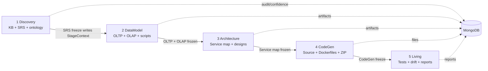
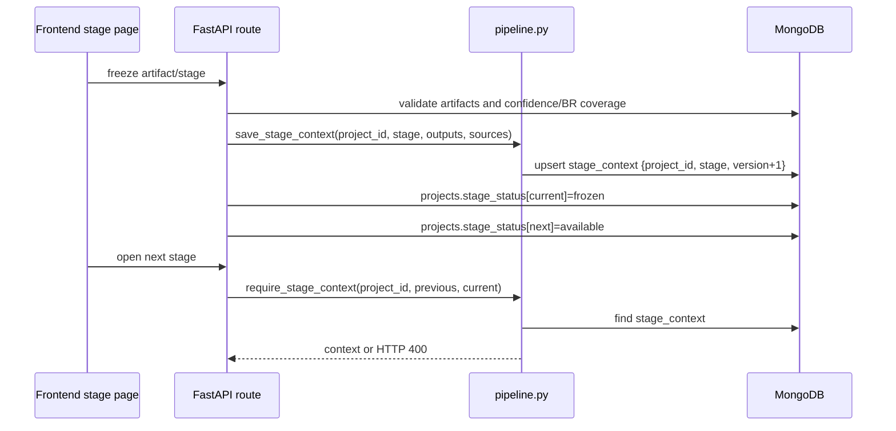
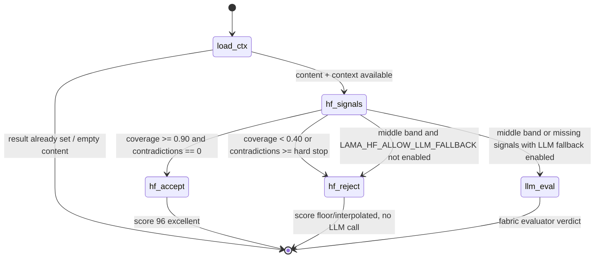
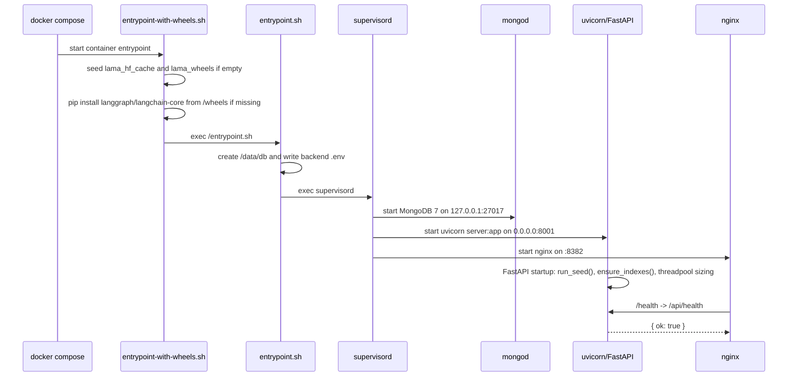

# LAMA Technical Architecture

Last rewritten: 2026-08-14. This document reflects the repository at iteration 14.27 and replaces the older June architecture note. It is a reference for engineers and AI coding agents working in this repository, not a roadmap or plan.

Primary source files for operational contracts are `AGENTS.md`, `CLAUDE.md`, and the append-only history in `memory/PRD.md`. If those files conflict with this document, prefer the newest code and the newest iteration note in `memory/PRD.md`.


## 1. Overview & Vision

LAMA (Legacy Application Modernization & Alignment) is a full-stack migration studio. A user ingests a legacy application folder, ZIP, git repository, or live database descriptor. LAMA builds a knowledge base, derives requirements, designs a target system, generates code, and then evaluates the generated system for drift and accuracy.

The system is intentionally stage-gated. The frontend has one active project at a time; the backend still stores project and tenant identifiers, but the product shell is single-active-project. `ProjectContext` chooses the first available project and refreshes pipeline state on navigation. There is no project switcher workflow in the main stage pages.

The five stages are strict and sequential:

| # | Stage | Primary outputs | Freeze/unlock contract |
| --- | --- | --- | --- |
| 1 | Discovery | KB YAML/TOON, business ontology, 12-section IEEE-830 SRS | Freezing SRS writes `StageContext(Discovery)` and unlocks DataModel |
| 2 | DataModel | OLTP DDL, OLAP/star schema DDL, bus matrix, migration scripts | Freezing OLTP + OLAP writes `StageContext(DataModel)` and unlocks Architecture |
| 3 | Architecture | Service map, optional HLD/LLD/API contracts/sequence diagrams | Freezing Service Map promotes Architecture and unlocks CodeGen |
| 4 | CodeGen | Per-service source tree, Dockerfiles, ZIP, disk export, optional GitHub push | Freeze writes `StageContext(CodeGen)` and unlocks Living |
| 5 | Living | Selenium/JMeter/drift/SRS-diff artifacts and accuracy report | Final observational stage; can freeze its own status |




## 2. Repository Layout

The repository is a single deployable application. The backend and frontend can run as split dev processes, but production-like deployment uses one Docker image with MongoDB, FastAPI, Nginx and the React build in the same container.

```text
lama/
├── AGENTS.md                         # Operating guide for AI agents; load-bearing contracts
├── CLAUDE.md                         # Current project memory and concise contract set
├── memory/PRD.md                     # Append-only iteration log; recent iteration notes override older docs
├── Dockerfile                        # Multi-stage build: React build, Python 3.11 runtime, MongoDB 7, Nginx, supervisord
├── docker-compose.yml                # Host/local deployment, bind mounts, named HF/wheel/Mongo volumes
├── docker/
│   ├── entrypoint.sh                 # Runtime .env writer, dependency self-heal, supervisord handoff
│   ├── entrypoint-with-wheels.sh     # iter-14.26/27 named-volume seeding + offline langgraph install
│   ├── supervisord.conf              # Starts mongod, uvicorn, nginx
│   └── nginx.conf                    # Serves SPA and proxies /api to FastAPI
├── docs/ARCHITECTURE.md              # This document
├── backend/
│   ├── server.py                     # FastAPI entrypoint; mounts all routers; startup seed/index hooks
│   ├── db.py                         # Motor client and collection accessors; index creation
│   ├── models.py                     # Pydantic v2 data contracts
│   ├── pipeline.py                   # StageContext handoff helpers
│   ├── llm.py                        # fabric_call wrapper, OpenRouter fallback, trace recording
│   ├── confidence.py                 # Legacy multi-model confidence scorer
│   ├── confidence_langgraph.py       # iter-14 LangGraph + HF confidence engine
│   ├── seed.py                       # Idempotent prompt/project/provider seed data
│   ├── agent_memory.py               # Rolling-memory LLM sessions
│   ├── context_bundler.py            # Host-anchored prompt context bundles
│   ├── fabric/model_fabric.py        # Provider presets, agent tiers, model routing, usage logging
│   ├── kb/                           # Discovery knowledge-base engine
│   │   ├── parsers.py                # File/ZIP parsing and supported source types
│   │   ├── tech_detector.py          # Language/framework/database fingerprinting
│   │   ├── owl_extractor.py          # Language-agnostic entity extraction
│   │   ├── owl_export.py             # YAML KB context export (back-compat name export_owl)
│   │   ├── toon.py                   # TOON serialization and stage-aware pruning
│   │   ├── business_ontology.py      # Business entity clustering/enrichment
│   │   ├── vector_store.py           # Qdrant indexing/search; resilient no-op on failure
│   │   ├── kb_graph.py               # Property graph construction
│   │   ├── graph_retriever.py        # Section-specific subgraph YAML retrieval
│   │   ├── br_tracker.py             # Business-rule coverage checks for freeze gates
│   │   ├── workspace_isolation.py    # Project path/suffix guards
│   │   └── factory_materializer.py   # Factory.ai filesystem materialization
│   ├── datamodel/                    # Deterministic/LLM DataModel generators
│   ├── codegen/                      # File templates, ZIP builder, disk exporter, parity loop
│   ├── integrations/                 # Government/platform integration catalog and renderers
│   ├── routes/                       # One router per concern; cataloged below
│   └── tests/                        # Pytest suites; iteration-numbered regression tests
├── frontend/
│   ├── package.json                  # React 19 + CRACO + Tailwind + pinned dependencies
│   └── src/
│       ├── App.js                    # Router and application shell
│       ├── lib/api.js                # Axios API client and endpoint wrappers
│       ├── state/ProjectContext.jsx  # Single active project + rolling session IDs
│       ├── state/AuthContext.jsx     # JWT auth state
│       ├── pages/                    # Stage and admin/console pages
│       └── components/               # Stage panels, confidence badge, sidebar, diagrams, console
└── test_reports/                     # Frontend/smoke report artifacts from prior iterations
```

Backend routes currently include: `admin`, `architecture`, `audit`, `auth`, `chat`, `codegen`, `console`, `context`, `datamodel`, `db_ingest`, `github`, `integrations`, `kb`, `living`, `pipeline`, `projects`, `prompts`, `sessions`, and `srs`. Frontend page routes map to Discovery, DataModel, Architecture, CodeGen, Integrations, Living, Prompts, Console, Ontology Studio, Settings, Audit, Admin, and UI Showcase.


## 3. Tech Stack & Pinned Versions

Versions below are read from `backend/requirements.txt` and `frontend/package.json`. Do not silently bump the pins called out in the right column.

> **2026-09:** `requirements.txt` was pruned from a 176-line `pip freeze` (taken on a Linux CUDA workstation) to 38 direct dependencies, which pip resolves to 122 with transitives and **zero** nvidia/cuda packages. Transitive pins such as numpy, scipy, lxml and orjson are no longer declared here — they arrive via the packages that need them. See `docs/verification/requirements-resolution.txt`.

| Backend package | Pinned requirement | Notes |
| --- | --- | --- |
| fastapi | fastapi==0.110.1 |  |
| motor | motor==3.3.1 |  |
| pydantic | pydantic==2.13.4 |  |
| httpx | httpx==0.28.1 |  |
| PyYAML | PyYAML==6.0.3 |  |
| PyGithub | PyGithub==2.9.1 |  |
| qdrant-client | qdrant-client==1.18.0 |  |
| sentence-transformers | sentence-transformers==5.5.0 |  |
| transformers | transformers==5.8.1 |  |
| torch | torch==2.12.0 | DO NOT bump casually |
| langgraph | langgraph==0.2.60 | DO NOT bump casually |
| langchain-core | langchain-core==0.3.29 |  |
| uvicorn | uvicorn[standard]==0.25.0 | the `[standard]` extra is pinned here now; the Dockerfile used to reinstall it unpinned AFTER requirements.txt, silently upgrading past this pin |
| pytest | pytest==9.0.3 |  |
| pytest-asyncio | pytest-asyncio>=1.0 | mandatory — without it every `@pytest.mark.asyncio` coroutine is silently never awaited and passes without asserting |
| PyJWT | PyJWT==2.12.1 | the JWT library actually imported (`backend/auth.py:19`) |
| bcrypt | bcrypt==4.0.1 | pinned for passlib 1.7.4 compatibility |
| dulwich | dulwich>=1.2.5,<2.0 |  |

| Frontend package | Version spec | Notes |
| --- | --- | --- |
| react | ^19.0.0 | React 19 application shell |
| react-dom | ^19.0.0 |  |
| react-router-dom | ^7.5.1 |  |
| @craco/craco | ^7.1.0 |  |
| tailwindcss | ^3.4.17 |  |
| d3 | 7.9.0 |  |
| mermaid | ^11.15.0 |  |
| @monaco-editor/react | ^4.7.0 |  |
| react-resizable-panels | 2.1.7 | DO NOT bump; panel-collapse behaviour depends on 2.1.7 |
| axios | ^1.8.4 |  |
| lucide-react | ^0.507.0 |  |

Runtime pin: `Dockerfile` uses `python:3.11-slim-bookworm`. LangGraph is pinned to `langgraph==0.2.60`; the comments in `requirements.txt` describe this as the stable LTS line used by `backend/confidence_langgraph.py::_build_graph`. Frontend package manager is `yarn@1.22.22`; this repo is yarn-only.

```text
// backend/requirements.txt:207-228
207. # ── iter 14.14 — LangGraph + HuggingFace confidence engine (opt-in) ──
208. # Enables the token-hostile confidence engine in
209. # `backend/confidence_langgraph.py`. Off by default; turn on with env
210. # `LAMA_CONFIDENCE_ENGINE=langgraph`. Falls back transparently to the
211. # legacy fabric_call scoring path on any failure so a stale/broken
212. # install cannot regress the SRS retry loop.
213. #
214. # Dependencies:
215. #   * langgraph           — graph orchestration (state machine).
216. #   * langchain-core      — TypedDict + graph state contracts. We NEVER
217. #                           install langchain-openai / langchain-anthropic
218. #                           because those bypass Console routing
219. #                           (contract #4 — all LLM calls via fabric_call).
220. #   * sentence-transformers + transformers + torch — already pinned above
221. #                           (lines 141 / 154 / 152) for embeddings + NLI.
222. #                           No additional install needed for HF signals.
223. #
224. # Pinned floors chosen for stability — 0.2.60 / 0.3.29 are the last LTS
225. # releases before the 0.3/0.4 breaking changes; upgrade only after
226. # revalidating `backend/confidence_langgraph.py::_build_graph`.
227. langgraph==0.2.60
228. langchain-core==0.3.29
```

```json
// frontend/package.json:48-67
48.     "react": "^19.0.0",
49.     "react-day-picker": "8.10.1",
50.     "react-dom": "^19.0.0",
51.     "react-hook-form": "^7.56.2",
52.     "react-markdown": "^10.1.0",
53.     "react-resizable-panels": "2.1.7",
54.     "react-router-dom": "^7.5.1",
55.     "react-scripts": "5.0.1",
56.     "recharts": "^3.6.0",
57.     "remark-gfm": "^4.0.1",
58.     "sonner": "^2.0.3",
59.     "tailwind-merge": "^3.2.0",
60.     "tailwindcss-animate": "^1.0.7",
61.     "vaul": "^1.1.2",
62.     "zod": "^3.24.4"
63.   },
64.   "scripts": {
65.     "start": "craco start",
66.     "build": "craco build",
67.     "test": "craco test"
```

```dockerfile
// Dockerfile:41-51
41. # ===============================================================
42. # Stage 2 — runtime image (Python + Mongo + Nginx + supervisord)
43. # ===============================================================
44. FROM python:3.11-slim-bookworm AS runtime
45. 
46. ENV DEBIAN_FRONTEND=noninteractive \
47.     PYTHONUNBUFFERED=1 \
48.     PYTHONDONTWRITEBYTECODE=1 \
49.     PIP_NO_CACHE_DIR=1 \
50.     PIP_DISABLE_PIP_VERSION_CHECK=1 \
51.     TZ=UTC
```


## 4. The 5-Stage Pipeline


### Stage 1 — Discovery

Discovery ingests source files, folders, ZIPs, git repositories, live database schema descriptors, and optional app URL hints. It parses text, detects legacy technology, extracts language-agnostic KB entities, builds TOON, stores Qdrant vectors when configured, derives business ontology, generates the 12-section IEEE-830 SRS, and freezes into `StageContext(Discovery)`.

| Input | Output | Key files | Key functions/prompts |
| --- | --- | --- | --- |
| Source files/folders/ZIP/git/live DB/app URL | `kb_files`, `kb_chunks`, `kb_entities`, `kb_toon`, `business_ontologies`, `srs_documents` | `routes/kb.py`, `kb/parsers.py`, `kb/tech_detector.py`, `kb/owl_extractor.py`, `kb/business_ontology.py`, `routes/srs.py` | `scan_folder`, `upload_files`, `build_kb`, `extract_*`, `toon_serialise`, `SECTION_CONFIGS`, `freeze_srs`; prompts `gov.*`, `srs.generate`, `srs.revalidation` |

The 12 SRS sections are the single source of truth for Discovery confidence rows:

| # | key | label | TOON focus | min words |
| --- | --- | --- | --- | --- |
| 1 | introduction | 1. Introduction | CLASSES | 600 |
| 2 | overall_description | 2. Overall Description | TABLES | 700 |
| 3 | actors_use_case_inventory | 3. Actors and Use Case Inventory | INDIVIDUALS | 500 |
| 4 | specific_requirements | 4. Specific Requirements | CLASSES | 2000 |
| 5 | detailed_use_cases | 5. Detailed Use Cases | CLASSES | 2500 |
| 6 | external_interfaces | 6. External Interfaces | CLASSES | 500 |
| 7 | non_functional_requirements | 7. Non-Functional Requirements (NFRs) | TABLES | 500 |
| 8 | integration_requirements | 8. Integration Requirements | CLASSES | 400 |
| 9 | validation_verification | 9. Validation and Verification | CLASSES | 500 |
| 10 | traceability_matrix | 10. Traceability Matrix | CLASSES | 300 |
| 11 | appendices | 11. Appendices | TABLES | 400 |
| 12 | entity_model | 12. Entity Relationship Model | TABLES | 0 |

```python
# backend/routes/srs.py:713-760
713. SECTION_CONFIGS = [
714.     {
715.         "key": "introduction",
716.         "label": "1. Introduction",
717.         "toon_focus": "CLASSES",
718.         "min_words": 600,
719.         "instructions": """Write Section 1 of an IEEE 830 / IEEE 29148 SRS with these FIVE sub-sections (use `## 1.x` headings, do NOT skip any):
720. 
721. ## 1.1 Purpose
722. What this system does (based on actual module / controller / table names visible in the KB), the business problems it solves, and what the migration aims to achieve. Write for a domain reader (an operations head, a programme owner) — not a developer. Avoid framework or language jargon unless it appears VERBATIM in the source.
723. 
724. ## 1.2 Scope
725. Every functional area found in the KB grouped by business domain (procurement / billing / reporting / etc.). What is explicitly OUT of scope for this migration. Integration boundaries with upstream and downstream systems.
726. 
727. ## 1.3 Definitions, Acronyms & Abbreviations
728. Definition list (term: explanation) for every domain term, acronym and role found in table names, module names, role names, and any regulatory terms visible. Use the business meaning, not the implementation meaning.
729. 
730. ## 1.4 References
731. Bullet list of EVERY source artifact this SRS derives from. Cite by **relative file path** (no language assumptions — could be any source / config / schema file). If only the KB summary is available, say so explicitly with `NOT_EVIDENCED`.
732. 
733. ## 1.5 Document Overview
734. Summarise the structure of the remaining 10 sections of this SRS in 1–2 sentences each.""",
735.     },
736.     {
737.         "key": "overall_description",
738.         "label": "2. Overall Description",
739.         "toon_focus": "TABLES",
740.         "min_words": 700,
741.         "instructions": """Write Section 2 with these SIX sub-sections (use `## 2.x` headings):
742. 
743. ## 2.1 Product Perspective
744. Where this system sits — standalone, part of a larger landscape, dependencies on upstream / downstream systems visible in the code. Speak in business terms; if the source stack ships specific runtime constraints, cite them verbatim from the DETECTED LEGACY STACK block.
745. 
746. ## 2.2 Product Functions
747. Top-level functional grouping (one bullet per major business capability, e.g. "Tender Floating", "Bill Processing", "Beneficiary Onboarding"). Tie each capability to the source-tree directory or module group that implements it — language-agnostic ("the procurement module under `<path>`"), not "the PHP controllers".
748. 
749. ## 2.3 User Classes and Characteristics
750. For EVERY role found in the KB: role name, typical user profile, technical-skill assumption, and the screens / modules they touch. Describe each user class as a human, not a database row.
751. 
752. ## 2.4 Operating Environment
753. Runtime versions, framework, DB engine, OS, browser support — taken from the DETECTED LEGACY STACK block, properties files and config XML. Mark as `NOT_EVIDENCED` if not visible.
754. 
755. ## 2.5 Design and Implementation Constraints
756. Constraints the legacy system imposes on any rewrite: standard libraries, code-style mandates, mandatory interfaces, schema invariants. List the constraint + the file that establishes it.
757. 
758. ## 2.6 Assumptions and Dependencies
759. External libraries, government services, payment gateways, SMS / email providers etc. visible in the code or in the configuration.""",
760.     },
```

Discovery freeze is a hard gate. It blocks low mean section confidence unless the typed override is supplied, checks business-rule coverage, marks the SRS frozen, writes audit, builds StageContext from KB entities/TOON/YAML export, and makes DataModel available.

```python
# backend/routes/srs.py:6914-7003
6914. @router.post("/freeze")
6915. async def freeze_srs(payload: dict):
6916.     project_id = payload.get("project_id")
6917.     set_current_project_id(project_id)  # iter-13.38
6918.     user = payload.get("user", "system")
6919.     srs_doc = await srs_documents.find_one({"project_id": project_id}, {"_id": 0})
6920.     if not srs_doc:
6921.         raise HTTPException(404, "SRS not found")
6922. 
6923.     # iter-14.11 — Hard-block freeze when mean per-section confidence is
6924.     # below FREEZE_MIN_CONFIDENCE (default 95). Uses the retry-loop's
6925.     # `sections_meta.<key>.final_score` because those numbers were
6926.     # produced by the same judge that gated regeneration. Falls back to
6927.     # the `stage_confidence` collection when meta is missing (e.g. an
6928.     # SRS generated before iter-14.11).
6929.     #
6930.     # Override is a typed-confirmation identical to the RESET / FREEZE
6931.     # pattern already used elsewhere — the payload must carry
6932.     # `override: "OVERRIDE"` verbatim.
6933.     override_raw = str(payload.get("override") or "").strip()
6934.     override_ok = override_raw == "OVERRIDE"
6935.     section_meta = (srs_doc.get("sections_meta") or {})
6936.     scored_finals: list[float] = []
6937.     plateaued_keys: list[str] = []
6938.     for _k, _m in section_meta.items():
6939.         if not isinstance(_m, dict):
6940.             continue
6941.         try:
6942.             _fs = float(_m.get("final_score", 0.0) or 0.0)
6943.         except (TypeError, ValueError):
6944.             _fs = 0.0
6945.         scored_finals.append(_fs)
6946.         if _m.get("plateaued"):
6947.             plateaued_keys.append(_k)
6948.     mean_meta_score = round(sum(scored_finals) / len(scored_finals), 2) if scored_finals else None
6949.     # Legacy fallback — pre-14.11 SRS docs have no meta.
6950.     legacy_overall = None
6951.     if mean_meta_score is None:
6952.         try:
6953.             from db import stage_confidence as _sc_col
6954.             _sc_doc = await _sc_col.find_one(
6955.                 {"project_id": project_id, "stage": "Discovery"},
6956.                 {"_id": 0, "overall_score": 1},
6957.             )
6958.             if _sc_doc and _sc_doc.get("overall_score") is not None:
6959.                 legacy_overall = round(float(_sc_doc["overall_score"] or 0.0), 2)
6960.         except Exception:
6961.             legacy_overall = None
6962.     effective_score = mean_meta_score if mean_meta_score is not None else legacy_overall
6963.     if (
6964.         effective_score is not None
6965.         and effective_score < FREEZE_MIN_CONFIDENCE
6966.         and not override_ok
6967.     ):
6968.         # Record the refusal so we can trace override abuse later.
6969.         try:
6970.             await audit_log.insert_one({
6971.                 "action": "srs.freeze.blocked",
6972.                 "project_id": project_id,
6973.                 "at": datetime.now(timezone.utc).isoformat(),
6974.                 "details": {
6975.                     "by": user,
6976.                     "effective_score": effective_score,
6977.                     "threshold": FREEZE_MIN_CONFIDENCE,
6978.                     "source": "sections_meta" if mean_meta_score is not None else "stage_confidence",
6979.                     "plateaued_sections": plateaued_keys,
6980.                     "override_supplied": bool(override_raw),
6981.                 },
6982.             })
6983.         except Exception:  # noqa: BLE001
6984.             pass
6985.         raise HTTPException(
6986.             status_code=422,
6987.             detail={
6988.                 "error": "SRS_CONFIDENCE_BELOW_THRESHOLD",
6989.                 "stage": "srs",
6990.                 "effective_score": effective_score,
6991.                 "threshold": FREEZE_MIN_CONFIDENCE,
6992.                 "plateaued_sections": plateaued_keys,
6993.                 "source": "sections_meta" if mean_meta_score is not None else "stage_confidence",
6994.                 "message": (
6995.                     f"SRS mean per-section confidence is {effective_score:.1f}% "
6996.                     f"(threshold {FREEZE_MIN_CONFIDENCE:.0f}%). "
6997.                     "Click *Regenerate* on the amber-tinted sections until each "
6998.                     "clears the threshold, or resubmit with "
6999.                     "`override:\"OVERRIDE\"` to freeze anyway "
7000.                     "(mirrors the RESET / FREEZE typed-confirmation pattern)."
7001.                 ),
7002.             },
7003.         )
```

```python
# backend/routes/srs.py:7056-7077
7056.     # ------------------------------------------------------------------
7057.     # Pipeline handoff: persist a StageContext snapshot for downstream stages.
7058.     # Best-effort — never fail the freeze if the snapshot build hiccups.
7059.     # ------------------------------------------------------------------
7060.     try:
7061.         entities = await kb_entities.find({"project_id": project_id}, {"_id": 0}).to_list(100000)
7062.         toon_doc = await kb_toon.find_one({"project_id": project_id}, {"_id": 0})
7063.         proj = await projects.find_one({"id": project_id}, {"_id": 0})
7064. 
7065.         owl = export_owl(proj or {}, entities, (srs_doc or {}).get("sections", {}))
7066. 
7067.         domain_map = owl.get("data_model_hints", {}).get("domains", {})
7068.         high_risk = owl.get("data_model_hints", {}).get("high_risk_tables", [])
7069.         boundaries = owl.get("microservice_hints", {}).get("suggested_boundaries", [])
7070.         stats = (toon_doc or {}).get("stats", {})
7071. 
7072.         tables_only = [e for e in entities if e.get("type") == "TABLE"]
7073.         classes_only = [e for e in entities if e.get("type") == "CLASS"]
7074.         key_tables = sorted(tables_only, key=lambda t: len(t.get("fks") or []), reverse=True)[:80]
7075.         key_classes = sorted(classes_only, key=lambda c: len(c.get("methods") or []), reverse=True)[:60]
7076.         toon_summary = toon_serialise(key_tables + key_classes)[:8000]
7077. 
```


### Stage 2 — DataModel

DataModel consumes frozen Discovery context. It produces OLTP DDL, OLAP/star-schema DDL, a bus matrix, migration scripts, and an entity graph. It supports background job endpoints because real schemas can exceed ingress/request timeouts. It still has synchronous generate endpoints for streaming/generation compatibility.

| Input | Output | Key files | Key functions/prompts |
| --- | --- | --- | --- |
| `StageContext(Discovery)`: SRS sections, domain map, data_model_hints, TOON summary | `data_models` artifacts of type `oltp_ddl`, `olap_ddl`, `bus_matrix`, migration scripts; `StageContext(DataModel)` | `routes/datamodel.py`, `datamodel/oltp_generator.py`, `olap_generator.py`, `bus_matrix_deriver.py`, `migration_generator.py` | `start_oltp_job`, `start_olap_job`, `start_scripts_job`, `generate_oltp`, `freeze_artifact`; prompts `datamodel.oltp`, `datamodel.olap`, `datamodel.bus_matrix`, `datamodel.chat` |

```python
# backend/routes/datamodel.py:955-1022
955. @router.post("/jobs/start/oltp")
956. async def start_oltp_job(payload: dict):
957.     """Start OLTP generation as a background job. Returns {job_id} immediately so the
958.     frontend can poll without being killed by K8s 60s ingress timeout.
959. 
960.     iter-13.44 — accepts optional `generation` overrides (per-request layer of
961.     the deterministic/LLM flag system). Example:
962.         { "project_id": "...", "generation": {"oltp": "llm"} }
963.     """
964.     project_id = payload.get("project_id")
965.     set_current_project_id(project_id)  # iter-13.38
966.     if not project_id:
967.         raise HTTPException(400, "project_id required")
968.     await require_stage_context(project_id, "Discovery", "DataModel")
969.     # iter-13.81.2 — first run → datamodel.generate bucket; re-run (artifact
970.     # already exists) → datamodel.regenerate. Lets the Console's per-bucket
971.     # model pin actually take effect for Factory.ai.
972.     _existing = await data_models.find_one({"project_id": project_id, "type": "oltp_ddl"}, {"_id": 1})
973.     set_current_agent_key("datamodel.regenerate" if _existing else "datamodel.generate")
974.     model = payload.get("model") or ""  # iter-13.30: Console resolves via AGENT_COMPLEXITY
975.     gen_overrides = payload.get("generation") or {}
976.     jid = _new_job(project_id, "oltp")
977.     asyncio.create_task(_run_oltp_job(jid, project_id, model, gen_overrides))
978.     return {"job_id": jid, "status": "queued"}
979. 
980. 
981. @router.post("/jobs/start/olap")
982. async def start_olap_job(payload: dict):
983.     """Start OLAP generation as a background job. Returns {job_id} immediately.
984. 
985.     iter-13.44 — accepts optional `generation` overrides (see start_oltp_job).
986.     """
987.     project_id = payload.get("project_id")
988.     set_current_project_id(project_id)  # iter-13.38
989.     if not project_id:
990.         raise HTTPException(400, "project_id required")
991.     await require_stage_context(project_id, "Discovery", "DataModel")
992.     _existing = await data_models.find_one({"project_id": project_id, "type": "olap_ddl"}, {"_id": 1})
993.     set_current_agent_key("datamodel.regenerate" if _existing else "datamodel.generate")
994.     model = payload.get("model") or ""  # iter-13.30: Console resolves via AGENT_COMPLEXITY
995.     gen_overrides = payload.get("generation") or {}
996.     jid = _new_job(project_id, "olap")
997.     asyncio.create_task(_run_olap_job(jid, project_id, model, gen_overrides))
998.     return {"job_id": jid, "status": "queued"}
999. 
1000. 
1001. @router.post("/jobs/start/scripts")
1002. async def start_scripts_job(payload: dict):
1003.     """Start migration-scripts generation (deterministic by default; LLM-mode
1004.     runs 3 sequential calls).
1005. 
1006.     iter-13.44 — accepts optional `generation` overrides (see start_oltp_job).
1007.     """
1008.     project_id = payload.get("project_id")
1009.     set_current_project_id(project_id)  # iter-13.38
1010.     if not project_id:
1011.         raise HTTPException(400, "project_id required")
1012.     await require_stage_context(project_id, "Discovery", "DataModel")
1013.     _existing = await data_models.find_one(
1014.         {"project_id": project_id, "type": {"$in": ["migration_oltp_to_oltp", "migration_oltp_to_olap", "migration_full"]}},
1015.         {"_id": 0, "id": 1},
1016.     )
1017.     set_current_agent_key("datamodel.regenerate" if _existing else "datamodel.generate")
1018.     model = payload.get("model") or ""  # iter-13.30: Console resolves via AGENT_COMPLEXITY
1019.     gen_overrides = payload.get("generation") or {}
1020.     jid = _new_job(project_id, "scripts")
1021.     asyncio.create_task(_run_scripts_job(jid, project_id, model, gen_overrides))
1022.     return {"job_id": jid, "status": "queued"}
```

```python
# backend/routes/datamodel.py:1110-1145
1110. @router.post("/generate/oltp")
1111. async def generate_oltp(payload: dict):
1112.     project_id = payload.get("project_id")
1113.     set_current_project_id(project_id)  # iter-13.38
1114.     if not project_id:
1115.         raise HTTPException(400, "project_id required")
1116.     model = payload.get("model") or ""  # iter-13.30: Console resolves via AGENT_COMPLEXITY
1117. 
1118.     discovery_ctx = await require_stage_context(project_id, "Discovery", "DataModel")
1119.     proj = await projects.find_one({"id": project_id}, {"_id": 0})
1120.     if not proj:
1121.         raise HTTPException(404, "Project not found")
1122. 
1123.     srs_functional = (discovery_ctx.get("outputs", {}).get("srs_sections", {}) or {}).get("functional_requirements", "")
1124.     domain_map = discovery_ctx.get("outputs", {}).get("domain_map", {})
1125.     data_hints = discovery_ctx.get("outputs", {}).get("data_model_hints", {})
1126. 
1127.     # Truncate for prompt
1128.     srs_functional = (srs_functional or "")[:8000]
1129.     domain_map_str = json.dumps(
1130.         {k: {"tables": (v or {}).get("tables", [])[:15]} for k, v in (domain_map or {}).items()}
1131.     )[:4000]
1132. 
1133.     async def event_gen():
1134.         # RAG context
1135.         try:
1136.             rag_chunks = await qdrant_search(project_id, "database tables relationships foreign keys constraints", top_k=20)
1137.         except Exception:
1138.             rag_chunks = []
1139.         rag_context = "\n\n---\n\n".join(rag_chunks)[:12000] if rag_chunks else (discovery_ctx.get("toon_summary") or "")[:12000]
1140. 
1141.         n_tables = data_hints.get("domains") and sum(len(d.get("tables", [])) for d in (data_hints.get("domains") or {}).values())
1142.         if not n_tables:
1143.             n_tables = await kb_entities.count_documents({"project_id": project_id, "type": "TABLE"})
1144. 
1145.         yield f"data: {json.dumps({'type': 'start', 'message': f'Analysing {n_tables} legacy tables…'})}\n\n"
```

The stage freeze contract is artifact-driven: once OLTP and OLAP artifacts are frozen, the route writes `StageContext(DataModel)` and unlocks Architecture.

```python
# backend/routes/datamodel.py:1707-1771
1707. @router.post("/{project_id}/artifact/{artifact_id}/freeze")
1708. async def freeze_artifact(project_id: str, artifact_id: str):
1709.     doc = await data_models.find_one({"project_id": project_id, "id": artifact_id}, {"_id": 0})
1710.     if not doc:
1711.         raise HTTPException(404, "Artifact not found")
1712.     now = datetime.now(timezone.utc).isoformat()
1713.     await data_models.update_one(
1714.         {"project_id": project_id, "id": artifact_id},
1715.         {"$set": {"frozen": True, "frozen_at": now, "updated_at": now}},
1716.     )
1717.     await audit_log.insert_one({
1718.         "action": "datamodel.artifact.freeze",
1719.         "project_id": project_id,
1720.         "at": now,
1721.         "details": {"artifact_id": artifact_id, "type": doc.get("type")},
1722.     })
1723. 
1724.     # If oltp_ddl + olap_ddl both frozen → freeze the whole DataModel stage
1725.     oltp = await data_models.find_one({"project_id": project_id, "type": "oltp_ddl"}, {"_id": 0})
1726.     olap = await data_models.find_one({"project_id": project_id, "type": "olap_ddl"}, {"_id": 0})
1727.     bus = await data_models.find_one({"project_id": project_id, "type": "bus_matrix"}, {"_id": 0})
1728. 
1729.     if oltp and oltp.get("frozen") and olap and olap.get("frozen"):
1730.         discovery_ctx = await stage_context_col.find_one({"project_id": project_id, "stage": "Discovery"}, {"_id": 0})
1731.         scripts = {}
1732.         for s in ("migrate_old_to_oltp", "migrate_oltp_to_olap", "test_migration"):
1733.             a = await data_models.find_one({"project_id": project_id, "type": s}, {"_id": 0})
1734.             if a:
1735.                 scripts[s] = a["id"]
1736.         outputs = {
1737.             "oltp_artifact_id": oltp["id"],
1738.             "olap_artifact_id": olap["id"],
1739.             "bus_matrix_artifact_id": (bus or {}).get("id"),
1740.             "script_artifact_ids": scripts,
1741.             "oltp_ddl": oltp.get("content", ""),
1742.             "olap_ddl": olap.get("content", ""),
1743.             "oltp_table_count": oltp.get("content", "").upper().count("CREATE TABLE"),
1744.             "olap_fact_count": (olap.get("content", "")).upper().count("CREATE TABLE FACT_"),
1745.             "olap_dim_count": (olap.get("content", "")).upper().count("CREATE TABLE DIM_"),
1746.             "domain_map": (discovery_ctx or {}).get("outputs", {}).get("domain_map", {}),
1747.             "service_boundaries": (discovery_ctx or {}).get("outputs", {}).get("suggested_service_boundaries", []),
1748.         }
1749.         sources = {
1750.             "discovery_version": (discovery_ctx or {}).get("version", 1),
1751.             "model_used": doc.get("generated_by", ""),
1752.             "prompts_used": ["datamodel.oltp", "datamodel.olap", "datamodel.bus_matrix", "datamodel.chat"],
1753.         }
1754.         await save_stage_context(
1755.             project_id=project_id,
1756.             stage="DataModel",
1757.             outputs=outputs,
1758.             sources=sources,
1759.             toon_summary=(discovery_ctx or {}).get("toon_summary", "")[:4000],
1760.             frozen_by="system",
1761.         )
1762.         await projects.update_one(
1763.             {"id": project_id},
1764.             {"$set": {
1765.                 "stage_status.DataModel": "frozen",
1766.                 "stage_status.Architecture": "available",
1767.                 "updated_at": now,
1768.             }},
1769.         )
1770. 
1771.     return {"ok": True, "frozen": True}
```


### Stage 3 — Architecture

Architecture consumes frozen DataModel context. It recommends bounded services, stores rows in `arch_services`, creates a canonical `service_map`, and can generate optional HLD, LLD, sequence diagrams, and OpenAPI contracts. The service map is the canonical freeze gate; optional deliverables can be generated before or after CodeGen.

Architecture does not use SSE for long jobs. The code follows a background-job plus polling pattern because production Kubernetes ingress has a 60-second timeout. The same pattern is used by CodeGen, Living, and confidence recompute jobs.

| Input | Output | Key files | Key functions/prompts |
| --- | --- | --- | --- |
| `StageContext(DataModel)`, KB graph, SRS slices, OLTP/OLAP artifacts | `arch_documents`, `arch_services`, `StageContext(Architecture)` | `routes/architecture.py`, `kb/graph_retriever.py` | `start_recommend`, `_run_recommend_job`, `start_hld`, `start_lld`, `start_seq`, `start_api_contracts`, `_promote_architecture_stage`; prompts `arch.recommend`, `arch.hld`, `arch.lld`, `arch.sequence`, `arch.api_contracts` |

```python
# backend/routes/architecture.py:1481-1504
1481. async def _run_recommend_job(jid: str, project_id: str, model: str, override_message: str = ""):
1482.     try:
1483.         _job_update(jid, status="running", step="Loading DataModel context…", pct=4)
1484.         dm_ctx = await require_stage_context(project_id, "DataModel", "Architecture")
1485.         proj = await projects.find_one({"id": project_id}, {"_id": 0})
1486.         await _ensure_kb_graph(project_id)
1487. 
1488.         # iter-13.43 — DETERMINISTIC enumeration of the legacy surface.
1489.         # This is the core fix: the LLM no longer has to "discover" 500+
1490.         # endpoints from a truncated context window. We enumerate every
1491.         # route + table + module from kb_graph (or kb_entities fallback)
1492.         # before calling the model, hand it a compact module-level
1493.         # skeleton, and mechanically attach the full route/table lists
1494.         # to each service after the model returns. 100% surface coverage,
1495.         # ~10x fewer prompt tokens, no hallucinated endpoints.
1496.         _job_update(jid, step="Enumerating legacy surface (routes / tables / modules)…", pct=10)
1497.         surface = await _enumerate_legacy_surface(project_id)
1498.         logger.info(
1499.             "arch.recommend surface: project=%s source=%s routes=%d tables=%d modules=%d",
1500.             project_id, surface.get("source"),
1501.             surface["total_routes"], surface["total_tables"], surface["total_modules"],
1502.         )
1503.         surface_skeleton = _format_surface_skeleton(surface, max_modules=80)
1504. 
```

```python
# backend/routes/architecture.py:2684-2696
2684. @router.post("/jobs/start/hld")
2685. async def start_hld(payload: dict):
2686.     project_id = payload.get("project_id")
2687.     set_current_project_id(project_id)  # iter-13.38
2688.     if not project_id:
2689.         raise HTTPException(400, "project_id required")
2690.     await require_stage_context(project_id, "DataModel", "Architecture")
2691.     _existing = await arch_documents.find_one({"project_id": project_id, "type": "hld"}, {"_id": 1})
2692.     set_current_agent_key("arch.regenerate" if _existing else "arch.hld")
2693.     model = payload.get("model") or ""  # iter-13.30: Console resolves via AGENT_COMPLEXITY
2694.     jid = _new_job(project_id, "hld")
2695.     asyncio.create_task(_run_hld_job(jid, project_id, model))
2696.     return {"job_id": jid, "status": "queued"}
```

```python
# backend/routes/architecture.py:3304-3315
3304. @router.get("/jobs/{job_id}")
3305. async def get_job(job_id: str):
3306.     j = _JOBS.get(job_id)
3307.     if not j:
3308.         raise HTTPException(404, "Job not found")
3309.     return {"id": j["id"], "status": j["status"], "step": j.get("step", ""),
3310.             "pct": j.get("pct", 0), "error": j.get("error"),
3311.             "result": j.get("result", {}), "kind": j.get("kind"),
3312.             # iter-13.50 — per-section failures (transport vs model) so the
3313.             # UI can surface a "5/10 sections failed with DNS error" toast.
3314.             "section_errors": j.get("section_errors", [])}
3315. 
```

The Architecture handoff stores optional deliverable presence explicitly so CodeGen can treat HLD/LLD/API/sequence material as supplementary rather than mandatory.

```python
# backend/routes/architecture.py:2125-2195
2125. async def _promote_architecture_stage(project_id: str, frozen_by: str = "system") -> bool:
2126.     sm = await arch_documents.find_one(
2127.         {"project_id": project_id, "type": "service_map"}, {"_id": 0},
2128.     )
2129.     if not sm or not sm.get("frozen"):
2130.         return False
2131.     try:
2132.         sm_data = json.loads(sm.get("content", "") or "{}")
2133.     except Exception:
2134.         sm_data = {}
2135.     services = await arch_services.find(
2136.         {"project_id": project_id}, {"_id": 0},
2137.     ).to_list(200)
2138.     biz_services = [s for s in services if s.get("kind") != "utility" and not s.get("frontend")]
2139.     hld = await arch_documents.find_one(
2140.         {"project_id": project_id, "type": "hld"}, {"_id": 0},
2141.     ) or {}
2142.     lld = await arch_documents.find_one(
2143.         {"project_id": project_id, "type": "lld"}, {"_id": 0},
2144.     ) or {}
2145.     seq = await arch_documents.find_one(
2146.         {"project_id": project_id, "type": "sequence_diagrams"}, {"_id": 0},
2147.     ) or {}
2148.     api = await arch_documents.find_one(
2149.         {"project_id": project_id, "type": "api_contracts"}, {"_id": 0},
2150.     ) or {}
2151.     outputs = {
2152.         "pattern": sm_data.get("recommended_pattern"),
2153.         "services": services,
2154.         # iter-13.81.13 — these blocks are OPTIONAL. Empty strings are valid;
2155.         # CodeGen only uses them as supplementary prompt context.
2156.         "hld_content": hld.get("content", ""),
2157.         "lld_content": lld.get("content", ""),
2158.         "api_contracts": api.get("content", ""),
2159.         "sequence_diagrams": seq.get("content", ""),
2160.         "service_count": len(services),
2161.         "frontend_service": sm_data.get("frontend_service", {}),
2162.         "backend_lang": (biz_services[0]["backend_lang"]
2163.                          if biz_services else "nodejs"),
2164.         "event_bus": sm_data.get("event_bus", False),
2165.         # Provenance — which optional deliverables actually exist?
2166.         "optional_deliverables": {
2167.             "hld": bool(hld.get("frozen")),
2168.             "lld": bool(lld.get("frozen")),
2169.             "sequence_diagrams": bool(seq.get("frozen")),
2170.             "api_contracts": bool(api.get("frozen")),
2171.         },
2172.     }
2173.     dm_ctx = await stage_context_col.find_one(
2174.         {"project_id": project_id, "stage": "DataModel"}, {"_id": 0},
2175.     )
2176.     sources = {
2177.         "datamodel_version": (dm_ctx or {}).get("version"),
2178.         "service_map_version": sm.get("version"),
2179.         "prompts_used": ["arch.recommend"]
2180.             + (["arch.hld"] if hld.get("frozen") else [])
2181.             + (["arch.lld"] if lld.get("frozen") else [])
2182.             + (["arch.sequence"] if seq.get("frozen") else [])
2183.             + (["arch.api_contracts"] if api.get("frozen") else []),
2184.     }
2185.     await save_stage_context(
2186.         project_id, "Architecture", outputs, sources, frozen_by=frozen_by,
2187.     )
2188.     now = datetime.now(timezone.utc).isoformat()
2189.     await projects.update_one(
2190.         {"id": project_id},
2191.         {"$set": {"stage_status.Architecture": "frozen",
2192.                   "stage_status.CodeGen": "available",
2193.                   "updated_at": now}},
2194.     )
2195.     return True
```


### Stage 4 — CodeGen

CodeGen consumes frozen Architecture context and DataModel artifacts. It generates backend services, frontend React code, Dockerfiles, tests, reports, ZIP downloads, disk exports, and optional GitHub pushes. Generated files are persisted individually in `codegen_files` so the UI can browse/edit/apply changes without unpacking a ZIP.

| Input | Output | Key files | Key functions/prompts |
| --- | --- | --- | --- |
| `StageContext(Architecture)`, `arch_services`, DataModel outputs, KB graph/legacy analysis | `codegen_files`, `codegen_runs`, `parity_runs`, ZIP/disk/GitHub output, `StageContext(CodeGen)` | `routes/codegen.py`, `codegen/file_templates.py`, `zip_builder.py`, `disk_exporter.py`, `parity_loop.py` | `start_codegen`, gap-recovery jobs, `download_zip`, `export_to_disk`, GitHub push job, `freeze_codegen`; prompts `codegen.service`, `codegen.frontend`, `codegen.docs`, `codegen.gap_recovery` |

```python
# backend/routes/codegen.py:5017-5065
5017. @router.post("/{project_id}/download-zip")
5018. async def download_zip(project_id: str):
5019.     proj = await projects.find_one({"id": project_id}, {"_id": 0})
5020.     if not proj:
5021.         raise HTTPException(404, "Project not found")
5022.     files = await codegen_files.find({"project_id": project_id}, {"_id": 0}).to_list(5000)
5023.     if not files:
5024.         raise HTTPException(400, "No files to package. Generate code first.")
5025.     blob = build_zip(proj.get("name", "lama"), files)
5026.     fn = (proj.get("name", "lama") or "lama").lower().replace(" ", "_") + ".zip"
5027.     return StreamingResponse(io.BytesIO(blob), media_type="application/zip",
5028.                              headers={"Content-Disposition": f'attachment; filename="{fn}"'})
5029. 
5030. 
5031. # -----------------------------------------------------------
5032. # F.2 — Export to disk (iter-13.110)
5033. # Writes the generated frontend + backend trees to a real folder OUTSIDE
5034. # the LAMA repo. Default root: <parent-of-lama-main>/tanent-project-data/
5035. # Override with LAMA_EXPORT_ROOT env-var (absolute path).
5036. # -----------------------------------------------------------
5037. @router.post("/{project_id}/export-to-disk")
5038. async def export_to_disk(project_id: str):
5039.     proj = await projects.find_one({"id": project_id}, {"_id": 0})
5040.     if not proj:
5041.         raise HTTPException(404, "Project not found")
5042.     files = await codegen_files.find({"project_id": project_id}, {"_id": 0}).to_list(5000)
5043.     if not files:
5044.         raise HTTPException(400, "No files to export. Generate code first.")
5045.     try:
5046.         manifest = export_project_to_disk(
5047.             project_name=proj.get("name", "lama"),
5048.             files=files,
5049.         )
5050.     except PermissionError as e:
5051.         raise HTTPException(500, f"Export root not writable: {e}")
5052.     except Exception as e:  # noqa: BLE001
5053.         raise HTTPException(500, f"Export failed: {e}")
5054.     try:
5055.         await audit_log.insert_one({
5056.             "action": "codegen.export_to_disk",
5057.             "project_id": project_id,
5058.             "at": datetime.now(timezone.utc).isoformat(),
5059.             "details": {
5060.                 "project_root":   manifest["project_root"],
5061.                 "frontend_files": manifest["frontend_files"],
5062.                 "backend_files":  manifest["backend_files"],
5063.                 "skipped":        len(manifest.get("skipped") or []),
5064.             },
5065.         })
```

```python
# backend/routes/codegen.py:5349-5397
5349. @router.post("/{project_id}/freeze")
5350. async def freeze_codegen(project_id: str):
5351.     files_count = await codegen_files.count_documents({"project_id": project_id})
5352.     if files_count == 0:
5353.         raise HTTPException(400, "Generate code first.")
5354. 
5355.     # iter-13.30 — Thumb rule: 100% legacy BRs must appear in generated
5356.     # source (typically as `// BR-NN` comment annotations the codegen
5357.     # prompts are seeded to emit). Concatenates every generated file's
5358.     # body and checks token presence. Hard-blocks when LAMA_BR_ENFORCE=1.
5359.     from kb.br_tracker import assert_coverage_or_warn, BRCoverageError
5360.     file_texts: list[str] = []
5361.     cur = codegen_files.find(
5362.         {"project_id": project_id},
5363.         {"_id": 0, "content": 1},
5364.     )
5365.     async for f in cur:
5366.         file_texts.append(f.get("content", "") or "")
5367.     try:
5368.         br_coverage = await assert_coverage_or_warn(project_id, "codegen", file_texts)
5369.     except BRCoverageError as bce:
5370.         raise HTTPException(
5371.             status_code=422,
5372.             detail={
5373.                 "error": "BR_COVERAGE_BELOW_THRESHOLD",
5374.                 "stage": "codegen",
5375.                 "message": str(bce),
5376.                 "coverage": bce.coverage,
5377.             },
5378.         )
5379. 
5380.     services = await arch_services.find({"project_id": project_id}, {"_id": 0}).to_list(100)
5381.     backend_langs = sorted({s.get("backend_lang", "nodejs") for s in services if not s.get("frontend")})
5382.     outputs = {
5383.         "total_files": files_count,
5384.         "services_generated": len(services),
5385.         "frontend_framework": "react",
5386.         "backend_langs": backend_langs,
5387.         "zip_available": True,
5388.         "br_coverage": br_coverage,
5389.     }
5390.     sources = {"prompts_used": ["codegen.service", "codegen.frontend", "codegen.docs"]}
5391.     await save_stage_context(project_id, "CodeGen", outputs, sources, frozen_by="user")
5392.     now = datetime.now(timezone.utc).isoformat()
5393.     await projects.update_one(
5394.         {"id": project_id},
5395.         {"$set": {"stage_status.CodeGen": "frozen", "stage_status.Living": "available", "updated_at": now}},
5396.     )
5397.     return {"ok": True, "br_coverage": br_coverage}
```

```python
# backend/routes/codegen.py:5400-5426
5400. # ════════════════════════════════════════════════════════════════════
5401. # iter-13.119 — AUTOMATED VALIDATION + IMPROVEMENT LOOP
5402. # ────────────────────────────────────────────────────────────────────
5403. # "Continue generating/refining until confidence ≥ 95%."
5404. #
5405. # Pipeline (per iteration):
5406. #   1. Score every generated source file via `parity_loop.score_run()`
5407. #      across 6 axes — structural / parity / coverage / schema / evidence
5408. #      / requirement. Roll up to per-service and per-run confidence %.
5409. #   2. If run_score >= threshold (default 95) → DONE.
5410. #   3. Otherwise, pick the worst-scoring recoverable files via
5411. #      `parity_loop.select_recovery_targets()` and run the existing
5412. #      `_gap_recover_one_file()` on each (concurrent, bounded).
5413. #   4. Re-score → next iteration. Cap at `max_iterations` (default 5)
5414. #      so a stubbornly-low-evidence project can't burn unlimited tokens.
5415. #
5416. # Persisted artifacts:
5417. #   • `parity_runs` collection — one doc per auto-validate run with the
5418. #     per-iteration trajectory + final report.
5419. #   • `_lama/reports/auto-validate-<ts>.md` — codegen_files entry the
5420. #     user can ZIP / GitHub-push along with the generated code.
5421. #   • `audit_log` row keyed by `codegen.auto_validate`.
5422. #
5423. # Job control: reuses the same `_new_job` / `_await_job_control` /
5424. # pause/resume/stop infrastructure as Generate All and Gap Recovery, so
5425. # the UI's existing job-bar machinery just works.
5426. # ════════════════════════════════════════════════════════════════════
```


### Stage 5 — Living

Living consumes frozen CodeGen context. It creates Selenium tests, JMeter plans, drift reports, SRS-diff reports, and a KB-versus-artifact accuracy report. Like Architecture and CodeGen, Living uses in-memory background jobs and polling rather than SSE.

| Input | Output | Key files | Key functions/prompts |
| --- | --- | --- | --- |
| `StageContext(CodeGen)`, SRS, arch services, generated code | `living_artifacts`, `living_runs`, `living_reports`, optional stage status frozen | `routes/living.py`, `confidence.py`, `confidence_langgraph.py` | `start_selenium`, `start_jmeter`, `start_drift`, `start_srs_diff`, `start_accuracy_report`; prompts `test.selenium`, `test.jmeter`, `drift.detector`, `diff.srs` |

```python
# backend/routes/living.py:1-11
1. """Stage 5 — Living System.
2. 
3. Generates:
4.   - Selenium acceptance tests (test.selenium)
5.   - JMeter performance plans (test.jmeter)
6.   - Drift reports (drift.detector)
7.   - SRS diff reports (diff.srs)
8. 
9. All long LLM calls use the in-memory job polling pattern (no SSE),
10. identical to architecture.py / codegen.py to bypass K8s 60s ingress timeouts.
11. """
```

```python
# backend/routes/living.py:172-219
172. # ─── Job runners ──────────────────────────────────────────────────────
173. async def _run_generic(jid: str, project_id: str, agent_key: str, kind: str, model: str = ""):
174.     try:
175.         _job_update(jid, status="running", step="Loading context…", pct=8)
176.         ctx = await _assemble_context(project_id)
177.         _job_update(jid, step="Rendering prompt…", pct=18)
178.         template = await get_prompt_for_project(project_id, agent_key)
179.         if not template:
180.             raise RuntimeError(f"Prompt {agent_key} not found")
181.         try:
182.             system_prompt = template.format(**ctx)
183.         except KeyError as e:
184.             raise RuntimeError(f"Missing template variable {e}; available: {list(ctx.keys())}")
185. 
186.         _job_update(jid, step=f"Calling {agent_key} LLM…", pct=35)
187.         r = await fabric_call(
188.             messages=[
189.                 {"role": "system", "content": system_prompt},
190.                 {"role": "user", "content": f"Generate {kind} now."},
191.             ],
192.             agent_key=agent_key, project_id=project_id,
193.             model_override=model, max_tokens=8000, temperature=0.2, timeout=200.0,
194.         )
195.         raw = (r.get("content") or "").strip()
196. 
197.         _job_update(jid, step="Persisting artifact…", pct=88)
198.         files = _split_files(raw) if kind in {"selenium", "jmeter"} else [
199.             {"path": f"{kind}.md", "content": raw}
200.         ]
201.         art_id = await _save_artifact(project_id, kind, files, {"model": r.get("model"), "agent_key": agent_key})
202. 
203.         _job_complete(jid, {"artifact_id": art_id, "kind": kind,
204.                             "files_count": len(files), "model": r.get("model")})
205.     except Exception as e:
206.         logger.exception(f"living job {kind} failed: {e}")
207.         _job_error(jid, str(e)[:500])
208. 
209. 
210. @router.post("/jobs/start/selenium")
211. async def start_selenium(payload: dict):
212.     project_id = payload.get("project_id")
213.     if not project_id:
214.         raise HTTPException(400, "project_id required")
215.     await require_stage_context(project_id, "CodeGen", "Living")
216.     jid = _new_job(project_id, "selenium")
217.     asyncio.create_task(_run_generic(jid, project_id, "test.selenium", "selenium",
218.                                      payload.get("model", "")))
219.     return {"job_id": jid, "status": "queued"}
```


## 5. Stage Handoff (`stage_context`)

`stage_context` is the durable contract between stages. There is one document per `(project_id, stage)`. Stages call `require_stage_context(project_id, upstream_stage, calling_stage)` and receive HTTP 400 if the upstream stage has not been frozen. `save_stage_context` increments `version` and stores outputs, sources, TOON summary, timestamp, and frozen_by.

```python
# backend/pipeline.py:1-26
1. """Pipeline context loader.
2. 
3. Every stage route imports this to get upstream stage outputs.
4. Single source of truth for inter-stage data handoff.
5. """
6. from typing import Optional, Dict, Any
7. 
8. from db import stage_context as stage_context_col
9. 
10. 
11. async def get_stage_context(project_id: str, stage: str) -> Optional[Dict[str, Any]]:
12.     doc = await stage_context_col.find_one(
13.         {"project_id": project_id, "stage": stage}, {"_id": 0}
14.     )
15.     return doc
16. 
17. 
18. async def require_stage_context(project_id: str, stage: str, calling_stage: str) -> Dict[str, Any]:
19.     from fastapi import HTTPException
20.     doc = await get_stage_context(project_id, stage)
21.     if not doc:
22.         raise HTTPException(
23.             400,
24.             f"{stage} stage not frozen. Complete and freeze {stage} before starting {calling_stage}.",
25.         )
26.     return doc
```

```python
# backend/pipeline.py:75-105
75. async def save_stage_context(
76.     project_id: str,
77.     stage: str,
78.     outputs: Dict,
79.     sources: Dict,
80.     toon_summary: str = "",
81.     frozen_by: str = "system",
82. ) -> None:
83.     from datetime import datetime, timezone
84.     from models import StageContext
85. 
86.     now = datetime.now(timezone.utc).isoformat()
87.     existing = await stage_context_col.find_one(
88.         {"project_id": project_id, "stage": stage}, {"_id": 0}
89.     )
90.     version = ((existing or {}).get("version", 0)) + 1
91.     ctx = StageContext(
92.         project_id=project_id,
93.         stage=stage,
94.         frozen_at=now,
95.         frozen_by=frozen_by,
96.         version=version,
97.         outputs=outputs,
98.         toon_summary=toon_summary,
99.         sources=sources,
100.     )
101.     await stage_context_col.update_one(
102.         {"project_id": project_id, "stage": stage},
103.         {"$set": ctx.model_dump()},
104.         upsert=True,
105.     )
```

Promotion is separate from the StageContext write. Freeze handlers update `projects.stage_status` to mark the current stage `frozen` and the next stage `available`. Reset/unskip paths lock downstream stages unless they are already frozen.




## 6. The LLM Fabric (Model Fabric)

Every LLM call must route through `llm.fabric_call()` or wrappers that call it. Direct vendor HTTP calls violate the project contract. The fabric architecture is provider-agnostic: Console stores providers, routing maps, agent complexity, budgets, and model catalogs in MongoDB. `AGENT_COMPLEXITY[agent_key]` resolves to `low`, `medium`, or `high`; the selected provider then maps that tier to a model through `routing[tier]` unless a stage-specific route or model override is active.

```python
# backend/fabric/model_fabric.py:21-47
21. # ── Provider presets ──────────────────────────────────────────────────
22. PROVIDER_PRESETS: Dict[str, Dict] = {
23.     "openrouter": {
24.         "base_url": "https://openrouter.ai/api/v1",
25.         "key_prefix": "sk-or-",
26.         "default_models": {
27.             "low": "deepseek/deepseek-chat",
28.             "medium": "anthropic/claude-sonnet-4.6",
29.             "high": "anthropic/claude-opus-4.7",
30.         },
31.         "model_catalogue": [
32.             {"id": "deepseek/deepseek-chat", "label": "DeepSeek Chat (low)",
33.              "context_window": 128000, "cost_per_1k_input": 0.00027, "cost_per_1k_output": 0.0011},
34.             {"id": "qwen/qwen-2.5-72b-instruct", "label": "Qwen 2.5 72B (medium)",
35.              "context_window": 32000, "cost_per_1k_input": 0.00040, "cost_per_1k_output": 0.00040},
36.             {"id": "meta-llama/llama-3.3-70b-instruct", "label": "Llama 3.3 70B (medium)",
37.              "context_window": 128000, "cost_per_1k_input": 0.00059, "cost_per_1k_output": 0.00079},
38.             {"id": "anthropic/claude-sonnet-4", "label": "Claude Sonnet 4 (high)",
39.              "context_window": 200000, "cost_per_1k_input": 0.003, "cost_per_1k_output": 0.015},
40.             # — iter 13.2: SRS-generation + verification flagships ——————————
41.             {"id": "anthropic/claude-sonnet-4.6", "label": "Claude Sonnet 4.6 (medium/high) — SRS verification",
42.              "context_window": 200000, "cost_per_1k_input": 0.003, "cost_per_1k_output": 0.015},
43.             {"id": "anthropic/claude-opus-4.7", "label": "Claude Opus 4.7 (flagship) — SRS generation",
44.              "context_window": 200000, "cost_per_1k_input": 0.015, "cost_per_1k_output": 0.075},
45.             {"id": "openai/gpt-4o", "label": "GPT-4o (high)",
46.              "context_window": 128000, "cost_per_1k_input": 0.005, "cost_per_1k_output": 0.015},
47.         ],
```

```python
# backend/fabric/model_fabric.py:133-190
133. # ── Complexity map for all agent keys ────────────────────────────────
134. # iter-13.76 — Split first-pass GENERATION (Sonnet / medium) from
135. # REGENERATION (Opus / high) on the user's two highest-cost stages
136. # (SRS + CodeGen). The default Console routing for Anthropic is
137. # {low: haiku, medium: sonnet-4.6, high: opus-4.7} (see
138. # PROVIDER_PRESETS above), so:
139. #
140. #   • First-time generation runs through `srs.generate` / `codegen.service`
141. #     / `codegen.frontend` → MEDIUM tier → Claude Sonnet 4.6.
142. #   • The user clicking "Regenerate" routes through `srs.regenerate` /
143. #     `codegen.regenerate` / `codegen.gap_recovery` → HIGH tier →
144. #     Claude Opus 4.7.
145. #   • The independent second-opinion pass (`srs.revalidation`) is also
146. #     HIGH so the revalidator never re-uses the cheaper model that wrote
147. #     the original — same vendor, stronger tier.
148. #
149. # These are tier hints — the actual model still resolves through
150. # `Console.routing[tier]` so an admin can rebind them without code.
151. AGENT_COMPLEXITY: Dict[str, str] = {
152.     # ── Discovery / SRS ──────────────────────────────────────────────
153.     "srs.gap_question":   "low",      # tiny clarification call
154.     "srs.generate":       "medium",   # first-time SRS section → Sonnet
155.     "srs.regenerate":     "high",     # user-triggered section regen → Opus
156.     "srs.revalidation":   "high",     # independent 2nd pass → Opus
157.     "srs.edit":           "medium",   # in-line edit → Sonnet
158.     "srs.diff":           "medium",
159.     # ── DataModel ────────────────────────────────────────────────────
160.     "datamodel.oltp":     "high",     # one-shot, deeply structural → Opus
161.     "datamodel.olap":     "medium",
162.     "datamodel.bus_matrix": "low",
163.     "datamodel.chat":     "medium",
164.     # ── Architecture ─────────────────────────────────────────────────
165.     "arch.recommend":     "high",
166.     "arch.hld":           "high",
167.     "arch.lld":           "medium",
168.     "arch.sequence":      "medium",
169.     "arch.api_contracts": "high",
170.     "arch.chat":          "medium",
171.     "arch.decompose":     "high",
172.     # ── CodeGen ──────────────────────────────────────────────────────
173.     "codegen.service":     "medium",  # first-time backend file → Sonnet
174.     "codegen.frontend":    "medium",  # first-time frontend file → Sonnet
175.     "codegen.regenerate":  "high",    # user-triggered file regen → Opus
176.     "codegen.gap_recovery":"high",    # regeneration of an incomplete file → Opus
177.     "codegen.chat":        "medium",
178.     "codegen.docs":        "low",
179.     # ── Orchestrators ────────────────────────────────────────────────
180.     "orchestrator.discovery":    "medium",
181.     "orchestrator.datamodel":    "medium",
182.     "orchestrator.architecture": "medium",
183.     "orchestrator.codegen":      "medium",
184.     "orchestrator.living":       "medium",
185.     # iter-13.32 — Graphify enrichment pass (runs during Build KB). Tier "high"
186.     # so by default it routes to the Anthropic Opus / equivalent flagship via
187.     # Console.routing[high]; downstream SRS / Arch / CodeGen then consume the
188.     # enriched subgraph through subgraph_yaml_for_*.
189.     "kb.graphify": "high",
190. }
```

```python
# backend/fabric/model_fabric.py:319-390
319. async def resolve_model(agent_key: str) -> Tuple[str, str, Dict]:
320.     """Resolve which model and provider to use for an agent.
321.     Returns (model_id, provider_base_url, provider_headers).
322. 
323.     iter-13.112 — Stage-based routing with generate/regenerate modes (like Factory).
324.     Determines if this is a first-time generation or regeneration based on agent_key
325.     patterns, then checks the appropriate stage_routing_* field.
326.     """
327.     from db import agent_configs as ac_col, model_providers as mp_col
328.     agent = await ac_col.find_one({"key": agent_key}, {"_id": 0})
329.     stage = (agent or {}).get("stage", "")
330.     complexity = (agent or {}).get("complexity") or AGENT_COMPLEXITY.get(agent_key, "medium")
331.     model_override = (agent or {}).get("model_override", "")
332.     provider_id = (agent or {}).get("provider_id", "")
333. 
334.     # Determine if this is a regeneration call based on agent_key patterns
335.     is_regeneration = any(pattern in (agent_key or "").lower() for pattern in [
336.         ".regenerate", ".gap_recovery", ".revalidation", "regen", "gap_recovery"
337.     ])
338. 
339.     provider = None
340.     if provider_id:
341.         provider = await mp_col.find_one({"id": provider_id, "is_active": True}, {"_id": 0})
342.         # iter-13.34 fix — STALE-PIN CLEANUP. If the pinned provider is gone
343.         # or has been deactivated (Console reconfigure / new key paste /
344.         # provider removed) the lookup above returns None. Without this
345.         # cleanup, the pin would survive and `fabric_chat_with_failover`
346.         # would keep listing this dead provider as the "first attempt" on
347.         # every call — wasting one round-trip per LLM call and (when the
348.         # original key has now been reissued elsewhere) producing
349.         # confusing telemetry. Wipe the dead pin so future calls fall
350.         # through to the active default cleanly.
351.         if not provider:
352.             try:
353.                 await ac_col.update_one(
354.                     {"key": agent_key},
355.                     {"$set": {"provider_id": ""}},
356.                 )
357.             except Exception:  # noqa: BLE001
358.                 pass
359.     if not provider:
360.         provider = await mp_col.find_one({"is_default": True, "is_active": True}, {"_id": 0})
361. 
362.     if not provider:
363.         # Fallback to env vars (legacy OpenRouter)
364.         return (
365.             os.environ.get("LAMA_DEFAULT_MODEL", "deepseek/deepseek-chat"),
366.             os.environ.get("OPENROUTER_BASE_URL", "https://openrouter.ai/api/v1"),
367.             {
368.                 "Authorization": f"Bearer {os.environ.get('OPENROUTER_API_KEY', '')}",
369.                 "Content-Type": "application/json",
370.                 "HTTP-Referer": "https://lama.local",
371.                 "X-Title": "LAMA",
372.             },
373.         )
374. 
375.     # iter-13.112 — Try stage_routing_generate or stage_routing_regenerate first,
376.     # then fall back to complexity-based routing
377.     model_id = model_override
378.     if not model_id and stage:
379.         if is_regeneration:
380.             model_id = (provider.get("stage_routing_regenerate") or {}).get(stage, "")
381.         else:
382.             model_id = (provider.get("stage_routing_generate") or {}).get(stage, "")
383.     if not model_id:
384.         model_id = provider.get("routing", {}).get(complexity, "")
385.     if not model_id:
386.         model_id = (provider.get("models") or [{}])[0].get("id", "")
387. 
388.     ptype = provider.get("provider_type", "openrouter")
389.     base_url = provider.get("base_url", "")
390.     # iter-13.114 — runtime localhost rewrite for already-stored rows.
```

The public `fabric_call` wrapper records full traces in `llm_traces`. `_fabric_call_impl` first tries Factory/session/orchestrator paths when enabled, then Model Fabric provider failover, then configured Ollama fallback, then env-var OpenRouter when allowed and available. Empty provider content is treated as failure so fallback can rescue SRS sections.

```python
# backend/llm.py:652-728
652. async def fabric_call(
653.     messages: List[Dict],
654.     agent_key: str = "",
655.     project_id: str = "",
656.     **kwargs,
657. ) -> Dict:
658.     """Public LLM call entry-point. Thin wrapper around `_fabric_call_impl`
659.     that records a trace into the `llm_traces` collection for the
660.     Audit page "Detail Log Trace" feature (iter-13.101).
661. 
662.     Behaviour is otherwise identical to the previous fabric_call —
663.     same signature, same return shape, same exception propagation.
664.     """
665.     import time as _time
666.     from datetime import datetime as _dt
667.     from uuid import uuid4 as _uuid4
668.     trace_id = _uuid4().hex
669.     started_iso = _dt.utcnow().isoformat()
670.     started_perf = _time.perf_counter()
671.     try:
672.         result = await _fabric_call_impl(
673.             messages=messages,
674.             agent_key=agent_key,
675.             project_id=project_id,
676.             **kwargs,
677.         )
678.         if isinstance(result, dict):
679.             result.setdefault("trace_id", trace_id)
680.         await _record_llm_trace(
681.             trace_id=trace_id,
682.             messages=messages,
683.             response=result,
684.             started_iso=started_iso,
685.             started_perf=started_perf,
686.             agent_key=agent_key,
687.             project_id=project_id,
688.             kwargs=kwargs,
689.             status="SUCCESS",
690.             error_reason="",
691.         )
692.         return result
693.     except BaseException as exc:  # noqa: BLE001
694.         await _record_llm_trace(
695.             trace_id=trace_id,
696.             messages=messages,
697.             response=None,
698.             started_iso=started_iso,
699.             started_perf=started_perf,
700.             agent_key=agent_key,
701.             project_id=project_id,
702.             kwargs=kwargs,
703.             status="FAIL",
704.             error_reason=f"{type(exc).__name__}: {exc}",
705.         )
706.         raise
707. 
708. 
709. async def _fabric_call_impl(
710.     messages: List[Dict],
711.     agent_key: str = "",
712.     project_id: str = "",
713.     **kwargs,
714. ) -> Dict:
715.     """Drop-in replacement for chat_completion. Routes through Model Fabric if providers
716.     are configured, else falls back to legacy chat_completion. Accepts both
717.     `model=...` (legacy) and `model_override=...` kwargs.
718. 
719.     iter-13.101 — Renamed from `fabric_call` so the public `fabric_call`
720.     name can be a thin instrumentation wrapper that records every LLM
721.     call into the `llm_traces` collection (for the Audit page's
722.     "Detail Log Trace" button). All internal callers in this module
723.     AND every `from llm import fabric_call` import in the rest of the
724.     codebase resolve to the wrapper — preserving the recording even
725.     for monkey-patched stubs in tests (`monkeypatch.setattr(llm,
726.     "fabric_call", ...)` replaces the wrapper, which is exactly the
727.     behaviour those tests rely on).
728.     """
```

```python
# backend/llm.py:1132-1233
1132.         from db import model_providers as mp_col
1133.         has_providers = await mp_col.count_documents({"is_active": True}) > 0
1134.         if has_providers:
1135.             # Snapshot which provider vendors fabric tried so we can decide
1136.             # whether the env-var OPENROUTER_API_KEY is a DIFFERENT vendor
1137.             # (and therefore worth retrying) when fabric raises CreditError.
1138.             try:
1139.                 async for _p in mp_col.find({"is_active": True}, {"_id": 0, "provider_type": 1}):
1140.                     fabric_provider_types.add((_p.get("provider_type") or "").lower())
1141.             except Exception:  # noqa: BLE001
1142.                 pass
1143.             # iter 13.8.2 — use the failover variant so a single
1144.             # provider's 402 / quota error doesn't blow up the whole
1145.             # section. fabric_chat_with_failover walks every is_active
1146.             # provider in priority order and raises CreditError only
1147.             # when *every* one has refused for billing/auth reasons.
1148.             from fabric.model_fabric import fabric_chat_with_failover, CreditError
1149.             try:
1150.                 result = await fabric_chat_with_failover(
1151.                     messages=messages,
1152.                     agent_key=agent_key,
1153.                     project_id=project_id,
1154.                     model_override=kwargs.get("model_override", "") or kwargs.get("model", ""),
1155.                     max_tokens=kwargs.get("max_tokens", 0) or 0,
1156.                     temperature=kwargs.get("temperature", 0.3),
1157.                     timeout=kwargs.get("timeout", 120.0),
1158.                 )
1159.                 # If failover returned empty content (e.g., upstream 200 with no text)
1160.                 # and we have an OpenRouter env-var fallback configured, retry via legacy client.
1161.                 if (result.get("content") or "").strip() or not OPENROUTER_API_KEY:
1162.                     # iter-13.99.1 — workspace-isolation guard.
1163.                     result = await _sanitize_response_inplace(
1164.                         result, project_id, agent_key, source="fabric",
1165.                     )
1166.                     return result
1167.                 fabric_err = RuntimeError("fabric returned empty content")
1168.             except CreditError as ce:
1169.                 # iter-13.34 — CROSS-VENDOR ENV FALLBACK.
1170.                 # Previous logic re-raised CreditError unconditionally on
1171.                 # the assumption that env OPENROUTER_API_KEY would be the
1172.                 # SAME key already loaded into Console (so retrying would
1173.                 # burn time on a guaranteed 402). That assumption breaks
1174.                 # for the very common setup where:
1175.                 #   • Console has only Anthropic (sk-ant-…) — out of credits
1176.                 #   • Env has OPENROUTER_API_KEY (sk-or-…) — separate vendor,
1177.                 #     separate billing, still funded
1178.                 # In that case env-var OpenRouter is a perfectly valid
1179.                 # last-resort failover. We allow it iff:
1180.                 #   1. OPENROUTER_API_KEY is set
1181.                 #   2. NO active Console provider is openrouter-typed
1182.                 #      (otherwise fabric already tried this key and failed)
1183.                 if (
1184.                     OPENROUTER_API_KEY
1185.                     and "openrouter" not in fabric_provider_types
1186.                 ):
1187.                     fabric_err = ce
1188.                     fabric_err_was_billing = True
1189.                     # fall through to env-var OpenRouter retry below
1190.                 else:
1191.                     _r = await _factory_safety_net(ce)
1192.                     if _r is not None:
1193.                         return _r
1194.                     raise
1195.             except Exception as e:
1196.                 fabric_err = e
1197.     except Exception as e:
1198.         # Re-raise CreditError; only swallow generic init failures.
1199.         from fabric.model_fabric import CreditError as _CE
1200.         if isinstance(e, _CE):
1201.             # Same cross-vendor escape hatch as above for the outer try.
1202.             if (
1203.                 OPENROUTER_API_KEY
1204.                 and "openrouter" not in fabric_provider_types
1205.             ):
1206.                 fabric_err = e
1207.                 fabric_err_was_billing = True
1208.             else:
1209.                 _r = await _factory_safety_net(e)
1210.                 if _r is not None:
1211.                     return _r
1212.                 raise
1213.         else:
1214.             fabric_err = e
1215. 
1216.     # iter-13.115 — Ollama-first fallback. Try a configured local Ollama
1217.     # provider BEFORE the env-var OpenRouter path (operator preference:
1218.     # "when factory is not reachable, do not try to connect openrouter,
1219.     # better connect ollama"). No-op when no Ollama provider exists.
1220.     if fabric_err is not None:
1221.         _o = await _try_ollama_fallback(
1222.             messages=messages, agent_key=agent_key,
1223.             project_id=project_id, kwargs=kwargs,
1224.         )
1225.         if _o is not None:
1226.             return _o
1227. 
1228.     # Fallback to env-var OpenRouter if fabric is not configured or fails.
1229.     if fabric_err is not None and not OPENROUTER_API_KEY:
1230.         _r = await _factory_safety_net(fabric_err)
1231.         if _r is not None:
1232.             return _r
1233.         raise fabric_err
```

```python
# backend/fabric/model_fabric.py:630-724
630. async def fabric_chat_with_failover(
631.     messages: List[Dict],
632.     agent_key: str,
633.     project_id: str = "",
634.     model_override: str = "",
635.     max_tokens: int = 0,
636.     temperature: float = 0.3,
637.     timeout: float = 120.0,
638. ) -> Dict:
639.     """Wrap fabric_chat with automatic provider failover on 402/401/quota.
640. 
641.     Iteration plan: default provider → other is_active providers in
642.     priority order (`priority` ASC, then `created_at` DESC). Successful
643.     response wins. If all fail with billing-style errors, raises
644.     CreditError with the per-provider attempt list.
645.     """
646.     from db import model_providers as mp_col, agent_configs as ac_col
647. 
648.     # Look up the agent's CURRENT pin (if any) BEFORE the first attempt so
649.     # we can correctly mark it as "already tried" in the walk below.
650.     pre_agent = await ac_col.find_one({"key": agent_key}, {"_id": 0})
651.     pinned_id = (pre_agent or {}).get("provider_id", "") or ""
652. 
653.     # First attempt — whatever resolve_model picks (pinned provider_id first,
654.     # else the default provider).
655.     attempts: List[Dict[str, str]] = []
656.     try:
657.         return await fabric_chat(
658.             messages=messages, agent_key=agent_key, project_id=project_id,
659.             model_override=model_override, max_tokens=max_tokens,
660.             temperature=temperature, timeout=timeout,
661.         )
662.     except Exception as exc:
663.         msg = str(exc)
664.         # Only failover for *recoverable* errors (billing / auth). Bugs,
665.         # 5xx, timeouts get re-raised so they're not silently masked.
666.         if not (_is_billing_error(msg) or _is_auth_error(msg)):
667.             raise
668.         # Record which provider failed first so the user sees the chain.
669.         if pinned_id:
670.             first_provider = await mp_col.find_one(
671.                 {"id": pinned_id, "is_active": True}, {"_id": 0}
672.             ) or await mp_col.find_one(
673.                 {"is_default": True, "is_active": True}, {"_id": 0}
674.             )
675.         else:
676.             first_provider = await mp_col.find_one(
677.                 {"is_default": True, "is_active": True}, {"_id": 0}
678.             )
679.         attempts.append({
680.             "provider": (first_provider or {}).get("name") or "default",
681.             "type":     (first_provider or {}).get("provider_type", "openrouter"),
682.             "error":    msg,
683.         })
684.         first_err: Exception = exc
685. 
686.     # Walk every other active provider, skipping ANY id we already tried
687.     # (both the default AND the pre-existing pin — otherwise a pinned-but-
688.     # exhausted provider gets retried a second time and the walk wastes a
689.     # round-trip on a guaranteed 402).
690.     tried_ids = {
691.         (first_provider or {}).get("id", ""),
692.         pinned_id,
693.     }
694.     tried_ids.discard("")
695.     others = await mp_col.find(
696.         {"is_active": True},
697.         {"_id": 0},
698.     ).sort([("priority", 1), ("created_at", -1)]).to_list(20)
699. 
700.     for prov in others:
701.         if prov.get("id") in tried_ids:
702.             continue
703.         # Pin the agent to this provider for the duration of the retry by
704.         # writing provider_id; restore after. Cheaper than refactoring
705.         # fabric_chat to accept an explicit provider arg.
706.         await ac_col.update_one(
707.             {"key": agent_key},
708.             {"$set": {"provider_id": prov.get("id", "")}},
709.             upsert=True,
710.         )
711.         try:
712.             result = await fabric_chat(
713.                 messages=messages, agent_key=agent_key, project_id=project_id,
714.                 model_override="",   # let resolve_model pick from this provider's routing
715.                 max_tokens=max_tokens, temperature=temperature, timeout=timeout,
716.             )
717.             # Success — leave the agent pinned to this working provider so
718.             # subsequent calls in the same SRS batch don't re-pay the
719.             # failover tax. The Console UI lets the user un-pin if needed.
720.             return result
721.         except Exception as exc:
722.             attempts.append({
723.                 "provider": prov.get("name") or prov.get("id") or "?",
724.                 "type":     prov.get("provider_type", ""),
```

```python
# backend/fabric/model_fabric.py:861-894
861.         if usage["total_tokens"] == 0:
862.             est_out = estimate_tokens("".join(accumulated))
863.             est_in = estimate_prompt_tokens(messages)
864.             usage = {"prompt_tokens": est_in, "completion_tokens": est_out,
865.                      "total_tokens": est_in + est_out}
866.         cost = estimate_cost(model_id, usage["prompt_tokens"], usage["completion_tokens"], ptype)
867.         log = TokenUsageLog(
868.             project_id=project_id, agent_key=agent_key,
869.             stage=(agent or {}).get("stage", ""),
870.             model=model_id, provider_type=ptype,
871.             prompt_tokens=usage["prompt_tokens"],
872.             completion_tokens=usage["completion_tokens"],
873.             total_tokens=usage["total_tokens"],
874.             cost_usd=cost, duration_ms=duration_ms,
875.             status=call_status, error=error_msg,
876.         )
877.         try:
878.             await log_col.insert_one(log.model_dump())
879.         except Exception:  # noqa: BLE001
880.             pass
881.         if agent:
882.             try:
883.                 used_prev = (agent or {}).get("tokens_used_all_time", 0)
884.                 await ac_col.update_one(
885.                     {"key": agent_key},
886.                     {"$set": {
887.                         "tokens_used_last_run": usage["total_tokens"],
888.                         "tokens_used_all_time": used_prev + usage["total_tokens"],
889.                         "last_run_at": now, "last_run_model": model_id,
890.                         "last_run_input_tokens": usage["prompt_tokens"],
891.                         "last_run_output_tokens": usage["completion_tokens"],
892.                         "last_run_cost_usd": cost, "updated_at": now,
893.                     }},
894.                 )
```

```mermaid
flowchart TD
  A[fabric_call(messages, agent_key, project_id)] --> B[Trace wrapper creates llm_traces id]
  B --> C{Factory/session path enabled?}
  C -->|yes| D[Factory CLI / rolling memory orchestration]
  C -->|no or failed/allowed| E[Model Fabric]
  E --> F[resolve_model: agent_key -> complexity -> provider.routing tier]
  F --> G[fabric_chat default/pinned provider]
  G --> H{billing/auth failure?}
  H -->|yes| I[fabric_chat_with_failover walks active providers by priority]
  H -->|no| J[Return content + usage]
  I --> J
  E -->|empty/exception| K[Configured Ollama fallback]
  K -->|unavailable| L[Env-var OpenRouter fallback when allowed]
  J --> M[token_usage_log + agent counters + trace]
  L --> M
```


## 7. Confidence Engine (iter-14.14 → 14.27)

The confidence engine exists to avoid spending expensive LLM/Factory tokens on sections that local signals can accept or reject deterministically. Iteration 14.14 introduced a LangGraph state machine. Iterations through 14.27 hardened strict-HF behavior, staleness detection, offline HuggingFace cache, and named-volume wheel/cache seeding.

Why LangGraph: confidence scoring is a state machine, not free-form generation. The code loads context, runs two HuggingFace signals, routes deterministically, and only calls the LLM node when explicitly allowed by `LAMA_HF_ALLOW_LLM_FALLBACK=1`.

Encoders and bands: `BAAI/bge-small-en-v1.5` computes coverage; `cross-encoder/nli-deberta-v3-base` checks contradictions. Defaults are `HF_COVERAGE_FLOOR=0.40`, `HF_COVERAGE_ACCEPT=0.90`, `HF_ACCEPT_SCORE=96.0`, `HF_REJECT_SCORE=55.0`. Middle-band coverage is `hf_reject` by default; the LLM node is opt-in only.

```python
# backend/confidence_langgraph.py:135-159
135. HF_EMBEDDING_MODEL = (
136.     os.environ.get("LAMA_HF_EMBEDDING_MODEL") or "BAAI/bge-small-en-v1.5"
137. )
138. HF_NLI_MODEL = (
139.     os.environ.get("LAMA_HF_NLI_MODEL") or "cross-encoder/nli-deberta-v3-base"
140. )
141. 
142. # Coverage thresholds — a KB token is "covered" when its best cosine
143. # similarity against any sentence in the artifact clears this floor.
144. HF_TOKEN_MATCH_SIM = _f("LAMA_HF_TOKEN_MATCH_SIM", 0.55)
145. 
146. # Section-level routing thresholds.
147. HF_COVERAGE_ACCEPT = _f("LAMA_HF_COVERAGE_ACCEPT", 0.90)
148. HF_COVERAGE_FLOOR = _f("LAMA_HF_COVERAGE_FLOOR", 0.40)
149. HF_CONTRADICTION_HARD_STOP = _i("LAMA_HF_CONTRADICTION_HARD_STOP", 2)
150. 
151. # NLI budget — how many (claim, best-sentence) pairs we run. Cross-encoder
152. # NLI is ~200ms/pair on CPU; 8 pairs per section per attempt keeps the HF
153. # pass under 2s wall-clock in worst case.
154. HF_NLI_MAX_PAIRS = _i("LAMA_HF_NLI_MAX_PAIRS", 8)
155. 
156. # Scores emitted on HF-only accept/reject routes. Chosen so the retry loop
157. # in `routes/srs.py` treats them the same way it treats LLM verdicts.
158. HF_ACCEPT_SCORE = _f("LAMA_HF_ACCEPT_SCORE", 96.0)
159. HF_REJECT_SCORE = _f("LAMA_HF_REJECT_SCORE", 55.0)
```

```python
# backend/confidence_langgraph.py:466-535
466. async def _hf_signals_node(state: ConfidenceState) -> dict:
467.     """Run coverage + NLI in parallel. Either can fail independently."""
468.     # If context is missing there are no KB tokens to compute coverage
469.     # against — HF signals would be meaningless. Skip to LLM node so we
470.     # can at least emit a proper `context_missing=True` verdict.
471.     if state.get("context_missing"):
472.         return {"hf_coverage": None, "hf_contradictions": None}
473.     kb_tokens = _extract_kb_tokens(
474.         state.get("kb_summary") or "",
475.         state.get("ground_truth") or "",
476.     )
477.     coverage_task = _compute_coverage(state.get("content") or "", kb_tokens)
478.     contradictions_task = _compute_contradictions(
479.         state.get("content") or "",
480.         state.get("ground_truth") or "",
481.     )
482.     coverage, contradictions = await asyncio.gather(
483.         coverage_task, contradictions_task, return_exceptions=True,
484.     )
485.     if isinstance(coverage, Exception):
486.         logger.warning("confidence.langgraph · coverage task raised: %s", coverage)
487.         coverage = None
488.     if isinstance(contradictions, Exception):
489.         logger.warning("confidence.langgraph · contradictions task raised: %s", contradictions)
490.         contradictions = None
491.     return {
492.         "hf_coverage": coverage,
493.         "hf_contradictions": contradictions,
494.     }
495. 
496. 
497. def _decide_route(state: ConfidenceState) -> str:
498.     """LangGraph conditional edge — routes to `hf_accept`, `hf_reject`, or `llm`.
499. 
500.     Deterministic; returns the branch key. LangGraph maps this to the
501.     corresponding node in the graph definition.
502. 
503.     iter-14.19 — When LAMA_HF_ALLOW_LLM_FALLBACK is NOT set (the default
504.     when `LAMA_CONFIDENCE_ENGINE=langgraph`), the "middle band" (coverage
505.     between floor and accept) is treated as `hf_reject` instead of `llm`.
506.     The `hf_reject` node interpolates the score from HF signals so the
507.     improve-loop still gets an actionable number, and NO Factory-CLI /
508.     OpenRouter call is ever made for confidence scoring. This is what the
509.     user wants: score < 95 → just trigger regeneration, don't ask the
510.     droid to grade the section.
511.     """
512.     result = state.get("result")
513.     if result:
514.         return "done"
515.     cov = state.get("hf_coverage")
516.     con = state.get("hf_contradictions")
517.     _allow_llm = (
518.         (os.environ.get("LAMA_HF_ALLOW_LLM_FALLBACK") or "").strip().lower()
519.         in ("1", "true", "yes", "on")
520.     )
521.     if cov is None and con is None:
522.         # HF stack unavailable OR context missing.
523.         # In HF-only mode we emit a "context_missing" hf_reject so the loop
524.         # can still make progress; otherwise route to LLM node.
525.         return "llm" if _allow_llm else "hf_reject"
526.     coverage_val = (cov or {}).get("coverage", 0.0)
527.     contradiction_count = (con or {}).get("contradictions", 0) if con is not None else 0
528.     if coverage_val >= HF_COVERAGE_ACCEPT and contradiction_count == 0:
529.         return "hf_accept"
530.     if (coverage_val < HF_COVERAGE_FLOOR
531.             or contradiction_count >= HF_CONTRADICTION_HARD_STOP):
532.         return "hf_reject"
533.     # Middle band: only touch the LLM if the operator explicitly opts in.
534.     return "llm" if _allow_llm else "hf_reject"
535. 
```

```python
# backend/confidence_langgraph.py:537-620
537. async def _hf_accept_node(state: ConfidenceState) -> dict:
538.     cov = state.get("hf_coverage") or {}
539.     con = state.get("hf_contradictions") or {}
540.     return {
541.         "route_taken": "hf_accept",
542.         "result": {
543.             "score": round(HF_ACCEPT_SCORE, 2),
544.             "band": "excellent",
545.             "rationale": (
546.                 f"embedding coverage {cov.get('coverage', 0.0):.0%} "
547.                 f"({cov.get('covered_count', 0)}/{cov.get('token_count', 0)} KB tokens) "
548.                 f"and NLI found no contradictions across "
549.                 f"{con.get('pairs_checked', 0)} claim pairs"
550.             ),
551.             "gaps": [],
552.             "model": f"hf:{HF_EMBEDDING_MODEL}",
553.             "context_missing": False,
554.             "engine": "langgraph",
555.             "route_taken": "hf_accept",
556.             "hf_coverage": cov,
557.             "hf_contradictions": con,
558.         },
559.     }
560. 
561. 
562. async def _hf_reject_node(state: ConfidenceState) -> dict:
563.     """Emit a verdict based purely on HF signals — never calls the LLM.
564. 
565.     iter-14.19 — Score is now interpolated across the HF coverage band so
566.     the improve-loop gets an actionable, monotonically-increasing signal
567.     without touching the Factory-CLI droid or OpenRouter:
568. 
569.       coverage <= FLOOR                              →  score = HF_REJECT_SCORE (55)
570.       coverage in [FLOOR, ACCEPT)  &  no contradiction  → linear interpolation
571.                                                           between REJECT_SCORE (55)
572.                                                           and ACCEPT_SCORE-2 (94)
573.       any contradictions                             →  cap at HF_REJECT_SCORE + 5
574. 
575.     This preserves the "score < 95 → regenerate" contract of the improve
576.     loop while giving the operator a real, interpretable HF-derived score.
577.     """
578.     cov = state.get("hf_coverage") or {}
579.     con = state.get("hf_contradictions") or {}
580.     coverage_val = float(cov.get("coverage", 0.0) or 0.0)
581.     contradiction_count = int(con.get("contradictions", 0) or 0)
582. 
583.     if not cov and not con:
584.         # Context / HF stack missing — floor score, poor band.
585.         score = float(HF_REJECT_SCORE)
586.         rationale = (
587.             "HF signals unavailable (context missing or encoders offline). "
588.             "Emitting floor score without calling the LLM. Add KB context and "
589.             "re-run confidence."
590.         )
591.     elif contradiction_count > 0:
592.         # Any contradiction: cap slightly above floor. Regenerate is needed.
593.         score = min(float(HF_REJECT_SCORE) + 5.0, float(HF_ACCEPT_SCORE) - 10.0)
594.         rationale = (
595.             f"NLI flagged {contradiction_count} contradiction(s) between the "
596.             f"section and ground truth. Coverage={coverage_val:.0%}. "
597.             "Section will be regenerated without an LLM grading step."
598.         )
599.     else:
600.         floor = float(HF_COVERAGE_FLOOR)
601.         ceiling = float(HF_COVERAGE_ACCEPT)
602.         if coverage_val <= floor:
603.             score = float(HF_REJECT_SCORE)
604.         else:
605.             span_coverage = max(1e-6, ceiling - floor)
606.             span_score = float(HF_ACCEPT_SCORE) - 2.0 - float(HF_REJECT_SCORE)
607.             score = float(HF_REJECT_SCORE) + (
608.                 (coverage_val - floor) / span_coverage
609.             ) * span_score
610.         rationale = (
611.             f"Embedding coverage {coverage_val:.0%} "
612.             f"({cov.get('covered_count', 0)}/{cov.get('token_count', 0)} KB tokens); "
613.             f"no contradictions. HF-only mode — score interpolated from coverage; "
614.             "no LLM call. Section will be regenerated if <95."
615.         )
616. 
617.     gaps: list[str] = []
618.     if cov.get("uncovered"):
619.         gaps.extend(f"KB token not covered: {t}" for t in cov["uncovered"][:5])
620.     if con.get("examples"):
```

```python
# backend/confidence_langgraph.py:731-764
731.         from langgraph.graph import StateGraph, END
732.     except Exception as exc:  # noqa: BLE001
733.         logger.warning("confidence.langgraph · langgraph import failed: %s", exc)
734.         _graph_build_failed = True
735.         return None
736.     try:
737.         g = StateGraph(ConfidenceState)
738.         g.add_node("load_ctx", _load_ctx_node)
739.         g.add_node("hf_signals", _hf_signals_node)
740.         g.add_node("hf_accept", _hf_accept_node)
741.         g.add_node("hf_reject", _hf_reject_node)
742.         g.add_node("llm_eval", _llm_eval_node)
743.         g.set_entry_point("load_ctx")
744.         # load_ctx may set `result` directly (empty content) — short-circuit.
745.         g.add_conditional_edges(
746.             "load_ctx",
747.             lambda s: "done" if s.get("result") else "signals",
748.             {"done": END, "signals": "hf_signals"},
749.         )
750.         g.add_conditional_edges(
751.             "hf_signals",
752.             _decide_route,
753.             {
754.                 "hf_accept": "hf_accept",
755.                 "hf_reject": "hf_reject",
756.                 "llm": "llm_eval",
757.                 "done": END,
758.             },
759.         )
760.         g.add_edge("hf_accept", END)
761.         g.add_edge("hf_reject", END)
762.         g.add_edge("llm_eval", END)
763.         _graph = g.compile()
764.         logger.info("confidence.langgraph · graph compiled")
```

SRS generation calls `_score_section_now` on the hot path. With `LAMA_CONFIDENCE_ENGINE=langgraph`, it uses `score_section_langgraph`. Strict-HF guard prevents fallback to `fabric_call` when LangGraph is selected or `LAMA_CONFIDENCE_STRICT_HF=1` is set.

```python
# backend/routes/srs.py:3224-3337
3224. async def _score_section_now(
3225.     project_id: str,
3226.     cfg: dict,
3227.     content: str,
3228.     kb_summary: str = "",
3229.     ground_truth: str = "",
3230. ) -> dict:
3231.     """Score ONE just-generated SRS section against its IEEE-830 label.
3232. 
3233.     Uses the FIRST evaluator model returned by Console (via
3234.     `pick_evaluator_models`). One model per attempt is deliberate — this
3235.     call is on the section hot-path (fires 1..3 times per section per run),
3236.     so we keep it cheap. Cross-model spread is still available through the
3237.     "Compute stage confidence" popover which uses the full multi-model
3238.     aggregate.
3239. 
3240.     iter-14.13 — `kb_summary` + `ground_truth` are now REQUIRED for the
3241.     judge to converge above the 85-88 plateau. Previously both were passed
3242.     as empty strings, which forced the evaluator to score blind. Per the
3243.     confidence-engine rubric that either yields a rubric-default 100
3244.     ("kb_silent_on_topic") or middle-band conservatism (80-88) — neither
3245.     of which reflects the artifact's real fidelity to the KB. Callers on
3246.     the SRS generation hot path MUST pass the same digests
3247.     `compute_stage_confidence` uses (via `_kb_summary_for_eval` +
3248.     `_ground_truth_for_eval` from `routes.living`). When both are empty
3249.     the returned row is tagged `context_missing=True` so the outer loop
3250.     can distinguish an evidence gap from a scorer-context gap.
3251. 
3252.     iter-14.14 — OPTIONAL LangGraph + HuggingFace engine. When
3253.     `LAMA_CONFIDENCE_ENGINE=langgraph` is set the call is routed through
3254.     `confidence_langgraph.score_section_langgraph`, which uses local HF
3255.     encoder models (sentence-transformer for coverage + cross-encoder
3256.     NLI for contradictions) to SKIP the LLM evaluator entirely on
3257.     sections that HF signals prove are KB-faithful. Empirical target:
3258.     40-60% of well-generated sections skip the LLM call → 40-60% fewer
3259.     Factory AI / OpenRouter tokens spent on the retry loop. Any failure
3260.     (import, graph build, model load, ainvoke) transparently falls back
3261.     to the legacy fabric_call path — no user-visible regression.
3262. 
3263.     Returns a compact dict:
3264.       {score, band, rationale, gaps, model, context_missing}.
3265.     When routed through the LangGraph engine also carries the extras:
3266.       {engine, route_taken, hf_coverage, hf_contradictions}.
3267.     Never raises — on evaluator failure returns score=0.0 so the outer
3268.     loop records the attempt but doesn't spuriously plateau.
3269.     """
3270.     if not content or not content.strip():
3271.         return {"score": 0.0, "band": "poor", "rationale": "empty content",
3272.                 "gaps": [], "model": "", "context_missing": False}
3273.     _ctx_missing = not (kb_summary or "").strip() and not (ground_truth or "").strip()
3274.     if _ctx_missing:
3275.         logger.warning(
3276.             "SRS[%s] · _score_section_now called WITHOUT kb_summary/ground_truth "
3277.             "for %s — evaluator will score blind; confidence will likely plateau. "
3278.             "This is the iter-14.13 root cause; caller should forward the digests "
3279.             "from `_kb_summary_for_eval` + `_ground_truth_for_eval`.",
3280.             project_id, cfg.get("key"),
3281.         )
3282. 
3283.     # iter-14.14 — LangGraph + HF encoder engine (opt-in via env flag).
3284.     # Falls back to the legacy fabric_call path on any failure so no
3285.     # deployment can regress by flipping the flag.
3286.     _engine = (os.environ.get("LAMA_CONFIDENCE_ENGINE") or "").strip().lower()
3287.     if _engine == "langgraph":
3288.         try:
3289.             from confidence_langgraph import (
3290.                 is_available as _lg_available,
3291.                 score_section_langgraph as _lg_score,
3292.             )
3293.             if _lg_available():
3294.                 _lg_result = await _lg_score(
3295.                     project_id, cfg, content,
3296.                     kb_summary=kb_summary or "",
3297.                     ground_truth=ground_truth or "",
3298.                 )
3299.                 # Preserve the caller-visible `context_missing` flag from
3300.                 # the legacy path — the engine may not set it in every
3301.                 # code path.
3302.                 _lg_result.setdefault("context_missing", _ctx_missing)
3303.                 logger.info(
3304.                     "SRS[%s] · confidence engine=langgraph · section=%s · "
3305.                     "route=%s · score=%.1f · coverage=%s · contradictions=%s",
3306.                     project_id, cfg.get("key"),
3307.                     _lg_result.get("route_taken"),
3308.                     float(_lg_result.get("score", 0.0) or 0.0),
3309.                     (_lg_result.get("hf_coverage") or {}).get("coverage"),
3310.                     (_lg_result.get("hf_contradictions") or {}).get("contradictions"),
3311.                 )
3312.                 return _lg_result
3313.             logger.warning(
3314.                 "SRS[%s] · LAMA_CONFIDENCE_ENGINE=langgraph but the engine is "
3315.                 "not available (langgraph/langchain-core not importable). "
3316.                 "Falling back to legacy fabric_call scoring.",
3317.                 project_id,
3318.             )
3319.         except Exception as _lg_exc:  # noqa: BLE001 — graceful fallback
3320.             logger.warning(
3321.                 "SRS[%s] · LangGraph confidence engine failed for %s (%s); "
3322.                 "falling back to legacy fabric_call scoring.",
3323.                 project_id, cfg.get("key"), _lg_exc,
3324.             )
3325. 
3326.     # iter-14.21 — Strict-HF guard. When the LangGraph engine is selected
3327.     # (or LAMA_CONFIDENCE_STRICT_HF=1 is explicitly set) we MUST NOT fall
3328.     # back to `_score_artifact_multi_model` here, because that routes
3329.     # through fabric_call → the Factory-CLI droid. Return a deterministic
3330.     # engine-unavailable stub instead so the caller sees the outage
3331.     # instead of silently spending Factory tokens on grading.
3332.     try:
3333.         from confidence_langgraph import strict_hf_only as _strict
3334.     except Exception:  # noqa: BLE001
3335.         _strict = lambda: False  # noqa: E731
3336.     if _strict():
3337.         logger.warning(
```

```python
# backend/routes/pipeline.py:419-455
419.                 # langgraph (or LAMA_CONFIDENCE_STRICT_HF=1) is set, refuse
420.                 # to route confidence scoring through fabric_call → Factory
421.                 # CLI. Return a marked-missing stub so the aggregator sees
422.                 # the outage explicitly instead of a phantom Factory-graded
423.                 # score.
424.                 try:
425.                     from confidence_langgraph import (
426.                         strict_hf_only as _strict,
427.                         engine_unavailable_row as _stub,
428.                     )
429.                 except Exception:  # noqa: BLE001
430.                     _strict = lambda: False  # noqa: E731
431.                     _stub = None
432.                 if _strict():
433.                     logger.warning(
434.                         "compute_stage_confidence[%s] · strict-HF mode ON — "
435.                         "refusing fabric fallback for %s; marking missing.",
436.                         project_id, sec.get("key"),
437.                     )
438.                     if _stub:
439.                         return _stub(sec, reason="langgraph unavailable")
440.                     return {
441.                         "key": sec["key"], "label": sec["label"],
442.                         "score": 0.0, "band": "poor",
443.                         "rationale": "Strict-HF mode: fabric fallback blocked.",
444.                         "gaps": [], "evidence": [], "votes": [], "missing": True,
445.                         "model_agreement_spread": 0.0,
446.                         "engine": "langgraph",
447.                         "route_taken": "engine_unavailable",
448.                     }
449.                 verdict = await score_artifact_multi_model(
450.                     project_id=project_id,
451.                     stage=stage,
452.                     artifact_text=artifact_text,
453.                     sections=[{"key": sec["key"], "label": sec["label"],
454.                                "what_to_check": sec["what_to_check"]}],
455.                     kb_summary=kb_summary,
```

Stage confidence uses `_REPORT_SECTIONS` from `routes/living.py`. Discovery currently has 12 rows aligned with `SECTION_CONFIGS`, followed by DataModel, Architecture, and CodeGen rows. Source keys drive artifact collection for scoring and improvement.

| Stage | Key | Label | source_keys |
| --- | --- | --- | --- |
| Discovery | introduction | 1. Introduction | srs.introduction |
| Discovery | overall_description | 2. Overall Description | srs.overall_description |
| Discovery | actors_use_case_inventory | 3. Actors & Use Case Inventory | srs.actors_use_case_inventory |
| Discovery | specific_requirements | 4. Specific Requirements | srs.specific_requirements |
| Discovery | detailed_use_cases | 5. Detailed Use Cases | srs.detailed_use_cases |
| Discovery | external_interfaces | 6. External Interfaces | srs.external_interfaces |
| Discovery | non_functional_requirements | 7. Non-Functional Requirements | srs.non_functional_requirements |
| Discovery | integration_requirements | 8. Integration Requirements | srs.integration_requirements |
| Discovery | validation_verification | 9. Validation & Verification | srs.validation_verification |
| Discovery | traceability_matrix | 10. Traceability Matrix | srs.traceability_matrix |
| Discovery | appendices | 11. Appendices | srs.appendices |
| Discovery | entity_model | 12. Entity Relationship Model | srs.entity_model |
| DataModel | data_model_oltp | OLTP data model | datamodel.oltp_ddl, kb.tables |
| DataModel | data_model_olap | OLAP / star schema | datamodel.olap_ddl, datamodel.bus_matrix |
| Architecture | service_map | Service map | arch.service_map, arch.hld |
| Architecture | api_contract | API contract | arch.api_contracts |
| Architecture | sequence_diagrams | Sequence diagrams | arch.sequence_diagrams |
| CodeGen | backend_code | Backend code (parity vs legacy) | codegen.backend_files, kb.classes |
| CodeGen | frontend_code | Frontend code (UI parity) | codegen.frontend_files, kb.routes |
| CodeGen | tests | Tests | codegen.test_files |

```python
# backend/routes/living.py:410-485
410. # bucket(s) to pull text from.
411. _REPORT_SECTIONS: list[dict] = [
412.     # ── Discovery / SRS ──
413.     # iter-14.23 — Replaced the 6 business-oriented rows (workflow,
414.     # business_rules, approval_flow, user_manual, actors, nfr) with the
415.     # 12 IEEE-830 SRS sections defined in `routes/srs.py::SECTION_CONFIGS`
416.     # so the confidence popover names match the numbered sections a
417.     # migration architect sees in the SRS panel. Each row's key + label
418.     # follows SECTION_CONFIGS 1:1, and `source_keys` is a single-element
419.     # list pointing at the matching SRS bucket — so the auto-improve
420.     # regenerator (via `_srs_keys_for_report_row`) targets exactly the
421.     # row the operator clicked.
422.     {"key": "introduction",              "label": "1. Introduction",
423.      "stage": "Discovery", "source_keys": ["srs.introduction"],
424.      "what_to_check": "Purpose, scope, definitions, references and overview are complete, cite the correct legacy stack, and match the KB — nothing invented."},
425.     {"key": "overall_description",       "label": "2. Overall Description",
426.      "stage": "Discovery", "source_keys": ["srs.overall_description"],
427.      "what_to_check": "Product perspective, functions, user classes, operating environment, constraints, assumptions and dependencies are grounded in the KB and cover every user-visible legacy module."},
428.     {"key": "actors_use_case_inventory", "label": "3. Actors & Use Case Inventory",
429.      "stage": "Discovery", "source_keys": ["srs.actors_use_case_inventory"],
430.      "what_to_check": "Every legacy role (kb_entities.ROLE) is enumerated with plain-English description + source evidence, and every discoverable use case appears in the UC inventory with a stable UC-* id."},
431.     {"key": "specific_requirements",     "label": "4. Specific Requirements",
432.      "stage": "Discovery", "source_keys": ["srs.specific_requirements"],
433.      "what_to_check": "Functional requirements + the full business-rules catalogue (branching guards / validators / DB constraints / status transitions / authz / calculations / audit / notifications / config flags / scheduled jobs / idempotency) are enumerated with verbatim semantics and `path::symbol` citations."},
434.     {"key": "detailed_use_cases",        "label": "5. Detailed Use Cases",
435.      "stage": "Discovery", "source_keys": ["srs.detailed_use_cases"],
436.      "what_to_check": "Every UC has Narrative + Preconditions + Postconditions + Business Workflow (≥5 numbered steps for non-trivial UCs) + Business Rules subsections. Pre/Post cite guarding symbols/DB constraints; NOT_EVIDENCED rows carry evidence-gap markers."},
437.     {"key": "external_interfaces",       "label": "6. External Interfaces",
438.      "stage": "Discovery", "source_keys": ["srs.external_interfaces"],
439.      "what_to_check": "UI, hardware, software and communication interfaces are documented — every screen/nav path/validation surface + every downstream API/queue/DB visible in the legacy code."},
440.     {"key": "non_functional_requirements", "label": "7. Non-Functional Requirements",
441.      "stage": "Discovery", "source_keys": ["srs.non_functional_requirements"],
442.      "what_to_check": "Performance, security, availability, accessibility, i18n and audit NFRs cover every concern the KB hints at (login, audit trail, role-based visibility, session management, etc)."},
443.     {"key": "integration_requirements",  "label": "8. Integration Requirements",
444.      "stage": "Discovery", "source_keys": ["srs.integration_requirements"],
445.      "what_to_check": "Every external system the legacy app talks to (SSO / SMTP / payment / storage / third-party APIs) is listed with protocol, data-shape and error contract."},
446.     {"key": "validation_verification",   "label": "9. Validation & Verification",
447.      "stage": "Discovery", "source_keys": ["srs.validation_verification"],
448.      "what_to_check": "Test strategy, acceptance criteria and verification method per requirement class are defined — no requirement lacks a V&V approach."},
449.     {"key": "traceability_matrix",       "label": "10. Traceability Matrix",
450.      "stage": "Discovery", "source_keys": ["srs.traceability_matrix"],
451.      "what_to_check": "Every BR-* / UC-* / FR-* / NFR-* has a row linking it to the source legacy artifact (file::symbol or table.column) AND to the SRS section that specifies it. No orphans."},
452.     {"key": "appendices",                "label": "11. Appendices",
453.      "stage": "Discovery", "source_keys": ["srs.appendices"],
454.      "what_to_check": "Data dictionary, glossary, supporting diagrams and reference documents are populated where the KB has raw material for them."},
455.     {"key": "entity_model",              "label": "12. Entity Relationship Model",
456.      "stage": "Discovery", "source_keys": ["srs.entity_model"],
457.      "what_to_check": "Every business-critical entity (kb_entities.TABLE) appears with attributes, PKs, FKs and cardinality, matching the legacy schema — no invented entities or relationships."},
458.     # ── DataModel ──
459.     {"key": "data_model_oltp",   "label": "OLTP data model",
460.      "stage": "DataModel", "source_keys": ["datamodel.oltp_ddl", "kb.tables"],
461.      "what_to_check": "Every business-critical table in kb_entities.TABLE appears in OLTP DDL with the right columns, PKs, FKs and constraints. No invented tables."},
462.     {"key": "data_model_olap",   "label": "OLAP / star schema",
463.      "stage": "DataModel", "source_keys": ["datamodel.olap_ddl", "datamodel.bus_matrix"],
464.      "what_to_check": "Bus matrix's facts + dimensions match the OLAP DDL; every fact has at least one dimension and a date dimension. No dangling references."},
465.     # ── Architecture ──
466.     {"key": "service_map",       "label": "Service map",
467.      "stage": "Architecture", "source_keys": ["arch.service_map", "arch.hld"],
468.      "what_to_check": "Each service owns a clear bounded context, with explicit dependencies + datastore + role boundaries traceable to KB modules."},
469.     {"key": "api_contract",      "label": "API contract",
470.      "stage": "Architecture", "source_keys": ["arch.api_contracts"],
471.      "what_to_check": "Every legacy route in kb_entities.ROUTE is represented as an OpenAPI operation with matching verb, path semantics, request/response shapes and role-guard tags."},
472.     {"key": "sequence_diagrams", "label": "Sequence diagrams",
473.      "stage": "Architecture", "source_keys": ["arch.sequence_diagrams"],
474.      "what_to_check": "Each major use case (UC-*) has a sequence diagram with the right actors, services, calls and error branches."},
475.     # ── CodeGen ──
476.     {"key": "backend_code",      "label": "Backend code (parity vs legacy)",
477.      "stage": "CodeGen", "source_keys": ["codegen.backend_files", "kb.classes"],
478.      "what_to_check": "Generated backend files cover every business module in kb_entities.CLASS (or the chosen subset), preserve all BR-* rules and role checks visible in legacy, and don't invent endpoints."},
479.     {"key": "frontend_code",     "label": "Frontend code (UI parity)",
480.      "stage": "CodeGen", "source_keys": ["codegen.frontend_files", "kb.routes"],
481.      "what_to_check": "Generated UI components match the screens, fields and validation rules visible in legacy JSP/HTML/PHP/CSHTML + honour the user-supplied theme brief (Figma / mockups)."},
482.     {"key": "tests",             "label": "Tests",
483.      "stage": "CodeGen", "source_keys": ["codegen.test_files"],
484.      "what_to_check": "Each major use case has at least one happy-path test + one unauthorised-role test + one validation-failure test."},
485. ]
```

Staleness detection in iter-14.24 rejects persisted confidence docs whose section keys no longer match the current catalogue. This prevents the UI from showing scores for obsolete report rows.

```python
# backend/routes/pipeline.py:649-684
649.     matches the current `_REPORT_SECTIONS` catalogue for that stage, so
650.     the sidebar pill drops to "-" (unknown) instead of surfacing rows
651.     keyed on a deprecated catalogue.
652.     """
653.     proj = await projects.find_one({"id": project_id}, {"_id": 0, "id": 1})
654.     if not proj:
655.         raise HTTPException(404, "Project not found")
656.     rows = await stage_confidence.find(
657.         {"project_id": project_id}, {"_id": 0},
658.     ).to_list(20)
659.     # Build a stage → current-catalogue-keys map for staleness detection.
660.     _stage_keys: dict[str, set[str]] = {}
661.     for s in _REPORT_SECTIONS:
662.         st = s.get("stage")
663.         k = s.get("key")
664.         if isinstance(st, str) and isinstance(k, str):
665.             _stage_keys.setdefault(st, set()).add(k)
666.     fresh: dict[str, dict] = {}
667.     for r in rows:
668.         st = r.get("stage")
669.         if not isinstance(st, str):
670.             continue
671.         stored_keys = {
672.             s["key"] for s in (r.get("sections") or [])
673.             if isinstance(s.get("key"), str)
674.         }
675.         current_keys = _stage_keys.get(st, set())
676.         if stored_keys and current_keys and not stored_keys.issubset(current_keys):
677.             logger.info(
678.                 "list_stage_confidence[%s/%s] · dropping stale doc "
679.                 "(unknown keys: %s).",
680.                 project_id, st, sorted(stored_keys - current_keys)[:6],
681.             )
682.             continue
683.         fresh[st] = r
684.     return {"project_id": project_id, "stages": fresh}
```

```python
# backend/routes/pipeline.py:687-741
687. @router.get("/{project_id}/confidence/{stage}")
688. async def get_stage_confidence(project_id: str, stage: str):
689.     """Most recent persisted confidence report for one stage, or
690.     `{"present": false}` so the UI renders an empty pill cleanly.
691. 
692.     iter-14.24 — Also treats stored docs whose `sections[].key` set no
693.     longer matches the current `_REPORT_SECTIONS` catalogue as *stale*
694.     and returns `present:false` for them. Prevents the popover from
695.     rendering rows keyed on a deprecated catalogue (e.g. the old
696.     Workflow / Business rules / Approval-flow / User-manual / Actors /
697.     NFR set that pre-dated the iter-14.23 IEEE-830 alignment). Once the
698.     operator clicks Recompute, the fresh doc overwrites the stale one
699.     and reads flip back to `present:true`. The stale doc itself is
700.     kept in Mongo so `best_overall_score` history isn't lost.
701.     """
702.     if stage not in _STAGE_CONFIDENCE_STAGES:
703.         raise HTTPException(400, f"Unknown stage '{stage}'.")
704.     proj = await projects.find_one({"id": project_id}, {"_id": 0, "id": 1})
705.     if not proj:
706.         raise HTTPException(404, "Project not found")
707.     doc = await stage_confidence.find_one(
708.         {"project_id": project_id, "stage": stage}, {"_id": 0},
709.     )
710.     if not doc:
711.         return {"present": False, "project_id": project_id, "stage": stage}
712.     # Stale-catalogue check.
713.     try:
714.         current_keys = {
715.             s["key"] for s in _REPORT_SECTIONS
716.             if s.get("stage") == stage and isinstance(s.get("key"), str)
717.         }
718.         stored_keys = {
719.             s["key"] for s in (doc.get("sections") or [])
720.             if isinstance(s.get("key"), str)
721.         }
722.         # Consider stored stale ONLY when it has keys AND at least one
723.         # doesn't map to the current catalogue. Empty stored keys are a
724.         # legitimate "not scored yet" state and should not be flagged.
725.         if stored_keys and not stored_keys.issubset(current_keys):
726.             logger.info(
727.                 "get_stage_confidence[%s/%s] · stored doc uses stale catalogue "
728.                 "(unknown keys: %s) — returning present:false so the UI shows "
729.                 "an empty pill until Recompute.",
730.                 project_id, stage, sorted(stored_keys - current_keys)[:6],
731.             )
732.             return {
733.                 "present": False,
734.                 "stale": True,
735.                 "project_id": project_id,
736.                 "stage": stage,
737.                 "reason": "catalogue_changed",
738.             }
739.     except Exception:  # noqa: BLE001 — never let staleness detection break reads
740.         pass
741.     return {"present": True, **doc}
```

HF cache and wheels are now named volumes. `docker-compose.yml` mounts `lama_hf_cache` to HuggingFace cache and `lama_wheels` to `/wheels`; `entrypoint-with-wheels.sh` seeds each volume from host bind mounts on first boot and installs `langgraph`/`langchain-core` from wheels when not importable.

```yaml
# docker-compose.yml:49-66
49.       # iter-14.27 — HF encoder cache lives in a NAMED VOLUME so it
50.       # survives `docker compose down` / container recreates without
51.       # needing a re-download from huggingface.co (which is blocked
52.       # by the corporate MITM proxy anyway). On first boot the wrapper
53.       # entrypoint seeds the volume from the read-only host bind at
54.       # /seed/hf_cache. On subsequent boots the seed copy is skipped.
55.       - lama_hf_cache:/root/.cache/huggingface
56.       - ./hf_cache:/seed/hf_cache:ro
57.       # iter-14.27 — LangGraph / LangChain-core wheels also live in a
58.       # named volume, seeded on first boot from ./wheels on the host.
59.       # See docker/entrypoint-with-wheels.sh — it pip-installs from
60.       # /wheels after seeding, so the modules are available before
61.       # supervisord starts uvicorn.
62.       - lama_wheels:/wheels
63.       - ./wheels:/seed/wheels:ro
64.       # iter-14.26 — Wrapper entrypoint that seeds the volumes above,
65.       # pip-installs langgraph from /wheels, then execs /entrypoint.sh.
66.       - ./docker/entrypoint-with-wheels.sh:/entrypoint-with-wheels.sh:ro
```

```yaml
# docker-compose.yml:221-270
221.       # ---- iter-14.14/15 — LangGraph + HuggingFace confidence engine.
222.       # When set to `langgraph`, the SRS auto-retry loop, the stage
223.       # "Check Confidence" popover, and the Living-drift re-eval all
224.       # route through a LangGraph state machine that first asks two
225.       # cheap HF encoders (bge-small-en-v1.5 for coverage,
226.       # nli-deberta-v3-base for contradictions) whether the LLM
227.       # evaluator even needs to be invoked. Well-covered sections
228.       # short-circuit with score 96 without any LLM call at all.
229.       # Leave empty to use the legacy multi-model fabric evaluator.
230.       # Optional tuning knobs — sensible defaults are baked into
231.       # confidence_langgraph.py:
232.       #   LAMA_HF_COVERAGE_ACCEPT           default 0.90
233.       #   LAMA_HF_COVERAGE_FLOOR            default 0.40
234.       #   LAMA_HF_CONTRADICTION_HARD_STOP   default 2
235.       #   LAMA_HF_ACCEPT_SCORE              default 96.0
236.       #   LAMA_HF_REJECT_SCORE              default 55.0
237.       LAMA_CONFIDENCE_ENGINE:              ${LAMA_CONFIDENCE_ENGINE:-}
238.       LAMA_HF_COVERAGE_ACCEPT:             ${LAMA_HF_COVERAGE_ACCEPT:-}
239.       LAMA_HF_COVERAGE_FLOOR:              ${LAMA_HF_COVERAGE_FLOOR:-}
240.       LAMA_HF_CONTRADICTION_HARD_STOP:     ${LAMA_HF_CONTRADICTION_HARD_STOP:-}
241.       LAMA_HF_ACCEPT_SCORE:                ${LAMA_HF_ACCEPT_SCORE:-}
242.       LAMA_HF_REJECT_SCORE:                ${LAMA_HF_REJECT_SCORE:-}
243.       LAMA_HF_EMBEDDING_MODEL:             ${LAMA_HF_EMBEDDING_MODEL:-}
244.       LAMA_HF_NLI_MODEL:                   ${LAMA_HF_NLI_MODEL:-}
245. 
246.       # iter-14.25 — Force HuggingFace Hub OFFLINE. Combined with the
247.       # `./hf_cache:/root/.cache/huggingface:ro` bind-mount above, this
248.       # makes SentenceTransformer / CrossEncoder load the pre-downloaded
249.       # BAAI/bge-small-en-v1.5 + cross-encoder/nli-deberta-v3-base weights
250.       # straight from disk with zero network round-trip. Fixes the
251.       # corporate-proxy TLS interception that was routing every section
252.       # through the `hf_reject` floor at 55%.
253.       HF_HUB_OFFLINE:                      "1"
254.       TRANSFORMERS_OFFLINE:                "1"
255. 
256.       # ---- iter-14.19 — HF-only confidence scoring (no droid).
257.       # Default: middle-band coverage (between COVERAGE_FLOOR and
258.       # COVERAGE_ACCEPT) is treated as `hf_reject` with an interpolated
259.       # score, so the improve loop regenerates below-threshold sections
260.       # WITHOUT ever calling the Factory-CLI droid or OpenRouter for
261.       # confidence grading. Set LAMA_HF_ALLOW_LLM_FALLBACK=1 to restore
262.       # the iter-14.14 behaviour (middle band → LLM node → fabric_call).
263.       LAMA_HF_ALLOW_LLM_FALLBACK:          ${LAMA_HF_ALLOW_LLM_FALLBACK:-}
264.       LAMA_CONFIDENCE_STAGE_CONCURRENCY:   ${LAMA_CONFIDENCE_STAGE_CONCURRENCY:-}
265.       # iter-14.21 — Hard guard: block the fabric_call → Factory-CLI
266.       # fallback in ALL confidence scoring paths (srs.py::_score_section_now,
267.       # routes/pipeline.py::compute_stage_confidence, routes/living.py
268.       # accuracy report). Auto-ON whenever LAMA_CONFIDENCE_ENGINE=langgraph;
269.       # set to "0" to allow fabric fallback when the HF engine explodes.
270.       LAMA_CONFIDENCE_STRICT_HF:           ${LAMA_CONFIDENCE_STRICT_HF:-}
```

```yaml
# docker-compose.yml:298-311
298. volumes:
299.   lama_mongo_data:
300.     name: lama_mongo_data
301.   # iter-14.27 — HF encoder cache. Populated on first boot by the
302.   # entrypoint wrapper from /seed/hf_cache (host `./hf_cache`). Survives
303.   # `docker compose down`. To force a rebuild from the seed dir, run
304.   # `docker compose down -v` (also wipes Mongo — usually not what you want)
305.   # or just `docker volume rm lama_hf_cache` then `docker compose up -d`.
306.   lama_hf_cache:
307.     name: lama_hf_cache
308.   # iter-14.27 — LangGraph / LangChain-core wheel cache. Same seed-on-
309.   # first-boot semantics as lama_hf_cache above.
310.   lama_wheels:
311.     name: lama_wheels
```

```bash
# docker/entrypoint-with-wheels.sh:27-68
27. # --- Job 1a: seed HF cache from host (first-boot only) --------------
28. if [ -d /root/.cache/huggingface ] && [ -d /seed/hf_cache ]; then
29.     if [ -z "$(ls -A /root/.cache/huggingface 2>/dev/null)" ]; then
30.         echo "[lama-boot] seeding lama_hf_cache from /seed/hf_cache …"
31.         cp -a /seed/hf_cache/. /root/.cache/huggingface/ 2>&1 | tail -3 || {
32.             echo "[lama-boot] WARNING: HF cache seed failed — first HF call may hit the network."
33.         }
34.         echo "[lama-boot] HF cache seed complete ($(du -sh /root/.cache/huggingface 2>/dev/null | cut -f1))."
35.     else
36.         echo "[lama-boot] lama_hf_cache already populated — skipping seed."
37.     fi
38. fi
39. 
40. # --- Job 1b: seed wheels volume from host (first-boot only) ---------
41. if [ -d /wheels ] && [ -d /seed/wheels ]; then
42.     if [ -z "$(ls -A /wheels 2>/dev/null)" ]; then
43.         echo "[lama-boot] seeding lama_wheels from /seed/wheels …"
44.         cp -a /seed/wheels/. /wheels/ 2>&1 | tail -3 || {
45.             echo "[lama-boot] WARNING: wheels seed failed — langgraph install will be skipped."
46.         }
47.         echo "[lama-boot] wheels seed complete ($(ls /wheels 2>/dev/null | wc -l) files)."
48.     else
49.         echo "[lama-boot] lama_wheels already populated — skipping seed."
50.     fi
51. fi
52. 
53. # --- Job 2: install langgraph from /wheels if missing ---------------
54. if [ -d /wheels ] && ls /wheels/langgraph-*.whl >/dev/null 2>&1; then
55.     if ! python -c 'import langgraph, langchain_core' >/dev/null 2>&1; then
56.         echo "[lama-boot] installing langgraph + langchain-core from /wheels…"
57.         pip install --no-cache-dir --no-index --find-links=/wheels \
58.             langgraph langchain-core 2>&1 | tail -3 || {
59.                 echo "[lama-boot] WARNING: wheel install failed — confidence engine may fall back to strict-HF stub."
60.             }
61.     else
62.         echo "[lama-boot] langgraph already importable — skipping wheel install."
63.     fi
64. else
65.     echo "[lama-boot] /wheels not populated — skipping wheel install."
66. fi
67. 
68. exec /entrypoint.sh "$@"
```




## 8. Knowledge Base (KB) Engine

The KB engine is Discovery’s evidence layer. It parses raw files into text, chunks/indexes them, extracts entities, serializes structure to TOON, optionally builds a Mongo-backed property graph, and exports a YAML KB context. Qdrant is optional/resilient: when unavailable, search returns empty and SRS/chat fall back to TOON and structured Mongo evidence.

```python
# backend/kb/parsers.py:65-120
65. def parse_zip(content: bytes) -> str:
66.     """Extract a .zip in memory and concatenate text from all supported members."""
67.     try:
68.         zf = zipfile.ZipFile(io.BytesIO(content))
69.     except Exception as e:
70.         return f"[ZIP open error: {e}]"
71. 
72.     parts: list[str] = []
73.     for name in zf.namelist():
74.         if name.endswith("/"):
75.             continue
76.         # skip junk + nested zips (avoid recursion bombs)
77.         lower = name.lower()
78.         if any(skip in lower for skip in ["__macosx", ".ds_store", "node_modules/", ".git/", "vendor/", "__pycache__/"]):
79.             continue
80.         if lower.endswith(".zip"):
81.             continue
82.         try:
83.             data = zf.read(name)
84.         except Exception:
85.             continue
86.         # recurse via parse_file but avoid re-zip
87.         _ftype, text = parse_file(name, data, allow_zip_recurse=False)
88.         if text.strip():
89.             parts.append(f"\n===== FILE: {name} =====\n{text}")
90.     return "\n".join(parts)
91. 
92. 
93. def parse_file(filename: str, content: bytes, allow_zip_recurse: bool = True) -> tuple[str, str]:
94.     """Returns (filetype, extracted_text)."""
95.     name = filename.lower()
96.     if name.endswith(".php"):
97.         return "php", parse_php(content)
98.     if name.endswith(".sql"):
99.         return "sql", parse_sql(content)
100.     if name.endswith(".java"):
101.         return "java", parse_java(content)
102.     if name.endswith((".jsp", ".jspx", ".jspf", ".tag", ".tld", ".xhtml")):
103.         return "jsp", parse_java(content)
104.     if name.endswith(".xml"):
105.         return "xml", parse_java(content)
106.     if name.endswith(".properties"):
107.         return "config", parse_java(content)
108.     if name.endswith((".cs", ".vb", ".aspx", ".cshtml", ".vbhtml", ".config")):
109.         return "dotnet", parse_code(content)
110.     if name.endswith((".js", ".jsx", ".ts", ".tsx")):
111.         return "js", parse_code(content)
112.     if name.endswith((".html", ".htm", ".css", ".scss")):
113.         return "web", parse_code(content)
114.     if name.endswith(".py"):
115.         return "python", parse_code(content)
116.     if name.endswith((".yaml", ".yml")):
117.         return "yaml", parse_code(content)
118.     if name.endswith(".json"):
119.         return "json", parse_code(content)
120.     if name.endswith(".pdf"):
```

Entity extraction is language-agnostic. `owl_extractor.py` contains extractors for Java/JSP, PHP, Python, .NET, and JS/TS, plus SQL/table extraction. The public `extract(filetype, content, filename)` dispatches by parsed file type.

```python
# backend/kb/owl_extractor.py:38-79
38. def extract_java(content: str, filename: str = "") -> List[Dict[str, Any]]:
39.     entities: List[Dict[str, Any]] = []
40.     pkg_m = JAVA_PACKAGE_RE.search(content)
41.     package = pkg_m.group(1) if pkg_m else ""
42.     is_jpa = bool(JAVA_JPA_ENTITY_RE.search(content))
43. 
44.     # Spring/JAX-RS routes
45.     for m in JAVA_ANNOTATION_ROUTE_RE.finditer(content):
46.         entities.append({"type": "ROUTE", "verb": m.group(1).replace("Mapping", "").upper(),
47.                          "name": m.group(2), "source": filename})
48. 
49.     # JPA table mappings
50.     for m in JAVA_JPA_TABLE_RE.finditer(content):
51.         entities.append({"type": "TABLE_HINT", "name": m.group(1), "source": filename,
52.                          "via": "JPA @Table"})
53. 
54.     # Classes
55.     for cls_m in JAVA_CLASS_RE.finditer(content):
56.         cls_name = cls_m.group(1)
57.         extends = (cls_m.group(2) or "").strip()
58.         implements = [s.strip() for s in (cls_m.group(3) or "").split(",") if s.strip()]
59.         brace_start = cls_m.end() - 1
60.         # crude: take 8000 chars window after class brace for method scan
61.         cls_body = content[brace_start:brace_start + 8000]
62.         methods = []
63.         for mm in JAVA_METHOD_RE.finditer(cls_body):
64.             mname = mm.group(1)
65.             if mname in {"if", "for", "while", "switch", "catch"}:
66.                 continue
67.             mstart = mm.start()
68.             window = cls_body[mstart:mstart + 1500]
69.             tables = set()
70.             for tm in JAVA_SQL_INLINE_RE.finditer(window):
71.                 tables.add(tm.group(1).strip("`\""))
72.             methods.append({"name": mname, "params": mm.group(2).strip(),
73.                             "tables": sorted(tables), "sessions": []})
74.         entities.append({
75.             "type": "CLASS", "name": cls_name, "namespace": package,
76.             "extends": extends, "implements": implements,
77.             "is_jpa_entity": is_jpa, "methods": methods, "source": filename,
78.         })
79.     return entities
```

```python
# backend/kb/owl_extractor.py:768-810
768. def extract(filetype: str, content: str, filename: str = "") -> List[Dict[str, Any]]:
769.     """Dispatch by parser-assigned filetype. Language-agnostic across PHP / SQL /
770.     Java / JSP / Python / .NET / JS-TS / ZIP. Returns [] for filetypes that
771.     carry no extractable ontology (txt, pdf, docx, csv, yaml, json, config, web)
772.     so the caller can safely call this on every file."""
773.     if filetype == "php":
774.         return extract_php(content, filename)
775.     if filetype == "sql":
776.         return extract_sql(content, filename)
777.     if filetype == "java":
778.         return extract_java(content, filename)
779.     if filetype == "jsp":
780.         return extract_jsp(content, filename)
781.     if filetype == "python":
782.         return extract_python(content, filename)
783.     if filetype == "dotnet":
784.         return extract_dotnet(content, filename)
785.     if filetype == "js":
786.         return extract_js(content, filename)
787.     if filetype == "xml":
788.         return extract_xml(content, filename)
789.     if filetype == "zip":
790.         return extract_zip(content, filename)
791.     return []
792. 
793. 
794. def aggregate_stats(entities: List[Dict[str, Any]]) -> Dict[str, int]:
795.     stats = {
796.         "entities": len(entities),
797.         "classes": 0,
798.         "methods": 0,
799.         "tables": 0,
800.         "columns": 0,
801.         "roles": 0,
802.         "relationships": 0,
803.         "routes": 0,
804.     }
805.     # Use sets so a table referenced from SQL DDL *and* hinted from PHP/JSP/Java
806.     # is only counted once, and FK relationships are de-duplicated across files.
807.     table_names: set = set()
808.     relation_keys: set = set()
809.     for e in entities:
810.         t = e.get("type")
```

The KB context export is YAML, not semantic OWL/JSON-LD. The route path remains `/api/kb/{project_id}/owl-export` for compatibility, but code should treat the payload as YAML context.

```python
# backend/kb/owl_export.py:1-39
1. """KB context export — YAML view of the legacy knowledge base.
2. 
3. The legacy JSON-LD/OWL bundle was renamed/repurposed in iter-13: downstream
4. LLM prompts and the Stage-2/3 service-map use this payload as **context only**
5. — they never reason over OWL semantics. YAML is a friendlier, less-noisy
6. serialisation (no `@type` / `@id` / `lama:` prefixes for the LLM to ignore)
7. and exactly what the user asked for: *"do not expect owl script. take it as
8. yaml script. and use yml as extractor."*
9. 
10. This module now exposes:
11.   * `export_kb_context(project, entities, srs_sections)` → flat dict (clean keys).
12.   * `export_kb_yaml(...)`                                 → YAML string for download.
13.   * `export_owl(...)`  (kept for backwards-compat: returns the same flat dict
14.                        so existing callers in `routes/srs.py` keep working).
15. 
16. Heuristic only — deterministic given the same input entities.
17. """
18. from typing import List, Dict, Any
19. from datetime import datetime, timezone
20. from collections import defaultdict
21. 
22. try:
23.     import yaml  # PyYAML — already in requirements.txt
24. except ImportError:  # pragma: no cover — install-time safety net
25.     yaml = None  # type: ignore
26. 
27. 
28. def export_kb_context(
29.     project: Dict,
30.     entities: List[Dict],
31.     srs_sections: Dict[str, str] = None,
32. ) -> Dict[str, Any]:
33.     """Flat, LLM-friendly KB context (no JSON-LD prefixes).
34. 
35.     The returned dict is the **single source of truth** for both the YAML
36.     download AND any in-process consumer that needs a deterministic
37.     structured view of the KB (e.g. `routes/srs.py` builds StageContext from
38.     `data_model_hints` + `microservice_hints`).
39.     """
```

TOON pruning is stage-aware. Iteration 14.12 demotes non-hot slices to names-only projections, preserving entity awareness while reducing prompt size.

```python
# backend/kb/toon.py:132-205
132. # The canonical home for TOON slicing. `routes/chat.py::prune_toon` is
133. # kept as a thin re-export for backward compatibility with existing
134. # imports and tests (iter-13.30 contract). Every stage carries a
135. # different "hot" slice; sending the other slices verbatim wastes
136. # tokens without helping the LLM ground its answer.
137. _STAGE_SECTION_ORDER: Dict[str, List[str]] = {
138.     "discovery":    ["CLASSES", "ROUTES", "INDIVIDUALS", "TABLES"],
139.     "datamodel":    ["TABLES", "CLASSES", "ROUTES", "INDIVIDUALS"],
140.     "architecture": ["ROUTES", "CLASSES", "TABLES", "INDIVIDUALS"],
141.     "codegen":      ["ROUTES", "CLASSES", "TABLES", "INDIVIDUALS"],
142.     "living":       ["ROUTES", "CLASSES", "TABLES", "INDIVIDUALS"],
143. }
144. 
145. 
146. def _split_sections(toon: str) -> Dict[str, List[str]]:
147.     """Parse a serialised TOON blob back into its `# SECTION` blocks."""
148.     out: Dict[str, List[str]] = {}
149.     current: str | None = None
150.     for line in toon.split("\n"):
151.         if line.startswith("# "):
152.             current = line[2:].strip().split()[0]
153.             out.setdefault(current, [])
154.         elif current is not None:
155.             out[current].append(line)
156.     return out
157. 
158. 
159. def prune(toon: str, max_chars: int, stage: str) -> str:
160.     """Stage-aware pruning of a serialised TOON blob.
161. 
162.     - Returns the input unchanged when already under `max_chars`.
163.     - Emits sections in the stage-priority order; sections not relevant
164.       to the stage are demoted to a "names-only" projection so the LLM
165.       still sees they EXIST (avoids hallucinated new entities) without
166.       paying the full column/method cost.
167.     - Truncates at the section boundary once the budget is hit.
168.     """
169.     if not toon:
170.         return ""
171.     if len(toon) <= max_chars:
172.         return toon
173. 
174.     sections = _split_sections(toon)
175.     stage_l = (stage or "").lower()
176.     order = _STAGE_SECTION_ORDER.get(stage_l, ["ROUTES", "CLASSES", "TABLES", "INDIVIDUALS"])
177. 
178.     result: List[str] = []
179.     total = 0
180.     hot_key = order[0]
181. 
182.     for key in order:
183.         block_lines = sections.get(key)
184.         if not block_lines:
185.             continue
186. 
187.         # For non-hot sections, keep header rows only ([CLASS:name],
188.         # [TABLE:name], …) — drop indented detail lines. Massive win
189.         # for irrelevant slices: a 40-KB TABLES block collapses to
190.         # ~2 KB of names when the stage is Discovery.
191.         if key != hot_key:
192.             header_lines = [ln for ln in block_lines if ln and not ln.startswith("  ")]
193.             block = f"# {key} (names only)\n" + "\n".join(header_lines)
194.         else:
195.             block = f"# {key}\n" + "\n".join(block_lines)
196. 
197.         remaining = max_chars - total
198.         if len(block) > remaining:
199.             if remaining > 200:
200.                 result.append(block[:remaining] + "\n...[truncated]")
201.             break
202.         result.append(block)
203.         total += len(block) + 1  # +1 for join newline
204. 
205.     return "\n".join(result)
```

```python
# backend/routes/chat.py:33-41
33. def prune_toon(toon: str, max_chars: int, stage: str) -> str:
34.     """Stage-aware token-efficient pruning of the TOON context.
35. 
36.     Thin re-export of `kb.toon.prune` — kept here for backward compat
37.     with existing imports and tests that reference `routes.chat.prune_toon`.
38.     See `backend/kb/toon.py::prune` for the canonical implementation.
39.     """
40.     from kb.toon import prune as _prune
41.     return _prune(toon, max_chars, stage)
```

Qdrant vector storage is resilient. `QDRANT_URL` enables indexing; otherwise calls no-op. The embedding model and dimensionality are environment-driven.

```python
# backend/kb/vector_store.py:1-31
1. """Qdrant vector store for semantic RAG over the knowledge base.
2. 
3. All operations are resilient — if Qdrant is unreachable or auth fails,
4. calls return gracefully (empty results / no-op) so chat and SRS keep
5. working with the structural TOON skeleton only.
6. """
7. import os
8. import logging
9. import hashlib
10. import asyncio
11. from typing import Optional
12. 
13. logger = logging.getLogger("lama.vector")
14. 
15. QDRANT_URL = os.environ.get("QDRANT_URL", "")
16. QDRANT_API_KEY = os.environ.get("QDRANT_API_KEY", "")
17. EMBED_MODEL = os.environ.get("EMBED_MODEL", "all-MiniLM-L6-v2")
18. COLLECTION = os.environ.get("LAMA_QDRANT_COLLECTION", "lama_kb")
19. # iter-13.18 — model-agnostic vector sizing. Default matches MiniLM-L6-v2
20. # (384 dims) but the actual dimensionality is now resolved from the
21. # loaded SentenceTransformer at startup so swapping `EMBED_MODEL` env-var
22. # to BGE / GTE / E5 / Nomic etc. works without a code edit. Override via
23. # `EMBED_DIM=…` if you want to force a value.
24. VECTOR_SIZE = int(os.environ.get("EMBED_DIM", "384") or "384")
25. 
26. _client = None
27. _embedder = None
28. 
29. 
30. def _enabled() -> bool:
31.     return bool(QDRANT_URL)
```

```python
# backend/kb/vector_store.py:86-121
86. async def ensure_collection() -> bool:
87.     client = get_client()
88.     if client is None:
89.         return False
90.     try:
91.         from qdrant_client import models
92.         existing = [c.name for c in client.get_collections().collections]
93.         if COLLECTION not in existing:
94.             client.create_collection(
95.                 collection_name=COLLECTION,
96.                 vectors_config=models.VectorParams(size=VECTOR_SIZE, distance=models.Distance.COSINE),
97.             )
98.             logger.info(f"Created Qdrant collection: {COLLECTION}")
99.         return True
100.     except Exception as e:
101.         logger.warning(f"Qdrant ensure_collection failed: {e}")
102.         return False
103. 
104. 
105. def _embed_batch(texts: list[str]) -> Optional[list[list[float]]]:
106.     embedder = get_embedder()
107.     if embedder is None:
108.         return None
109.     try:
110.         return embedder.encode(texts, batch_size=64, show_progress_bar=False, normalize_embeddings=True).tolist()
111.     except Exception as e:
112.         logger.error(f"Embedding batch failed: {e}")
113.         return None
114. 
115. 
116. async def index_chunks(project_id: str, chunks: list[dict]) -> int:
117.     """Embed and upsert chunks. Returns number successfully indexed."""
118.     if not chunks or not _enabled():
119.         return 0
120.     ok = await ensure_collection()
121.     if not ok:
```


## 9. Backend Layer

The backend is FastAPI on Python 3.11 with Motor async MongoDB. `server.py` loads dotenv, installs a log-tail handler, imports routers, mounts them under `/api`, enables CORS, seeds prompt/project/config state on startup, and ensures Mongo indexes. Routers follow the one-file-per-concern convention. State-changing routes write audit rows.

```python
# backend/server.py:1-45
1. """LAMA — Legacy Application Modernisation AI Studio — FastAPI entrypoint."""
2. from fastapi import FastAPI, APIRouter
3. from dotenv import load_dotenv
4. from starlette.middleware.cors import CORSMiddleware
5. from pathlib import Path
6. import os
7. import asyncio
8. import logging
9. 
10. ROOT_DIR = Path(__file__).parent
11. load_dotenv(ROOT_DIR / ".env")
12. 
13. # Import after dotenv is loaded
14. from db import client, ensure_indexes  # noqa: E402
15. from routes.projects import router as projects_router  # noqa: E402
16. from routes.kb import router as kb_router  # noqa: E402
17. from routes.db_ingest import router as db_ingest_router  # noqa: E402  (iter 13.8)
18. from routes.chat import router as chat_router  # noqa: E402
19. from routes.srs import router as srs_router  # noqa: E402
20. from routes.prompts import router as prompts_router  # noqa: E402
21. from routes.github import router as github_router  # noqa: E402
22. from routes.audit import router as audit_router  # noqa: E402
23. from routes.datamodel import router as datamodel_router, factory_router as factory_router  # noqa: E402
24. from routes.architecture import router as architecture_router  # noqa: E402
25. from routes.codegen import router as codegen_router  # noqa: E402
26. from routes.living import router as living_router  # noqa: E402
27. from routes.console import router as console_router  # noqa: E402
28. from routes.integrations import router as integrations_router  # noqa: E402  (iter-13.60)
29. from routes.pipeline import router as pipeline_router  # noqa: E402  (iter-13.66 — skip stages)
30. from routes.auth import router as auth_router  # noqa: E402  (iter-13.68 — multi-tenant)
31. from routes.admin import router as admin_router  # noqa: E402  (iter-13.68 — super-admin)
32. from routes.context import router as context_router  # noqa: E402  (iter-13.91.16 — host-anchored context bundler)
33. from routes.sessions import router as sessions_router  # noqa: E402  (iter-13.100 — rolling-memory agent sessions)
34. from seed import run_seed  # noqa: E402
35. from log_tail import install_log_tail_handler  # noqa: E402  (iter-14.17 — live log tail)
36. 
37. # iter-14.17 — install the ring-buffer handler on the ROOT logger as
38. # early as possible so every subsequent import can contribute records.
39. # Idempotent + does NOT displace existing handlers (uvicorn / supervisord
40. # stdout logging still works).
41. install_log_tail_handler()
42. 
43. 
44. app = FastAPI(title="LAMA API", version="0.2.0")
45. api_router = APIRouter(prefix="/api")
```

```python
# backend/server.py:72-102
72. # Register sub-routers under /api
73. api_router.include_router(projects_router)
74. api_router.include_router(kb_router)
75. api_router.include_router(db_ingest_router)   # iter 13.8 — DB + app-URL ingestion
76. api_router.include_router(chat_router)
77. api_router.include_router(srs_router)
78. api_router.include_router(prompts_router)
79. api_router.include_router(github_router)
80. api_router.include_router(audit_router)
81. api_router.include_router(datamodel_router)
82. api_router.include_router(factory_router)
83. api_router.include_router(architecture_router)
84. api_router.include_router(codegen_router)
85. api_router.include_router(living_router)
86. api_router.include_router(console_router)
87. api_router.include_router(integrations_router)
88. api_router.include_router(pipeline_router)   # iter-13.66 — skip / unskip intermediate stages
89. api_router.include_router(auth_router)        # iter-13.68 — login / me / logout
90. api_router.include_router(admin_router)       # iter-13.68 — super-admin tenants/users/dashboard
91. api_router.include_router(context_router)     # iter-13.91.16 — host-anchored context bundle preview
92. api_router.include_router(sessions_router)    # iter-13.100 — rolling-memory agent sessions
93. 
94. app.include_router(api_router)
95. 
96. app.add_middleware(
97.     CORSMiddleware,
98.     allow_credentials=True,
99.     allow_origins=os.environ.get("CORS_ORIGINS", "*").split(","),
100.     allow_methods=["*"],
101.     allow_headers=["*"],
102. )
```

```python
# backend/server.py:108-160
108. @app.on_event("startup")
109. async def on_startup():
110.     # iter-13.99 — emit a hard-to-miss banner so the operator can
111.     # confirm from `docker compose logs lama` which sanitizer
112.     # generation is actually running. Without this banner, leak-fix
113.     # regressions reported by users were repeatedly caused by stale
114.     # containers running pre-fix code.
115.     logger.warning(
116.         "════════════════════════════════════════════════════════════════\n"
117.         "  LAMA backend booting — iter-13.99 ACTIVE\n"
118.         "  Project-isolated workspace:   /lama-workspaces/{tid}__{pid}/\n"
119.         "  Cross-project path guard:     HARD prefix enforcement + suffix\n"
120.         "  Output sanitizer location:    routes/srs.py::_gen_one_section\n"
121.         "  Verify per-call activity:     `docker logs lama | grep iter-13.99`\n"
122.         "════════════════════════════════════════════════════════════════"
123.     )
124.     try:
125.         await run_seed()
126.         logger.info("Seed complete")
127.     except Exception as e:
128.         logger.exception(f"Seed failed: {e}")
129. 
130.     # iter-13.120 — Create MongoDB indexes on hot-path collections.
131.     # Without these, every project_id filter (i.e. almost every query in
132.     # the app) does a full COLLSCAN. delete_project + project listing +
133.     # sidebar pipeline status were all bottlenecked on this.
134.     try:
135.         await ensure_indexes()
136.         logger.info("Index ensure complete")
137.     except Exception as e:
138.         logger.exception(f"Index ensure failed: {e}")
139. 
140.     # iter-14.8 — Enlarge the default ThreadPoolExecutor used by
141.     # `asyncio.to_thread`. The stdlib default is `min(32, cpu+4)`, which
142.     # on a small container is 5-8 threads. Our KB ingest fans out
143.     # `LAMA_INGEST_CONCURRENCY` (default 12) parallel workers, each of
144.     # which submits 3 to_thread calls per file (read/parse/chunk). Once
145.     # a couple of CPU-heavy files (large Java/SQL, minified JS) pin
146.     # threads, subsequent to_thread submissions queue forever and the
147.     # whole ingest stalls at ~80%. Set the pool to
148.     # `LAMA_THREADPOOL_WORKERS` (default 64) so we always have headroom.
149.     try:
150.         import concurrent.futures as _cf
151.         _n_workers = int(os.environ.get("LAMA_THREADPOOL_WORKERS", "64"))
152.         asyncio.get_running_loop().set_default_executor(
153.             _cf.ThreadPoolExecutor(
154.                 max_workers=max(16, min(_n_workers, 256)),
155.                 thread_name_prefix="lama-ingest",
156.             )
157.         )
158.         logger.info("Default thread pool sized to %d workers", _n_workers)
159.     except Exception as e:
160.         logger.exception(f"Thread pool sizing failed: {e}")
```

`db.py` is the collection catalog and index owner. It reads `MONGO_URL` and `DB_NAME`, exposes collection handles, and creates hot-path indexes at startup.

```python
# backend/db.py:1-23
1. """MongoDB connection and collection accessors."""
2. import os
3. from motor.motor_asyncio import AsyncIOMotorClient
4. 
5. mongo_url = os.environ['MONGO_URL']
6. client = AsyncIOMotorClient(mongo_url)
7. db = client[os.environ['DB_NAME']]
8. 
9. # Collections
10. projects = db.projects
11. kb_files = db.kb_files
12. kb_chunks = db.kb_chunks
13. kb_entities = db.kb_entities
14. kb_toon = db.kb_toon
15. conversations = db.conversations
16. messages = db.messages
17. srs_documents = db.srs_documents
18. prompts = db.prompts
19. project_prompts = db.project_prompts
20. freeze_gates = db.freeze_gates
21. audit_log = db.audit_log
22. stage_context = db.stage_context
23. 
```

```python
# backend/db.py:163-218
163. _PROJECT_SCOPED = [
164.     kb_files, kb_chunks, kb_entities, kb_toon,
165.     conversations, messages,
166.     srs_documents, project_prompts, freeze_gates, audit_log, stage_context,
167.     data_models, bus_matrix, olap_models, migration_artifacts,
168.     arch_documents, arch_services,
169.     codegen_files, codegen_runs, parity_runs,
170.     token_usage_log,
171.     github_configs,
172.     living_artifacts, living_runs, living_reports,
173.     ontology_snapshots, business_ontologies,
174.     data_sources, legacy_analysis, kb_graph,
175.     project_integrations,
176.     kb_git_sources, kb_module_selection,
177.     stage_confidence,
178.     factory_workspaces,
179.     agent_sessions, llm_traces,
180. ]
181. 
182. async def ensure_indexes() -> None:
183.     """Create indexes we rely on for hot-path queries. Idempotent."""
184.     # Every project-scoped collection is filtered by project_id.
185.     for col in _PROJECT_SCOPED:
186.         try:
187.             await col.create_index("project_id", background=True)
188.         except Exception:
189.             # A pre-existing index with the same key but different options
190.             # would raise here. Don't block startup on that.
191.             pass
192. 
193.     # Extra hot-path composites.
194.     try:
195.         await projects.create_index("id", background=True, unique=False)
196.         await projects.create_index("tenant_id", background=True)
197.         await stage_context.create_index(
198.             [("project_id", 1), ("stage", 1)], background=True,
199.         )
200.         await messages.create_index(
201.             [("project_id", 1), ("conversation_id", 1)], background=True,
202.         )
203.         await kb_files.create_index(
204.             [("project_id", 1), ("filename", 1)], background=True,
205.         )
206.         await kb_chunks.create_index(
207.             [("project_id", 1), ("file_id", 1)], background=True,
208.         )
209.         await audit_log.create_index("at", background=True)
210.         await users.create_index("username", background=True)
211.         await tenants.create_index("id", background=True)
212.         # br_table_links is optional — some older deployments don't have it.
213.         try:
214.             await db.br_table_links.create_index("project_id", background=True)
215.         except Exception:
216.             pass
217.     except Exception:
218.         pass
```

Seed data is idempotent. Prompt library entries use `force_update=True` for controlled prompt rev-bumps, so startup can refresh global prompts without manual DB edits.

```python
# backend/seed.py:9-20
9. GLOBAL_PROMPTS = [
10.     {
11.         "key": "gov.core",
12.         "stage": "Discovery",
13.         "description": (
14.             "ModernizationAgent Core Governance Rules — loaded FIRST in "
15.             "every LLM call. Defines roles, truth_rule_mode, source_of_truth, "
16.             "non_negotiable_rules, dependency_rules. Inherited by every "
17.             "other governance / SRS / revalidation prompt."
18.         ),
19.         "force_update": True,
20.         "template": """# ===========================================================
```


## 10. API Endpoint Catalog

All paths below are mounted under `/api` by `server.py`. “Fields” lists the stable input/response shape at the architecture level; consult the route implementation for exact validation details.


### `backend/routes/projects.py`

| Method | Path | Purpose | Key request/response fields | Source |
| --- | --- | --- | --- | --- |
| POST | /projects | create project | path params + JSON/form payload as named; returns route-specific document/job/result | backend/routes/projects.py:35 |
| GET | /projects | list projects | path params + JSON/form payload as named; returns route-specific document/job/result | backend/routes/projects.py:85 |
| GET | /projects/{project_id} | get project | path params + JSON/form payload as named; returns route-specific document/job/result | backend/routes/projects.py:102 |
| GET | /projects/{project_id}/pipeline | get pipeline status | path params + JSON/form payload as named; returns route-specific document/job/result | backend/routes/projects.py:108 |
| GET | /projects/{project_id}/settings | get project settings | path params + JSON/form payload as named; returns route-specific document/job/result | backend/routes/projects.py:138 |
| PATCH | /projects/{project_id}/settings | patch project settings | path params + JSON/form payload as named; returns route-specific document/job/result | backend/routes/projects.py:157 |
| DELETE | /projects/{project_id} | delete project | path params + JSON/form payload as named; returns route-specific document/job/result | backend/routes/projects.py:184 |


### `backend/routes/kb.py`

| Method | Path | Purpose | Key request/response fields | Source |
| --- | --- | --- | --- | --- |
| POST | /kb/scan-folder | scan folder | path params + JSON/form payload as named; returns route-specific document/job/result | backend/routes/kb.py:159 |
| POST | /kb/upload | upload files | path params + JSON/form payload as named; returns route-specific document/job/result | backend/routes/kb.py:272 |
| GET | /kb/{project_id}/files | list files | path project_id/file_id; response file metadata/list | backend/routes/kb.py:449 |
| DELETE | /kb/files/{file_id} | delete file | path project_id/file_id; response file metadata/list | backend/routes/kb.py:455 |
| DELETE | /kb/{project_id}/all | delete all kb | path params + JSON/form payload as named; returns route-specific document/job/result | backend/routes/kb.py:466 |
| GET | /kb/kinds | list file kinds | path params + JSON/form payload as named; returns route-specific document/job/result | backend/routes/kb.py:676 |
| PATCH | /kb/files/{file_id}/kind | update file kind | path project_id/file_id; response file metadata/list | backend/routes/kb.py:682 |
| GET | /kb/{project_id}/source-inventory | get source inventory | path params + JSON/form payload as named; returns route-specific document/job/result | backend/routes/kb.py:733 |
| POST | /kb/build | build kb | path params + JSON/form payload as named; returns route-specific document/job/result | backend/routes/kb.py:845 |
| GET | /kb/{project_id}/build-progress | build progress | path params + JSON/form payload as named; returns route-specific document/job/result | backend/routes/kb.py:1403 |
| GET | /kb/{project_id}/status | kb status | path params + JSON/form payload as named; returns route-specific document/job/result | backend/routes/kb.py:1437 |
| GET | /kb/{project_id}/toon | get toon | path params + JSON/form payload as named; returns route-specific document/job/result | backend/routes/kb.py:1514 |
| GET | /kb/{project_id}/ontology | get ontology | path params + JSON/form payload as named; returns route-specific document/job/result | backend/routes/kb.py:1522 |
| POST | /kb/{project_id}/ontology/snapshot | create ontology snapshot | path params + JSON/form payload as named; returns route-specific document/job/result | backend/routes/kb.py:1646 |
| GET | /kb/{project_id}/ontology/snapshots | list ontology snapshots | path params + JSON/form payload as named; returns route-specific document/job/result | backend/routes/kb.py:1665 |
| DELETE | /kb/{project_id}/ontology/snapshot/{snapshot_id} | delete ontology snapshot | path params + JSON/form payload as named; returns route-specific document/job/result | backend/routes/kb.py:1673 |
| GET | /kb/{project_id}/ontology/diff | diff ontology | path params + JSON/form payload as named; returns route-specific document/job/result | backend/routes/kb.py:1681 |
| GET | /kb/{project_id}/business-ontology | get business ontology | path params + JSON/form payload as named; returns route-specific document/job/result | backend/routes/kb.py:1804 |
| POST | /kb/{project_id}/business-ontology/jobs/start | start business ontology job | request: project_id, model?, generation?/options; response: job_id, status | backend/routes/kb.py:1825 |
| GET | /kb/{project_id}/business-ontology/jobs/{job_id} | get business ontology job | path: job_id; response: status, pct, step, result/error | backend/routes/kb.py:1865 |
| POST | /kb/{project_id}/business-ontology/regenerate | regenerate business ontology | path params + JSON/form payload as named; returns route-specific document/job/result | backend/routes/kb.py:1879 |
| GET | /kb/{project_id}/glossary | get glossary | path params + JSON/form payload as named; returns route-specific document/job/result | backend/routes/kb.py:1885 |
| GET | /kb/{project_id}/owl-export | download owl | path params + JSON/form payload as named; returns route-specific document/job/result | backend/routes/kb.py:1902 |
| GET | /kb/{project_id}/target-stack/suggestions | get target stack suggestions | path params + JSON/form payload as named; returns route-specific document/job/result | backend/routes/kb.py:1950 |
| POST | /kb/{project_id}/target-stack/select | select target stack | path params + JSON/form payload as named; returns route-specific document/job/result | backend/routes/kb.py:1985 |
| POST | /kb/import-module-inventory | import module inventory | path params + JSON/form payload as named; returns route-specific document/job/result | backend/routes/kb.py:2067 |
| GET | /kb/{project_id}/module-traceability | get module traceability | path params + JSON/form payload as named; returns route-specific document/job/result | backend/routes/kb.py:2187 |
| POST | /kb/{project_id}/analyze-logic | analyze legacy logic | path params + JSON/form payload as named; returns route-specific document/job/result | backend/routes/kb.py:2257 |
| GET | /kb/{project_id}/logic-analysis | get legacy logic | path params + JSON/form payload as named; returns route-specific document/job/result | backend/routes/kb.py:2306 |
| GET | /kb/{project_id}/leak-scan | scan for foreign paths | path params + JSON/form payload as named; returns route-specific document/job/result | backend/routes/kb.py:2319 |
| POST | /kb/{project_id}/invalidate-analysis | invalidate legacy analysis cache | path params + JSON/form payload as named; returns route-specific document/job/result | backend/routes/kb.py:2431 |
| GET | /kb/{project_id}/workspace-info | get workspace info | path params + JSON/form payload as named; returns route-specific document/job/result | backend/routes/kb.py:2458 |
| GET | /kb/{project_id}/br-coverage | get br coverage | path params + JSON/form payload as named; returns route-specific document/job/result | backend/routes/kb.py:2499 |
| POST | /kb/{project_id}/clone-git | clone git repository | path params + JSON/form payload as named; returns route-specific document/job/result | backend/routes/kb.py:3053 |
| GET | /kb/{project_id}/clone-git/status | clone git status | path params + JSON/form payload as named; returns route-specific document/job/result | backend/routes/kb.py:3264 |
| GET | /kb/{project_id}/git-source | get latest git source | path params + JSON/form payload as named; returns route-specific document/job/result | backend/routes/kb.py:3305 |
| GET | /kb/{project_id}/modules-tree | get modules tree | path params + JSON/form payload as named; returns route-specific document/job/result | backend/routes/kb.py:3373 |
| PUT | /kb/{project_id}/modules-selection | put modules selection | path params + JSON/form payload as named; returns route-specific document/job/result | backend/routes/kb.py:3395 |
| POST | /kb/{project_id}/factory-materialize | kb factory materialize | path params + JSON/form payload as named; returns route-specific document/job/result | backend/routes/kb.py:3459 |
| GET | /kb/{project_id}/factory-materialize | kb factory materialize status | path params + JSON/form payload as named; returns route-specific document/job/result | backend/routes/kb.py:3504 |


### `backend/routes/chat.py`

| Method | Path | Purpose | Key request/response fields | Source |
| --- | --- | --- | --- | --- |
| GET | /chat/models | list models | path params + JSON/form payload as named; returns route-specific document/job/result | backend/routes/chat.py:54 |
| GET | /chat/{project_id}/history | get history | path params + JSON/form payload as named; returns route-specific document/job/result | backend/routes/chat.py:62 |
| POST | /chat | send message | path params + JSON/form payload as named; returns route-specific document/job/result | backend/routes/chat.py:71 |


### `backend/routes/srs.py`

| Method | Path | Purpose | Key request/response fields | Source |
| --- | --- | --- | --- | --- |
| POST | /srs/generate | generate srs | path params + JSON/form payload as named; returns route-specific document/job/result | backend/routes/srs.py:3891 |
| POST | /srs/generate/stream | generate srs stream | request: project_id, conversation_id?, model?; response: SSE events | backend/routes/srs.py:4993 |
| GET | /srs/{project_id}/generate/status | generate srs status | path params + JSON/form payload as named; returns route-specific document/job/result | backend/routes/srs.py:6473 |
| GET | /srs/{project_id} | get srs | path params + JSON/form payload as named; returns route-specific document/job/result | backend/routes/srs.py:6501 |
| PUT | /srs/{project_id}/section | update section | path params + JSON/form payload as named; returns route-specific document/job/result | backend/routes/srs.py:6527 |
| POST | /srs/{project_id}/generate/pause | pause srs generation | path params + JSON/form payload as named; returns route-specific document/job/result | backend/routes/srs.py:6554 |
| POST | /srs/{project_id}/generate/resume | resume srs generation | path params + JSON/form payload as named; returns route-specific document/job/result | backend/routes/srs.py:6564 |
| POST | /srs/{project_id}/generate/cancel | cancel srs generation | path params + JSON/form payload as named; returns route-specific document/job/result | backend/routes/srs.py:6572 |
| GET | /srs/{project_id}/section/{section_key}/prompt-preview | preview section prompt | path params + JSON/form payload as named; returns route-specific document/job/result | backend/routes/srs.py:6634 |
| POST | /srs/{project_id}/section/{section_key}/regenerate | regenerate one section | path params + JSON/form payload as named; returns route-specific document/job/result | backend/routes/srs.py:6689 |
| POST | /srs/{project_id}/section/{section_key}/regenerate/stream | regenerate one section stream | request: project_id, conversation_id?, model?; response: SSE events | backend/routes/srs.py:6790 |
| POST | /srs/freeze | freeze srs | path/payload project_id/artifact_id; response ok/frozen or 4xx gate detail | backend/routes/srs.py:6915 |
| POST | /srs/unfreeze | unfreeze srs | path params + JSON/form payload as named; returns route-specific document/job/result | backend/routes/srs.py:7198 |
| GET | /srs/{project_id}/export.pdf | export pdf | path params + JSON/form payload as named; returns route-specific document/job/result | backend/routes/srs.py:7214 |


### `backend/routes/prompts.py`

| Method | Path | Purpose | Key request/response fields | Source |
| --- | --- | --- | --- | --- |
| GET | /prompts | list prompts | path params + JSON/form payload as named; returns route-specific document/job/result | backend/routes/prompts.py:12 |
| PUT | /prompts/{key} | update prompt | path params + JSON/form payload as named; returns route-specific document/job/result | backend/routes/prompts.py:18 |
| GET | /prompts/project/{project_id} | list project prompts | path params + JSON/form payload as named; returns route-specific document/job/result | backend/routes/prompts.py:37 |
| PUT | /prompts/project/{project_id}/{key} | update project prompt | path params + JSON/form payload as named; returns route-specific document/job/result | backend/routes/prompts.py:43 |
| DELETE | /prompts/project/{project_id}/{key} | delete project prompt | path params + JSON/form payload as named; returns route-specific document/job/result | backend/routes/prompts.py:64 |


### `backend/routes/github.py`

| Method | Path | Purpose | Key request/response fields | Source |
| --- | --- | --- | --- | --- |
| POST | /github/config | save config | provider/agent config payload; response saved config, usage or test result | backend/routes/github.py:82 |
| GET | /github/config/{project_id} | get config | provider/agent config payload; response saved config, usage or test result | backend/routes/github.py:119 |
| POST | /github/test | test connection | path params + JSON/form payload as named; returns route-specific document/job/result | backend/routes/github.py:138 |
| POST | /github/push | push to github | path params + JSON/form payload as named; returns route-specific document/job/result | backend/routes/github.py:265 |


### `backend/routes/audit.py`

| Method | Path | Purpose | Key request/response fields | Source |
| --- | --- | --- | --- | --- |
| GET | /audit | list audit | path params + JSON/form payload as named; returns route-specific document/job/result | backend/routes/audit.py:10 |
| GET | /audit/trace/{trace_id} | get trace | path params + JSON/form payload as named; returns route-specific document/job/result | backend/routes/audit.py:33 |
| GET | /audit/traces | list traces | path params + JSON/form payload as named; returns route-specific document/job/result | backend/routes/audit.py:44 |


### `backend/routes/datamodel.py`

| Method | Path | Purpose | Key request/response fields | Source |
| --- | --- | --- | --- | --- |
| POST | /data-model/{project_id}/bus-matrix/apply | apply bus matrix change | path params + JSON/form payload as named; returns route-specific document/job/result | backend/routes/datamodel.py:868 |
| POST | /data-model/{project_id}/er/apply | apply er change | path params + JSON/form payload as named; returns route-specific document/job/result | backend/routes/datamodel.py:906 |
| POST | /data-model/jobs/start/oltp | start oltp job | request: project_id, model?, generation?/options; response: job_id, status | backend/routes/datamodel.py:956 |
| POST | /data-model/jobs/start/olap | start olap job | request: project_id, model?, generation?/options; response: job_id, status | backend/routes/datamodel.py:982 |
| POST | /data-model/jobs/start/scripts | start scripts job | request: project_id, model?, generation?/options; response: job_id, status | backend/routes/datamodel.py:1002 |
| GET | /data-model/{project_id}/generation-settings | get generation settings | path params + JSON/form payload as named; returns route-specific document/job/result | backend/routes/datamodel.py:1029 |
| PUT | /data-model/{project_id}/generation-settings | update generation settings | path params + JSON/form payload as named; returns route-specific document/job/result | backend/routes/datamodel.py:1046 |
| GET | /data-model/jobs/{job_id} | get job | path: job_id; response: status, pct, step, result/error | backend/routes/datamodel.py:1091 |
| POST | /data-model/generate/oltp | generate oltp | path params + JSON/form payload as named; returns route-specific document/job/result | backend/routes/datamodel.py:1111 |
| POST | /data-model/generate/olap | generate olap | path params + JSON/form payload as named; returns route-specific document/job/result | backend/routes/datamodel.py:1227 |
| POST | /data-model/generate/bus-matrix | generate bus matrix | path params + JSON/form payload as named; returns route-specific document/job/result | backend/routes/datamodel.py:1327 |
| POST | /data-model/generate/migration-scripts | generate migration scripts | path params + JSON/form payload as named; returns route-specific document/job/result | backend/routes/datamodel.py:1453 |
| POST | /data-model/generate/entity-graph | generate entity graph | path params + JSON/form payload as named; returns route-specific document/job/result | backend/routes/datamodel.py:1534 |
| POST | /data-model/chat | data model chat | path params + JSON/form payload as named; returns route-specific document/job/result | backend/routes/datamodel.py:1550 |
| GET | /data-model/{project_id}/artifacts | list artifacts | path params + JSON/form payload as named; returns route-specific document/job/result | backend/routes/datamodel.py:1665 |
| GET | /data-model/{project_id}/artifact/{artifact_id} | get artifact | path params + JSON/form payload as named; returns route-specific document/job/result | backend/routes/datamodel.py:1674 |
| PUT | /data-model/{project_id}/artifact/{artifact_id} | update artifact | path params + JSON/form payload as named; returns route-specific document/job/result | backend/routes/datamodel.py:1682 |
| POST | /data-model/{project_id}/artifact/{artifact_id}/freeze | freeze artifact | path/payload project_id/artifact_id; response ok/frozen or 4xx gate detail | backend/routes/datamodel.py:1708 |
| GET | /data-model/{project_id}/artifact/{artifact_id}/download | download artifact | path params + JSON/form payload as named; returns route-specific document/job/result | backend/routes/datamodel.py:1775 |
| POST | /data-model/{project_id}/reset | reset stage2 | path params + JSON/form payload as named; returns route-specific document/job/result | backend/routes/datamodel.py:1799 |
| POST | /data-model/{project_id}/factory-reset | factory reset | path params + JSON/form payload as named; returns route-specific document/job/result | backend/routes/datamodel.py:1839 |


### `backend/routes/architecture.py`

| Method | Path | Purpose | Key request/response fields | Source |
| --- | --- | --- | --- | --- |
| POST | /architecture/jobs/start/recommend | start recommend | request: project_id, model?, generation?/options; response: job_id, status | backend/routes/architecture.py:1863 |
| POST | /architecture/approve | approve service map | path params + JSON/form payload as named; returns route-specific document/job/result | backend/routes/architecture.py:1883 |
| POST | /architecture/{project_id}/merge-services | merge services | path params + JSON/form payload as named; returns route-specific document/job/result | backend/routes/architecture.py:2208 |
| POST | /architecture/{project_id}/unmerge-service | unmerge service | path params + JSON/form payload as named; returns route-specific document/job/result | backend/routes/architecture.py:2354 |
| GET | /architecture/{project_id}/utilities | list utilities | path params + JSON/form payload as named; returns route-specific document/job/result | backend/routes/architecture.py:2404 |
| POST | /architecture/jobs/start/hld | start hld | request: project_id, model?, generation?/options; response: job_id, status | backend/routes/architecture.py:2685 |
| POST | /architecture/jobs/start/lld | start lld | request: project_id, model?, generation?/options; response: job_id, status | backend/routes/architecture.py:2878 |
| POST | /architecture/jobs/start/sequence | start seq | request: project_id, model?, generation?/options; response: job_id, status | backend/routes/architecture.py:3034 |
| POST | /architecture/jobs/start/api_contracts | start api contracts | request: project_id, model?, generation?/options; response: job_id, status | backend/routes/architecture.py:3287 |
| GET | /architecture/jobs/{job_id} | get job | path: job_id; response: status, pct, step, result/error | backend/routes/architecture.py:3305 |
| POST | /architecture/chat | arch chat | path params + JSON/form payload as named; returns route-specific document/job/result | backend/routes/architecture.py:3321 |
| POST | /architecture/{project_id}/apply-changes | apply changes | path params + JSON/form payload as named; returns route-specific document/job/result | backend/routes/architecture.py:3408 |
| GET | /architecture/{project_id}/artifacts | list artifacts | path params + JSON/form payload as named; returns route-specific document/job/result | backend/routes/architecture.py:3466 |
| POST | /architecture/{project_id}/promote | promote stage | path params + JSON/form payload as named; returns route-specific document/job/result | backend/routes/architecture.py:3489 |
| GET | /architecture/{project_id}/artifact/{artifact_id} | get arch artifact | path params + JSON/form payload as named; returns route-specific document/job/result | backend/routes/architecture.py:3504 |
| PUT | /architecture/{project_id}/artifact/{artifact_id} | update arch artifact | path params + JSON/form payload as named; returns route-specific document/job/result | backend/routes/architecture.py:3512 |
| GET | /architecture/{project_id}/artifact/{artifact_id}/download | download arch | path params + JSON/form payload as named; returns route-specific document/job/result | backend/routes/architecture.py:3528 |
| POST | /architecture/{project_id}/artifact/{artifact_id}/freeze | freeze arch artifact | path/payload project_id/artifact_id; response ok/frozen or 4xx gate detail | backend/routes/architecture.py:3540 |
| POST | /architecture/{project_id}/reset | reset arch | path params + JSON/form payload as named; returns route-specific document/job/result | backend/routes/architecture.py:3565 |
| POST | /architecture/{project_id}/purge-broken | purge broken artifacts | path params + JSON/form payload as named; returns route-specific document/job/result | backend/routes/architecture.py:3598 |


### `backend/routes/codegen.py`

| Method | Path | Purpose | Key request/response fields | Source |
| --- | --- | --- | --- | --- |
| POST | /codegen/jobs/start/generate | start codegen | request: project_id, model?, generation?/options; response: job_id, status | backend/routes/codegen.py:4004 |
| POST | /codegen/jobs/start/gap-recovery-backend | start gap recovery backend | request: project_id, model?, generation?/options; response: job_id, status | backend/routes/codegen.py:4621 |
| POST | /codegen/jobs/start/gap-recovery-frontend | start gap recovery frontend | request: project_id, model?, generation?/options; response: job_id, status | backend/routes/codegen.py:4648 |
| GET | /codegen/jobs/{job_id} | get job | path: job_id; response: status, pct, step, result/error | backend/routes/codegen.py:4673 |
| POST | /codegen/jobs/{job_id}/pause | pause job | path: job_id; response: status, pct, step, result/error | backend/routes/codegen.py:4692 |
| POST | /codegen/jobs/{job_id}/resume | resume job | path: job_id; response: status, pct, step, result/error | backend/routes/codegen.py:4711 |
| POST | /codegen/jobs/{job_id}/stop | stop job | path: job_id; response: status, pct, step, result/error | backend/routes/codegen.py:4726 |
| GET | /codegen/{project_id}/files | list files | path project_id/file_id; response file metadata/list | backend/routes/codegen.py:4799 |
| GET | /codegen/{project_id}/api-mapping | get api mapping | path params + JSON/form payload as named; returns route-specific document/job/result | backend/routes/codegen.py:4873 |
| GET | /codegen/{project_id}/file/{file_id} | get file | path params + JSON/form payload as named; returns route-specific document/job/result | backend/routes/codegen.py:4938 |
| PUT | /codegen/{project_id}/file/{file_id} | update file | path params + JSON/form payload as named; returns route-specific document/job/result | backend/routes/codegen.py:4946 |
| DELETE | /codegen/{project_id}/file/{file_id} | delete file | path params + JSON/form payload as named; returns route-specific document/job/result | backend/routes/codegen.py:4970 |
| POST | /codegen/{project_id}/delete-path | delete path | path params + JSON/form payload as named; returns route-specific document/job/result | backend/routes/codegen.py:4985 |
| POST | /codegen/{project_id}/download-zip | download zip | path params + JSON/form payload as named; returns route-specific document/job/result | backend/routes/codegen.py:5018 |
| POST | /codegen/{project_id}/export-to-disk | export to disk | path params + JSON/form payload as named; returns route-specific document/job/result | backend/routes/codegen.py:5038 |
| GET | /codegen/export-root | export root info | path params + JSON/form payload as named; returns route-specific document/job/result | backend/routes/codegen.py:5072 |
| POST | /codegen/jobs/start/github-push | start github push | request: project_id, model?, generation?/options; response: job_id, status | backend/routes/codegen.py:5199 |
| POST | /codegen/chat | codegen chat | path params + JSON/form payload as named; returns route-specific document/job/result | backend/routes/codegen.py:5213 |
| POST | /codegen/{project_id}/apply-file-change | apply file change | path params + JSON/form payload as named; returns route-specific document/job/result | backend/routes/codegen.py:5309 |
| POST | /codegen/{project_id}/reset | reset codegen | path params + JSON/form payload as named; returns route-specific document/job/result | backend/routes/codegen.py:5333 |
| POST | /codegen/{project_id}/freeze | freeze codegen | path/payload project_id/artifact_id; response ok/frozen or 4xx gate detail | backend/routes/codegen.py:5350 |
| POST | /codegen/jobs/start/auto-validate | start auto validate | request: project_id, model?, generation?/options; response: job_id, status | backend/routes/codegen.py:5892 |
| GET | /codegen/{project_id}/parity-report | get parity report | path params + JSON/form payload as named; returns route-specific document/job/result | backend/routes/codegen.py:5942 |
| GET | /codegen/{project_id}/parity-runs | list parity runs | path params + JSON/form payload as named; returns route-specific document/job/result | backend/routes/codegen.py:5956 |
| POST | /codegen/{project_id}/parity-score | score parity once | path params + JSON/form payload as named; returns route-specific document/job/result | backend/routes/codegen.py:5966 |


### `backend/routes/living.py`

| Method | Path | Purpose | Key request/response fields | Source |
| --- | --- | --- | --- | --- |
| GET | /living/jobs/{job_id} | get job | path: job_id; response: status, pct, step, result/error | backend/routes/living.py:96 |
| POST | /living/jobs/start/selenium | start selenium | request: project_id, model?, generation?/options; response: job_id, status | backend/routes/living.py:211 |
| POST | /living/jobs/start/jmeter | start jmeter | request: project_id, model?, generation?/options; response: job_id, status | backend/routes/living.py:223 |
| POST | /living/jobs/start/drift | start drift | request: project_id, model?, generation?/options; response: job_id, status | backend/routes/living.py:235 |
| POST | /living/jobs/start/srs-diff | start srs diff | request: project_id, model?, generation?/options; response: job_id, status | backend/routes/living.py:271 |
| GET | /living/{project_id}/artifacts | list artifacts | path params + JSON/form payload as named; returns route-specific document/job/result | backend/routes/living.py:306 |
| GET | /living/{project_id}/artifact/{artifact_id} | get artifact | path params + JSON/form payload as named; returns route-specific document/job/result | backend/routes/living.py:312 |
| PUT | /living/{project_id}/artifact/{artifact_id} | update artifact | path params + JSON/form payload as named; returns route-specific document/job/result | backend/routes/living.py:320 |
| POST | /living/{project_id}/artifact/{artifact_id}/freeze | freeze artifact | path/payload project_id/artifact_id; response ok/frozen or 4xx gate detail | backend/routes/living.py:335 |
| POST | /living/{project_id}/artifact/{artifact_id}/download | download artifact | path params + JSON/form payload as named; returns route-specific document/job/result | backend/routes/living.py:348 |
| GET | /living/{project_id}/artifact/{artifact_id}/download | download artifact | path params + JSON/form payload as named; returns route-specific document/job/result | backend/routes/living.py:348 |
| POST | /living/{project_id}/freeze | freeze stage | path/payload project_id/artifact_id; response ok/frozen or 4xx gate detail | backend/routes/living.py:368 |
| POST | /living/{project_id}/reset | reset stage | path params + JSON/form payload as named; returns route-specific document/job/result | backend/routes/living.py:378 |
| POST | /living/{project_id}/jobs/start/accuracy-report | start accuracy report | request: project_id, model?, generation?/options; response: job_id, status | backend/routes/living.py:834 |
| GET | /living/{project_id}/accuracy-report/latest | get latest accuracy report | path params + JSON/form payload as named; returns route-specific document/job/result | backend/routes/living.py:856 |
| GET | /living/{project_id}/accuracy-report/sections | list accuracy sections | path params + JSON/form payload as named; returns route-specific document/job/result | backend/routes/living.py:869 |


### `backend/routes/console.py`

| Method | Path | Purpose | Key request/response fields | Source |
| --- | --- | --- | --- | --- |
| GET | /console/logs/tail | get logs tail | path params + JSON/form payload as named; returns route-specific document/job/result | backend/routes/console.py:48 |
| POST | /console/providers/setup | providers setup | provider/agent config payload; response saved config, usage or test result | backend/routes/console.py:85 |
| GET | /console/providers | list providers | provider/agent config payload; response saved config, usage or test result | backend/routes/console.py:99 |
| PUT | /console/providers/{provider_id} | update provider | provider/agent config payload; response saved config, usage or test result | backend/routes/console.py:105 |
| PUT | /console/providers/{provider_id}/key | update provider key | provider/agent config payload; response saved config, usage or test result | backend/routes/console.py:144 |
| DELETE | /console/providers/{provider_id} | delete provider | provider/agent config payload; response saved config, usage or test result | backend/routes/console.py:167 |
| POST | /console/providers/{provider_id}/test | test provider | provider/agent config payload; response saved config, usage or test result | backend/routes/console.py:184 |
| POST | /console/providers/{provider_id}/fetch-models | fetch provider models | provider/agent config payload; response saved config, usage or test result | backend/routes/console.py:226 |
| GET | /console/models/available | list available models | path params + JSON/form payload as named; returns route-specific document/job/result | backend/routes/console.py:265 |
| GET | /console/factory-orchestrator/config | get factory orchestrator config | provider/agent config payload; response saved config, usage or test result | backend/routes/console.py:278 |
| PUT | /console/factory-orchestrator/config | put factory orchestrator config | provider/agent config payload; response saved config, usage or test result | backend/routes/console.py:289 |
| GET | /console/factory-orchestrator/test | test factory orchestrator config | path params + JSON/form payload as named; returns route-specific document/job/result | backend/routes/console.py:305 |
| GET | /console/factory-orchestrator/test-cli | test factory orchestrator cli | path params + JSON/form payload as named; returns route-specific document/job/result | backend/routes/console.py:344 |
| DELETE | /console/factory-orchestrator/config | delete factory orchestrator config | provider/agent config payload; response saved config, usage or test result | backend/routes/console.py:359 |
| POST | /console/factory-orchestrator/workspace | create factory orchestrator workspace | path params + JSON/form payload as named; returns route-specific document/job/result | backend/routes/console.py:389 |
| POST | /console/factory-orchestrator/wake | wake factory orchestrator droid | path params + JSON/form payload as named; returns route-specific document/job/result | backend/routes/console.py:418 |
| POST | /console/factory-orchestrator/onboard | onboard factory orchestrator | path params + JSON/form payload as named; returns route-specific document/job/result | backend/routes/console.py:445 |
| GET | /console/agents | list agents | provider/agent config payload; response saved config, usage or test result | backend/routes/console.py:462 |
| GET | /console/agents/{key} | get agent | provider/agent config payload; response saved config, usage or test result | backend/routes/console.py:486 |
| PUT | /console/agents/{key} | update agent | provider/agent config payload; response saved config, usage or test result | backend/routes/console.py:494 |
| POST | /console/agents/{key}/reset-budget | reset budget | provider/agent config payload; response saved config, usage or test result | backend/routes/console.py:511 |
| POST | /console/agents/{key}/test | test agent | provider/agent config payload; response saved config, usage or test result | backend/routes/console.py:520 |
| GET | /console/agents/{key}/usage | agent usage | provider/agent config payload; response saved config, usage or test result | backend/routes/console.py:551 |
| GET | /console/usage/summary | usage summary | path params + JSON/form payload as named; returns route-specific document/job/result | backend/routes/console.py:580 |
| GET | /console/usage/log | usage log | path params + JSON/form payload as named; returns route-specific document/job/result | backend/routes/console.py:734 |
| POST | /console/prompts/preview | preview prompt | path params + JSON/form payload as named; returns route-specific document/job/result | backend/routes/console.py:776 |
| POST | /console/prompts/test | test prompt | path params + JSON/form payload as named; returns route-specific document/job/result | backend/routes/console.py:809 |


### `backend/routes/pipeline.py`

| Method | Path | Purpose | Key request/response fields | Source |
| --- | --- | --- | --- | --- |
| POST | /pipeline/{project_id}/skip/{stage} | skip stage | path params + JSON/form payload as named; returns route-specific document/job/result | backend/routes/pipeline.py:42 |
| POST | /pipeline/{project_id}/unskip/{stage} | unskip stage | path params + JSON/form payload as named; returns route-specific document/job/result | backend/routes/pipeline.py:107 |
| GET | /pipeline/{project_id}/confidence | list stage confidence | path params + JSON/form payload as named; returns route-specific document/job/result | backend/routes/pipeline.py:644 |
| GET | /pipeline/{project_id}/confidence/{stage} | get stage confidence | path params + JSON/form payload as named; returns route-specific document/job/result | backend/routes/pipeline.py:688 |
| POST | /pipeline/{project_id}/confidence/{stage}/recompute | recompute stage confidence | path params + JSON/form payload as named; returns route-specific document/job/result | backend/routes/pipeline.py:745 |
| GET | /pipeline/{project_id}/confidence/jobs/{job_id} | get confidence job | path: job_id; response: status, pct, step, result/error | backend/routes/pipeline.py:806 |
| POST | /pipeline/{project_id}/confidence/jobs/{job_id}/pause | pause confidence job | path: job_id; response: status, pct, step, result/error | backend/routes/pipeline.py:820 |
| POST | /pipeline/{project_id}/confidence/jobs/{job_id}/resume | resume confidence job | path: job_id; response: status, pct, step, result/error | backend/routes/pipeline.py:833 |
| POST | /pipeline/{project_id}/confidence/jobs/{job_id}/stop | stop confidence job | path: job_id; response: status, pct, step, result/error | backend/routes/pipeline.py:846 |
| POST | /pipeline/{project_id}/confidence/{stage}/improve | improve stage confidence | path params + JSON/form payload as named; returns route-specific document/job/result | backend/routes/pipeline.py:1321 |


### `backend/routes/admin.py`

| Method | Path | Purpose | Key request/response fields | Source |
| --- | --- | --- | --- | --- |
| GET | /admin/tenants | list tenants | path params + JSON/form payload as named; returns route-specific document/job/result | backend/routes/admin.py:53 |
| POST | /admin/tenants | create tenant | path params + JSON/form payload as named; returns route-specific document/job/result | backend/routes/admin.py:64 |
| PATCH | /admin/tenants/{tenant_id} | update tenant | path params + JSON/form payload as named; returns route-specific document/job/result | backend/routes/admin.py:84 |
| DELETE | /admin/tenants/{tenant_id} | delete tenant | path params + JSON/form payload as named; returns route-specific document/job/result | backend/routes/admin.py:114 |
| GET | /admin/users | list users | path params + JSON/form payload as named; returns route-specific document/job/result | backend/routes/admin.py:144 |
| POST | /admin/users | create user | path params + JSON/form payload as named; returns route-specific document/job/result | backend/routes/admin.py:159 |
| PATCH | /admin/users/{user_id} | update user | path params + JSON/form payload as named; returns route-specific document/job/result | backend/routes/admin.py:201 |
| DELETE | /admin/users/{user_id} | delete user | path params + JSON/form payload as named; returns route-specific document/job/result | backend/routes/admin.py:241 |
| GET | /admin/dashboard | dashboard | path params + JSON/form payload as named; returns route-specific document/job/result | backend/routes/admin.py:259 |


### `backend/routes/context.py`

| Method | Path | Purpose | Key request/response fields | Source |
| --- | --- | --- | --- | --- |
| GET | /context/{project_id}/{stage} | get stage bundle | path params + JSON/form payload as named; returns route-specific document/job/result | backend/routes/context.py:20 |
| GET | /context/{project_id}/{stage}/preview | get stage prompt preview | path params + JSON/form payload as named; returns route-specific document/job/result | backend/routes/context.py:35 |


### `backend/routes/sessions.py`

| Method | Path | Purpose | Key request/response fields | Source |
| --- | --- | --- | --- | --- |
| POST | /sessions | create session endpoint | path params + JSON/form payload as named; returns route-specific document/job/result | backend/routes/sessions.py:59 |
| GET | /sessions/{session_id} | get session endpoint | path params + JSON/form payload as named; returns route-specific document/job/result | backend/routes/sessions.py:76 |
| GET | /sessions | list sessions endpoint | path params + JSON/form payload as named; returns route-specific document/job/result | backend/routes/sessions.py:85 |
| POST | /sessions/{session_id}/archive | archive session endpoint | path params + JSON/form payload as named; returns route-specific document/job/result | backend/routes/sessions.py:102 |
| POST | /sessions/{session_id}/refs | attach ref endpoint | path params + JSON/form payload as named; returns route-specific document/job/result | backend/routes/sessions.py:116 |


### `backend/routes/auth.py`

| Method | Path | Purpose | Key request/response fields | Source |
| --- | --- | --- | --- | --- |
| POST | /auth/login | login | credentials/JWT user fields; response token/user or ok | backend/routes/auth.py:29 |
| GET | /auth/me | me | credentials/JWT user fields; response token/user or ok | backend/routes/auth.py:70 |
| POST | /auth/change-password | change password | credentials/JWT user fields; response token/user or ok | backend/routes/auth.py:78 |
| POST | /auth/logout | logout | credentials/JWT user fields; response token/user or ok | backend/routes/auth.py:107 |


### `backend/routes/db_ingest.py`

| Method | Path | Purpose | Key request/response fields | Source |
| --- | --- | --- | --- | --- |
| GET | /kb/db-drivers | list db drivers | path params + JSON/form payload as named; returns route-specific document/job/result | backend/routes/db_ingest.py:642 |
| POST | /kb/{project_id}/db-connect | db connect | path params + JSON/form payload as named; returns route-specific document/job/result | backend/routes/db_ingest.py:690 |
| POST | /kb/{project_id}/app-url | register app url | path params + JSON/form payload as named; returns route-specific document/job/result | backend/routes/db_ingest.py:818 |
| GET | /kb/{project_id}/data-sources | list data sources | path params + JSON/form payload as named; returns route-specific document/job/result | backend/routes/db_ingest.py:844 |


### `backend/routes/integrations.py`

| Method | Path | Purpose | Key request/response fields | Source |
| --- | --- | --- | --- | --- |
| GET | /integrations/catalog | get catalog | path params + JSON/form payload as named; returns route-specific document/job/result | backend/routes/integrations.py:49 |
| GET | /integrations/catalog/{integration_id} | get catalog entry | path params + JSON/form payload as named; returns route-specific document/job/result | backend/routes/integrations.py:56 |
| GET | /integrations/{project_id}/selections | get selections | path params + JSON/form payload as named; returns route-specific document/job/result | backend/routes/integrations.py:67 |
| PUT | /integrations/{project_id}/selections/{integration_id} | upsert selection | path params + JSON/form payload as named; returns route-specific document/job/result | backend/routes/integrations.py:84 |
| POST | /integrations/{project_id}/inject | inject | path params + JSON/form payload as named; returns route-specific document/job/result | backend/routes/integrations.py:104 |


## 11. MongoDB Collections

Every collection below is defined in `backend/db.py`. Most are project-scoped and receive a `project_id` index in `ensure_indexes()`. Shapes are intentionally summarized; Pydantic models and route writers define exact fields.

| Accessor | Mongo collection | Purpose / shape | Source |
| --- | --- | --- | --- |
| projects | projects | Project metadata, target/source stack, stage_status, settings. | `backend/db.py:10` |
| kb_files | kb_files | Ingested source file metadata and extracted text. | `backend/db.py:11` |
| kb_chunks | kb_chunks | Chunked source text for RAG indexing. | `backend/db.py:12` |
| kb_entities | kb_entities | Extracted classes, tables, routes, roles and graph entities. | `backend/db.py:13` |
| kb_toon | kb_toon | Serialized TOON structural summary and stats. | `backend/db.py:14` |
| conversations | conversations | Chat conversation envelopes. | `backend/db.py:15` |
| messages | messages | Chat turns. | `backend/db.py:16` |
| srs_documents | srs_documents | IEEE-830 SRS sections, metadata, freeze flags. | `backend/db.py:17` |
| prompts | prompts | Global prompt library seeded at boot. | `backend/db.py:18` |
| project_prompts | project_prompts | Per-project prompt overrides. | `backend/db.py:19` |
| freeze_gates | freeze_gates | Freeze-gate metadata. | `backend/db.py:20` |
| audit_log | audit_log | Human-readable state-change and LLM audit trail. | `backend/db.py:21` |
| stage_context | stage_context | Frozen handoff snapshots by (project_id, stage). | `backend/db.py:22` |
| data_models | data_models | OLTP/OLAP/bus-matrix/migration-script artifacts. | `backend/db.py:25` |
| bus_matrix | bus_matrix | Bus-matrix working collection. | `backend/db.py:26` |
| olap_models | olap_models | OLAP model working collection. | `backend/db.py:27` |
| migration_artifacts | migration_artifacts | Migration-script artifacts. | `backend/db.py:28` |
| arch_documents | arch_documents | Service map, HLD, LLD, OpenAPI, sequence docs. | `backend/db.py:31` |
| arch_services | arch_services | Service rows generated by Architecture. | `backend/db.py:32` |
| codegen_files | codegen_files | Generated source files, tests, Dockerfiles and reports. | `backend/db.py:35` |
| codegen_runs | codegen_runs | Code generation run metadata. | `backend/db.py:36` |
| parity_runs | parity_runs | Auto-validate/improve trajectories. | `backend/db.py:42` |
| model_providers | model_providers | Console Model Fabric provider configs. | `backend/db.py:45` |
| agent_configs | agent_configs | Agent tier/model/budget config. | `backend/db.py:46` |
| token_usage_log | token_usage_log | Per-call token and cost telemetry. | `backend/db.py:47` |
| github_configs | github_configs | GitHub push target and token config. | `backend/db.py:50` |
| living_artifacts | living_artifacts | Stage 5 generated Selenium/JMeter/drift/SRS-diff artifacts. | `backend/db.py:53` |
| living_runs | living_runs | Living job run metadata. | `backend/db.py:54` |
| ontology_snapshots | ontology_snapshots | Ontology Studio snapshots. | `backend/db.py:55` |
| business_ontologies | business_ontologies | Business ontology documents. | `backend/db.py:56` |
| data_sources | data_sources | Live DB/app URL ingestion descriptors. | `backend/db.py:59` |
| legacy_analysis | legacy_analysis | Deep legacy logic analysis shared across prompts. | `backend/db.py:67` |
| kb_graph | kb_graph | Property graph nodes/edges derived from KB. | `backend/db.py:75` |
| project_integrations | project_integrations | Selected integration templates per project. | `backend/db.py:81` |
| kb_git_sources | kb_git_sources | Git clone metadata, commit and ingest status. | `backend/db.py:91` |
| kb_module_selection | kb_module_selection | Excluded module/path prefixes after git ingest. | `backend/db.py:92` |
| tenants | tenants | Tenant/org records. | `backend/db.py:100` |
| users | users | JWT-auth user accounts and roles. | `backend/db.py:101` |
| stage_confidence | stage_confidence | Latest stage confidence score envelope. | `backend/db.py:111` |
| living_reports | living_reports | Living accuracy reports. | `backend/db.py:112` |
| factory_workspaces | factory_workspaces | Factory.ai workspace materialization state. | `backend/db.py:122` |
| agent_sessions | agent_sessions | Rolling-memory LLM session envelopes. | `backend/db.py:137` |
| llm_traces | llm_traces | Full LLM request/response traces. | `backend/db.py:146` |


## 12. Frontend Layer

The frontend is React 19 with CRA/CRACO, Tailwind, Radix/shadcn-style UI primitives, D3/Mermaid/Monaco, and `react-resizable-panels@2.1.7`. `App.js` owns shell routing; `lib/api.js` owns endpoint wrappers; `ProjectContext` owns the single active project and rolling-memory session IDs.

```jsx
// frontend/src/App.js:1-30
1. import React, { useState, useEffect } from "react";
2. import "@/App.css";
3. import { BrowserRouter, Routes, Route, Navigate, useLocation } from "react-router-dom";
4. import { Toaster } from "sonner";
5. import { Menu } from "lucide-react";
6. import { ProjectProvider } from "@/state/ProjectContext";
7. import { AuthProvider, useAuth } from "@/state/AuthContext";
8. import Sidebar from "@/components/Sidebar";
9. import StageProgress from "@/components/StageProgress";
10. import DiscoveryPage from "@/pages/DiscoveryV2";
11. import DataModelPage from "@/pages/DataModel";
12. import ArchitecturePage from "@/pages/Architecture";
13. import CodeGenPage from "@/pages/CodeGen";
14. import IntegrationsPage from "@/pages/Integrations";
15. import ConsolePage from "@/pages/Console";
16. import OntologyStudioPage from "@/pages/OntologyStudio";
17. import LivingPage from "@/pages/Living";
18. import StagePlaceholderPage from "@/pages/StagePlaceholder";
19. import PromptLibraryPage from "@/pages/PromptLibrary";
20. import AuditLogPage from "@/pages/AuditLog";
21. import GitHubSettingsPage from "@/pages/GitHubSettings";
22. import LoginPage from "@/pages/Login";
23. import AdminDashboard from "@/pages/AdminDashboard";
24. import UIShowcase from "@/pages/UIShowcase";
25. import MiniConsole from "@/components/MiniConsole";
26. import TopToolbar from "@/components/TopToolbar";
27. import StatusBar from "@/components/StatusBar";
28. import CommandPalette from "@/components/CommandPalette";
29. import { useIsMobile } from "@/hooks/useBreakpoint";
30. 
```

```jsx
// frontend/src/App.js:180-198
180.                   <RequireSuperAdmin>
181.                     <AdminDashboard />
182.                   </RequireSuperAdmin>
183.                 </RequireAuth>
184.               }
185.             />
186.             <Route path="/" element={<RequireAuth><Shell><DiscoveryPage /></Shell></RequireAuth>} />
187.             <Route path="/data-model" element={<RequireAuth><Shell><DataModelPage /></Shell></RequireAuth>} />
188.             <Route path="/architecture" element={<RequireAuth><Shell><ArchitecturePage /></Shell></RequireAuth>} />
189.             <Route path="/code-gen" element={<RequireAuth><Shell><CodeGenPage /></Shell></RequireAuth>} />
190.             <Route path="/integrations" element={<RequireAuth><Shell><IntegrationsPage /></Shell></RequireAuth>} />
191.             <Route path="/living" element={<RequireAuth><Shell><LivingPage /></Shell></RequireAuth>} />
192.             <Route path="/prompts" element={<RequireAuth><Shell><PromptLibraryPage /></Shell></RequireAuth>} />
193.             <Route path="/console" element={<RequireAuth><Shell><ConsolePage /></Shell></RequireAuth>} />
194.             <Route path="/ontology-studio" element={<RequireAuth><Shell><OntologyStudioPage /></Shell></RequireAuth>} />
195.             <Route path="/settings" element={<RequireAuth><Shell><GitHubSettingsPage /></Shell></RequireAuth>} />
196.             <Route path="/audit" element={<RequireAuth><Shell><AuditLogPage /></Shell></RequireAuth>} />
197.             <Route path="/ui-showcase" element={<RequireAuth><Shell><UIShowcase /></Shell></RequireAuth>} />
198.           </Routes>
```

```javascript
// frontend/src/lib/api.js:1-46
1. import axios from "axios";
2. 
3. // In the single-image deploy nginx serves the SPA and proxies /api → uvicorn
4. // on the same origin, so an empty BACKEND_URL (relative /api) is the correct
5. // default. REACT_APP_BACKEND_URL can override for split local dev (e.g.
6. // "http://127.0.0.1:8000"). Never let it be literally "undefined".
7. const RAW_BACKEND_URL = process.env.REACT_APP_BACKEND_URL;
8. const BACKEND_URL =
9.   RAW_BACKEND_URL && RAW_BACKEND_URL !== "undefined"
10.     ? RAW_BACKEND_URL.replace(/\/+$/, "")
11.     : "";
12. export const API = `${BACKEND_URL}/api`;
13. 
14. const api = axios.create({ baseURL: API, timeout: 600000 });
15. 
16. // iter-13.68 — Multi-tenant. Attach Bearer token (JWT) on every request,
17. // and on 401 drop the token + redirect to /login so the user re-auths.
18. const TOKEN_KEY = "lama:auth:token";
19. api.interceptors.request.use((config) => {
20.   try {
21.     const t = typeof window !== "undefined" ? window.localStorage.getItem(TOKEN_KEY) : "";
22.     if (t) {
23.       config.headers = config.headers || {};
24.       config.headers.Authorization = `Bearer ${t}`;
25.     }
26.   } catch (_) { /* localStorage may be blocked */ }
27.   return config;
28. });
29. api.interceptors.response.use(
30.   (r) => r,
31.   (err) => {
32.     const status = err?.response?.status;
33.     if (status === 401 && typeof window !== "undefined") {
34.       try {
35.         window.localStorage.removeItem(TOKEN_KEY);
36.         window.localStorage.removeItem("lama:auth:user");
37.         window.localStorage.removeItem("lama:auth:tenant");
38.       } catch (_) { /* */ }
39.       // Avoid redirect loop on the login page itself.
40.       if (!window.location.pathname.startsWith("/login")) {
41.         window.location.replace("/login");
42.       }
43.     }
44.     return Promise.reject(err);
45.   },
46. );
```

```jsx
// frontend/src/state/ProjectContext.jsx:38-85
38. export function ProjectProvider({ children }) {
39.   const [projects, setProjects] = useState([]);
40.   const [activeId, setActiveId] = useState(null);
41.   const [loading, setLoading] = useState(true);
42.   // iter-13.100 — Persisted (project → stage::agent → session_id) map.
43.   const [sessionMap, setSessionMap] = useState(loadSessionMap);
44.   const location = useLocation();
45. 
46.   const refresh = useCallback(async () => {
47.     setLoading(true);
48.     try {
49.       const data = await listProjects();
50.       // Defensive: backend should return List[Project], but guard against
51.       // error envelopes / unexpected shapes so the UI never white-screens.
52.       const list = Array.isArray(data)
53.         ? data
54.         : Array.isArray(data?.projects)
55.           ? data.projects
56.           : Array.isArray(data?.items)
57.             ? data.items
58.             : [];
59.       setProjects(list);
60.       if (!activeId && list.length > 0) {
61.         setActiveId(list[0].id);
62.       }
63.     } catch (err) {
64.       // eslint-disable-next-line no-console
65.       console.error("[ProjectContext] listProjects failed:", err);
66.       setProjects([]);
67.     } finally {
68.       setLoading(false);
69.     }
70.   }, [activeId]);
71. 
72.   // iter-13.21 — Refresh on every route change.
73.   // Without this, mutations made on Stage N (Freeze SRS, regenerate DDL,
74.   // unlock, …) that update `project.stage_status` on the backend were
75.   // never reflected in the in-memory project until the user did a hard
76.   // page reload. Symptom: Discovery freeze succeeds → sidebar shows
77.   // "Stage 2 READY" (computed from a different code path) → user opens
78.   // DataModel → page shows "Stage 2 is locked" banner forever.
79.   // useLocation fires on every navigation; one cheap GET /api/projects
80.   // per navigation keeps the state consistent end-to-end.
81.   useEffect(() => {
82.     refresh();
83.     // eslint-disable-next-line react-hooks/exhaustive-deps
84.   }, [location.pathname]);
85. 
```

Important component roles:

| Component | Responsibility |
| --- | --- |
| `Sidebar.jsx` | Stage navigation and stage lock/frozen/readiness badges. |
| `StageProgress.jsx` | Prominent pipeline stepper. |
| `ChatPanel.jsx` | Discovery chat, model selector, rolling-memory session controls, SRS auto-trigger. |
| `SRSPanel.jsx` | SRS generation stream, per-section editing/regeneration, confidence tint, freeze/unfreeze. |
| `ConfidenceBadge.jsx` | Per-stage confidence popover, background recompute polling and job controls. |
| `ERDiagram.jsx` / `ERDiagramV3.jsx` | Visual entity relationship diagrams. |
| `MiniConsole.jsx` | Always-on model/token mini console. |
| `UploadPanelV2.jsx` | Discovery source ingestion UI. |
| `BuildKBProgressDialog.jsx` | KB build/ingest progress modal. |
| `CommandPalette.jsx`, `TopToolbar.jsx`, `StatusBar.jsx` | Professional shell navigation and status affordances. |

```jsx
// frontend/src/components/ChatPanel.jsx:24-60
24. export default function ChatPanel({ projectId, kbReady, onConversationUpdated, model: modelProp, onModelChange }) {
25.   const [history, setHistory] = useState([]);
26.   const [input, setInput] = useState("");
27.   // iter-13.30 — No hard-coded vendor default. Empty string = Console resolves
28.   // via AGENT_COMPLEXITY[agent_key] → routing[tier]. Once `listModels()` returns
29.   // we seed with the first Console-sourced entry (or empty if Console has none).
30.   const [modelInternal, setModelInternal] = useState(modelProp || "");
31.   const model = modelProp ?? modelInternal;
32.   const setModel = (m) => {
33.     if (onModelChange) onModelChange(m);
34.     else setModelInternal(m);
35.   };
36.   const [models, setModels] = useState([]);
37.   const [conversationId, setConversationId] = useState(null);
38.   const [sending, setSending] = useState(false);
39.   const [tokens, setTokens] = useState(0);
40.   const [glossary, setGlossary] = useState([]);
41.   const [suggestions, setSuggestions] = useState([]);
42.   const [srsEditMode, setSrsEditMode] = useState(false);
43.   const [editSection, setEditSection] = useState("functional_requirements");
44.   // iter-13.35 — when Factory orchestrator is enabled for the project,
45.   // model selection is fully delegated to factory.ai's auto-router.
46.   // Disable the dropdown + force the model override to "" so SRSPanel
47.   // never forwards a specific model to the backend.
48.   const [factoryAuto, setFactoryAuto] = useState(false);
49.   const scrollRef = useRef(null);
50. 
51.   // iter-13.100 — Rolling-memory session ID (persisted per project in
52.   // ProjectContext → localStorage). When set, the chat call routes
53.   // through `fabric_call_with_session` so the LLM sees a stable
54.   // conversational context that survives browser refresh + droid swap +
55.   // context-window overflow.
56.   const { getSessionId, setSessionId } = useProjects();
57.   const SESSION_STAGE = "Discovery";
58.   const SESSION_AGENT = "srs.chat";
59.   const sessionId = getSessionId(SESSION_STAGE, SESSION_AGENT);
60.   const [sessionMeta, setSessionMeta] = useState(null);
```

```jsx
// frontend/src/components/ConfidenceBadge.jsx:1-15
1. /**
2.  * ConfidenceBadge - iter-13.71 (job-aware variant)
3.  *
4.  * Per-stage Accuracy / Confidence pill rendered next to every Freeze
5.  * button. Clicking the pill opens a popover. If no run has happened yet
6.  * (or the user clicks "Recompute"), it kicks off a BACKGROUND job and
7.  * the popover live-streams: percentage done, current section, running
8.  * score, plus Pause / Resume / Stop controls.
9.  *
10.  * Backend contract: see backend/routes/pipeline.py
11.  *   POST  /pipeline/{pid}/confidence/{stage}/recompute  -> { job_id }
12.  *   GET   /pipeline/{pid}/confidence/jobs/{jid}         -> live progress
13.  *   POST  .../jobs/{jid}/pause | resume | stop          -> control
14.  *   GET   /pipeline/{pid}/confidence/{stage}            -> latest result
15.  */
```

```jsx
// frontend/src/components/SRSPanel.jsx:652-688
652.             } else if (data.type === "section_complete") {
653.               if (inFlightRef.current) inFlightRef.current.delete(data.section);
654.               setSrs((s) => ({ ...(s || {}), sections: { ...(s?.sections || {}), [data.section]: data.content } }));
655.               setDoneSections((d) => { const n = new Set(d); n.add(data.section); return n; });
656.               // iter-14.11 — score/attempt telemetry from the retry loop.
657.               if (typeof data.final_score === "number") {
658.                 setSectionScore((m) => ({
659.                   ...m,
660.                   [data.section]: {
661.                     attempts: data.attempts || 1,
662.                     maxAttempts: data.max_attempts || 1,
663.                     initialScore: data.initial_score ?? data.final_score,
664.                     finalScore: data.final_score,
665.                     band: data.band || "poor",
666.                     plateaued: !!data.plateaued,
667.                     minConfidence: data.min_confidence || 95,
668.                     at: Date.now(),
669.                   },
670.                 }));
671.                 // Also merge into srs.sections_meta so the tint survives
672.                 // a refetch that lags the SSE stream.
673.                 setSrs((s) => ({
674.                   ...(s || {}),
675.                   sections_meta: {
676.                     ...(s?.sections_meta || {}),
677.                     [data.section]: {
678.                       attempts: data.attempts || 1,
679.                       max_attempts: data.max_attempts || 1,
680.                       initial_score: data.initial_score ?? data.final_score,
681.                       final_score: data.final_score,
682.                       band: data.band || "poor",
683.                       plateaued: !!data.plateaued,
684.                       min_confidence: data.min_confidence || 95,
685.                     },
686.                   },
687.                 }));
688.               }
```


## 13. The `data-testid` Contract

Testing agents assert on stable `data-testid` values. Do not rename them casually. When adding UI, follow the existing pattern: stable semantic names, not layout-dependent selectors.

| Convention/value | Meaning | Examples/source |
| --- | --- | --- |
| `stage-{key}-badge-{frozen\|ready\|locked}` | Sidebar/stepper stage state badge contract | Asserted by smoke tests; keep stage key/state suffix stable. |
| `owl-export-btn` | Discovery KB context YAML download button | Discovery/KB export UI. |
| `model-selector` | LLM model dropdown in chat/SRS panel | Must keep if selector remains user-visible. |
| `generate-srs-btn` | SRS generation start/resume affordance | Used by Discovery smoke tests. |
| `freeze-btn` | Typed freeze action | Stage panels use this for gate tests. |
| `refresh-kb-health` | KB health/status refresh | Discovery health panel contract. |
| `mobile-topbar`, `mobile-menu-toggle` | Responsive shell controls | `frontend/src/App.js:84`, `frontend/src/App.js:89`. |

- `data-testid="mobile-topbar"` — `frontend/src/App.js:84`
- `data-testid="mobile-menu-toggle"` — `frontend/src/App.js:89`
- `data-testid="model-selector"` — `frontend/src/components/ChatPanel.jsx:318`
- `data-testid="stage-progress"` — `frontend/src/components/StageProgress.jsx:39`
- `data-testid={`stage-progress-${s.key.toLowerCase()}`}` — `frontend/src/components/StageProgress.jsx:84`
- `<div ref={anchorRef} className="relative inline-flex" data-testid={`stage-confidence-${stage}`}>` — `frontend/src/components/ConfidenceBadge.jsx:219`
- `data-testid={`stage-confidence-pill-${stage}`}` — `frontend/src/components/ConfidenceBadge.jsx:230`
- `<div ref={anchorRef} className="relative inline-flex flex-col items-stretch" data-testid={`stage-confidence-${stage}`}>` — `frontend/src/components/ConfidenceBadge.jsx:259`
- `data-testid={`stage-confidence-toggle-${stage}`}` — `frontend/src/components/ConfidenceBadge.jsx:266`
- `data-testid={`stage-confidence-recompute-${stage}`}` — `frontend/src/components/ConfidenceBadge.jsx:276`
- `data-testid={`stage-confidence-detail-${stage}`}` — `frontend/src/components/ConfidenceBadge.jsx:353`
- `data-testid={`stage-confidence-best-${stage}`}` — `frontend/src/components/ConfidenceBadge.jsx:374`
- `data-testid={`stage-confidence-latest-${stage}`}` — `frontend/src/components/ConfidenceBadge.jsx:381`
- `data-testid={`stage-confidence-recompute-action-${stage}`}` — `frontend/src/components/ConfidenceBadge.jsx:403`
- `data-testid={`stage-confidence-trajectory-${stage}`}` — `frontend/src/components/ConfidenceBadge.jsx:447`
- `data-testid={`stage-confidence-tokens-${stage}`}` — `frontend/src/components/ConfidenceBadge.jsx:454`
- `data-testid={`stage-confidence-resume-${stage}`}` — `frontend/src/components/ConfidenceBadge.jsx:496`
- `data-testid={`stage-confidence-pause-${stage}`}` — `frontend/src/components/ConfidenceBadge.jsx:508`
- `data-testid={`stage-confidence-stop-${stage}`}` — `frontend/src/components/ConfidenceBadge.jsx:520`
- `data-testid={`stage-${s.key}`}` — `frontend/src/components/Sidebar.jsx:473`
- `<span data-testid={`stage-${s.key}-badge-frozen`} className="text-[9px] uppercase bg-[#FFE600] text-[#2E2E38] px-1.5 py-0.5 rounded-sm tracking-wider font-bold shrink-0">` — `frontend/src/components/Sidebar.jsx:506`
- `<span data-testid={`stage-${s.key}-badge-skipped`} className="text-[9px] uppercase bg-slate-300 text-slate-700 px-1.5 py-0.5 rounded-sm tracking-wider font-bold shrink-0">` — `frontend/src/components/Sidebar.jsx:511`
- `<span data-testid={`stage-${s.key}-badge-ready`} className="text-[9px] uppercase bg-emerald-100 text-emerald-700 px-1.5 py-0.5 rounded-sm tracking-wider font-bold shrink-0">` — `frontend/src/components/Sidebar.jsx:516`
- `<span data-testid={`stage-${s.key}-badge-locked`} className="text-[9px] uppercase bg-slate-200 text-slate-600 px-1.5 py-0.5 rounded-sm tracking-wider shrink-0">Soon</span>` — `frontend/src/components/Sidebar.jsx:521`
- `data-testid={`stage-${s.key}-skip`}` — `frontend/src/components/Sidebar.jsx:536`
- `data-testid={`stage-${s.key}-unskip`}` — `frontend/src/components/Sidebar.jsx:557`
- `<div className="font-mono text-[#2E2E38] text-base font-bold" data-testid="mini-console-stage-tokens">` — `frontend/src/components/MiniConsole.jsx:698`
- `data-testid="resume-srs-btn"` — `frontend/src/components/SRSPanel.jsx:959`
- `data-testid="generate-srs-btn"` — `frontend/src/components/SRSPanel.jsx:973`
- `data-testid="unfreeze-btn"` — `frontend/src/components/SRSPanel.jsx:990`
- `data-testid="freeze-btn"` — `frontend/src/components/SRSPanel.jsx:1000`
- `data-testid={`stage-routing-generate-${provider.id}-${stage}`}` — `frontend/src/pages/Console.jsx:1361`
- `data-testid={`stage-routing-regenerate-${provider.id}-${stage}`}` — `frontend/src/pages/Console.jsx:1374`
- `<div key={stage} className="bg-white border border-[#E6E6E6] rounded-sm" data-testid={`stage-block-${stage}`}>` — `frontend/src/pages/Console.jsx:1460`


## 14. Freeze Gates

Freeze gates are backend-enforced and UI-confirmed. The UI uses typed confirmations for destructive/high-impact actions such as `RESET` and `FREEZE`; the backend also checks confidence, BR coverage, artifact existence, and upstream context. Project promotion is automatic: successful freeze marks the current stage frozen and the next stage available.

| Stage | Backend gate | Promotion |
| --- | --- | --- |
| Discovery | SRS exists; mean per-section confidence >= `FREEZE_MIN_CONFIDENCE` or `override:"OVERRIDE"`; BR coverage check; StageContext best-effort write | `Discovery=frozen`, DataModel available via StageContext handoff |
| DataModel | OLTP and OLAP artifacts frozen; bus/scripts included when present | `DataModel=frozen`, `Architecture=available` |
| Architecture | Service Map artifact frozen; optional deliverables recorded | `Architecture=frozen`, `CodeGen=available` |
| CodeGen | At least one generated file; BR coverage check; writes CodeGen context | `CodeGen=frozen`, `Living=available` |
| Living | Explicit stage freeze marks Living frozen | Final stage status frozen |

```jsx
// frontend/src/components/SRSPanel.jsx:973-1008
973.             data-testid="generate-srs-btn"
974.             variant="secondary"
975.             size="sm"
976.             onClick={() => handleGenerate()}
977.             disabled={generating || frozen || !kbReady}
978.             className="bg-white border border-[#E6E6E6] hover:bg-[#F6F6FA] text-[#2E2E38] rounded-sm text-xs h-7"
979.             title={hasContent ? "Regenerate all 12 sections from scratch (overwrites completed sections)" : "Generate the full SRS"}
980.           >
981.             {generating ? <RefreshCw className="w-3 h-3 mr-1 animate-spin" /> : <Sparkles className="w-3 h-3 mr-1" />}
982.             {hasContent ? "Regenerate all" : "Generate"}
983.           </Button>
984. 
985.           {/* iter-13.71 — Confidence pill (self-labelled "CONFIDENCE NN.N%") */}
986.           <ConfidenceBadge projectId={projectId} stage="Discovery" compact />
987. 
988.           {frozen ? (
989.             <Button
990.               data-testid="unfreeze-btn"
991.               size="sm"
992.               onClick={handleUnfreeze}
993.               disabled={busy}
994.               className="bg-white border border-[#E6E6E6] text-[#2E2E38] hover:bg-[#F6F6FA] rounded-sm text-xs h-7"
995.             >
996.               <Unlock className="w-3 h-3 mr-1" /> Unfreeze
997.             </Button>
998.           ) : (
999.             <Button
1000.               data-testid="freeze-btn"
1001.               size="sm"
1002.               onClick={handleFreeze}
1003.               disabled={busy || !hasContent}
1004.               className="bg-[#2E2E38] text-white hover:bg-[#1A1A24] rounded-sm text-xs h-7"
1005.             >
1006.               <Lock className="w-3 h-3 mr-1" /> Freeze SRS
1007.             </Button>
1008.           )}
```

```python
# backend/routes/codegen.py:5349-5397
5349. @router.post("/{project_id}/freeze")
5350. async def freeze_codegen(project_id: str):
5351.     files_count = await codegen_files.count_documents({"project_id": project_id})
5352.     if files_count == 0:
5353.         raise HTTPException(400, "Generate code first.")
5354. 
5355.     # iter-13.30 — Thumb rule: 100% legacy BRs must appear in generated
5356.     # source (typically as `// BR-NN` comment annotations the codegen
5357.     # prompts are seeded to emit). Concatenates every generated file's
5358.     # body and checks token presence. Hard-blocks when LAMA_BR_ENFORCE=1.
5359.     from kb.br_tracker import assert_coverage_or_warn, BRCoverageError
5360.     file_texts: list[str] = []
5361.     cur = codegen_files.find(
5362.         {"project_id": project_id},
5363.         {"_id": 0, "content": 1},
5364.     )
5365.     async for f in cur:
5366.         file_texts.append(f.get("content", "") or "")
5367.     try:
5368.         br_coverage = await assert_coverage_or_warn(project_id, "codegen", file_texts)
5369.     except BRCoverageError as bce:
5370.         raise HTTPException(
5371.             status_code=422,
5372.             detail={
5373.                 "error": "BR_COVERAGE_BELOW_THRESHOLD",
5374.                 "stage": "codegen",
5375.                 "message": str(bce),
5376.                 "coverage": bce.coverage,
5377.             },
5378.         )
5379. 
5380.     services = await arch_services.find({"project_id": project_id}, {"_id": 0}).to_list(100)
5381.     backend_langs = sorted({s.get("backend_lang", "nodejs") for s in services if not s.get("frontend")})
5382.     outputs = {
5383.         "total_files": files_count,
5384.         "services_generated": len(services),
5385.         "frontend_framework": "react",
5386.         "backend_langs": backend_langs,
5387.         "zip_available": True,
5388.         "br_coverage": br_coverage,
5389.     }
5390.     sources = {"prompts_used": ["codegen.service", "codegen.frontend", "codegen.docs"]}
5391.     await save_stage_context(project_id, "CodeGen", outputs, sources, frozen_by="user")
5392.     now = datetime.now(timezone.utc).isoformat()
5393.     await projects.update_one(
5394.         {"id": project_id},
5395.         {"$set": {"stage_status.CodeGen": "frozen", "stage_status.Living": "available", "updated_at": now}},
5396.     )
5397.     return {"ok": True, "br_coverage": br_coverage}
```


## 15. Deployment Model

The deployment model is a single Docker image based on `python:3.11-slim-bookworm`. Build stage 1 compiles the React app using Node 24 (Active LTS) and yarn. Runtime contains Python, MongoDB 7, Nginx, supervisord, git/SSH, DB drivers, backend code, and the React build. Public port is 8382; Nginx proxies `/api/*` to Uvicorn on internal port 8001 and serves the SPA for all other routes.

`docker-compose.yml` overlays local development bind mounts: `./backend`, `./frontend/build`, `./docker/nginx.conf`, Factory CLI binds, corporate CA, export root, git cache, HF cache seed, and wheels seed. Named volumes: `lama_mongo_data`, `lama_hf_cache`, `lama_wheels`. Corporate proxy handling flows through `LAMA_CA_BUNDLE`, `SSL_CERT_FILE`, `REQUESTS_CA_BUNDLE`, `CURL_CA_BUNDLE`, and `NODE_EXTRA_CA_CERTS`; HF offline mode is enabled in compose.

```dockerfile
// Dockerfile:116-140
116. # ---------- Python backend ----------
117. WORKDIR /app/backend
118. COPY backend/requirements.txt ./
119. 
120. # Install CPU-only PyTorch first (saves ~700 MB vs the default CUDA build,
121. # and drops the triton GPU dep entirely). When pip later processes
122. # requirements.txt, the existing torch==2.12.0 install satisfies the pin and
123. # the CUDA wheel is NOT re-pulled.
124. RUN pip install --no-cache-dir --index-url https://download.pytorch.org/whl/cpu \
125.         torch==2.12.0 && \
126.     pip install --no-cache-dir -r requirements.txt && \
127.     pip install --no-cache-dir 'uvicorn[standard]'
128. 
129. COPY backend/ /app/backend/
130. 
131. # Drop the dev .env (real values come from -e flags at runtime via entrypoint.sh)
132. RUN rm -f /app/backend/.env
133. 
134. # ---------- React build output served by nginx ----------
135. COPY --from=frontend-build /build/build/ /usr/share/nginx/html/
136. 
137. # ---------- Nginx + supervisord configs ----------
138. COPY docker/nginx.conf      /etc/nginx/nginx.conf
139. COPY docker/supervisord.conf /etc/supervisor/supervisord.conf
140. COPY docker/entrypoint.sh    /entrypoint.sh
```

```yaml
# docker-compose.yml:16-33
16. services:
17.   lama:
18.     image: ${LAMA_IMAGE:-mishramesh/lama:latest}
19.     container_name: lama
20.     restart: unless-stopped
21.     pull_policy: ${LAMA_PULL_POLICY:-always}           # set LAMA_PULL_POLICY=missing in .env to use a local image
22.     ports:
23.       - "8382:8382"
24.     # iter-13.112 — Linux Docker doesn't auto-resolve host.docker.internal
25.     # unless we map it to the host gateway. Mac & Windows Docker Desktop
26.     # provide it automatically; this line is a harmless no-op there.
27.     # Required so the bundled "Add Ollama (local)" Console button reaches
28.     # the Ollama daemon running on the operator's HOST machine instead of
29.     # the container's loopback.
30.     extra_hosts:
31.       - "host.docker.internal:host-gateway"
32.     volumes:
33.       - lama_mongo_data:/data/db
```

```yaml
# docker-compose.yml:49-66
49.       # iter-14.27 — HF encoder cache lives in a NAMED VOLUME so it
50.       # survives `docker compose down` / container recreates without
51.       # needing a re-download from huggingface.co (which is blocked
52.       # by the corporate MITM proxy anyway). On first boot the wrapper
53.       # entrypoint seeds the volume from the read-only host bind at
54.       # /seed/hf_cache. On subsequent boots the seed copy is skipped.
55.       - lama_hf_cache:/root/.cache/huggingface
56.       - ./hf_cache:/seed/hf_cache:ro
57.       # iter-14.27 — LangGraph / LangChain-core wheels also live in a
58.       # named volume, seeded on first boot from ./wheels on the host.
59.       # See docker/entrypoint-with-wheels.sh — it pip-installs from
60.       # /wheels after seeding, so the modules are available before
61.       # supervisord starts uvicorn.
62.       - lama_wheels:/wheels
63.       - ./wheels:/seed/wheels:ro
64.       # iter-14.26 — Wrapper entrypoint that seeds the volumes above,
65.       # pip-installs langgraph from /wheels, then execs /entrypoint.sh.
66.       - ./docker/entrypoint-with-wheels.sh:/entrypoint-with-wheels.sh:ro
```

```ini
// docker/supervisord.conf:21-63
21. ; ---------------------------------------------------------------
22. ; MongoDB 7 — local data on /data/db (mount a host volume here for persistence)
23. ; ---------------------------------------------------------------
24. [program:mongodb]
25. command=/usr/bin/mongod --bind_ip 127.0.0.1 --port 27017 --dbpath /data/db --logpath /var/log/mongodb.log --logappend --quiet
26. autostart=true
27. autorestart=true
28. priority=10
29. stdout_logfile=/var/log/mongodb.out.log
30. stderr_logfile=/var/log/mongodb.err.log
31. stopsignal=INT
32. stopwaitsecs=30
33. 
34. ; ---------------------------------------------------------------
35. ; FastAPI backend (LAMA API on internal :8001)
36. ; ---------------------------------------------------------------
37. [program:backend]
38. command=/usr/local/bin/uvicorn server:app --host 0.0.0.0 --port 8001 --workers 1 --proxy-headers --forwarded-allow-ips="*"
39. directory=/app/backend
40. autostart=true
41. autorestart=true
42. priority=20
43. startsecs=8
44. startretries=10
45. stopsignal=INT
46. stopwaitsecs=10
47. environment=PYTHONUNBUFFERED="1",PYTHONPATH="/app/backend"
48. stdout_logfile=/var/log/backend.out.log
49. stderr_logfile=/var/log/backend.err.log
50. 
51. ; ---------------------------------------------------------------
52. ; Nginx — single public port (default 8382) serving:
53. ;   /              → React build (static)
54. ;   /api/*         → FastAPI on 127.0.0.1:8001 (long-poll friendly)
55. ; ---------------------------------------------------------------
56. [program:nginx]
57. command=/usr/sbin/nginx -g "daemon off;"
58. autostart=true
59. autorestart=true
60. priority=30
61. stdout_logfile=/var/log/nginx.out.log
62. stderr_logfile=/var/log/nginx.err.log
```

```nginx
// docker/nginx.conf:23-49
23.     server {
24.         listen 8382 default_server;
25.         listen [::]:8382 default_server;
26.         server_name _;
27. 
28.         # FastAPI backend (any /api/* request)
29.         location /api/ {
30.             proxy_pass http://127.0.0.1:8001;
31.             proxy_http_version 1.1;
32.             proxy_set_header Host              $host;
33.             proxy_set_header X-Real-IP         $remote_addr;
34.             proxy_set_header X-Forwarded-For   $proxy_add_x_forwarded_for;
35.             proxy_set_header X-Forwarded-Proto $scheme;
36.             proxy_set_header Connection        "";
37.         }
38. 
39.         # Health probe (proxied so /health works against the FastAPI service)
40.         location = /health {
41.             proxy_pass http://127.0.0.1:8001/api/health;
42.         }
43. 
44.         # React build (SPA) — everything else falls back to index.html
45.         root /usr/share/nginx/html;
46.         index index.html;
47. 
48.         location / {
49.             try_files $uri $uri/ /index.html;
```


## 16. Environment Variables

Catalog below is read from `docker-compose.yml` environment entries. Defaults are the compose defaults. Some variables are intentionally empty by default and become meaningful only when an operator sets them in `.env` or the host environment.

| Variable | Default | Purpose | Compose line |
| --- | --- | --- | --- |
| LAMA_EXPORT_ROOT | /lama-export | Container root for CodeGen export-to-disk. | 132 |
| LAMA_GIT_CLONE_ROOT |  | Optional git clone cache path inside container. | 140 |
| LAMA_GIT_CLONE_TIMEOUT | 300 | Timeout in seconds for git clone subprocess. | 144 |
| HTTP_PROXY |  | Outbound proxy for git/KB/network operations. | 149 |
| HTTPS_PROXY |  | Outbound HTTPS proxy. | 150 |
| NO_PROXY |  | Proxy bypass list. | 151 |
| LAMA_FACTORY_CLI_BIN | /usr/local/bin/droid | Factory.ai Droid CLI path inside container. | 163 |
| LAMA_FACTORY_CLI_SLIM | 1 | Slim prompt mode for Factory CLI. | 182 |
| LAMA_FACTORY_MODE | cli | Marks deployment as CLI-first/factory mode. | 184 |
| LAMA_FACTORY_CLI_DUMP_PROMPT |  | Optional prompt dump flag for Factory CLI diagnostics. | 185 |
| LAMA_FACTORY_CLI_TIMEOUT_SEC |  | Factory CLI timeout override. | 186 |
| OPENROUTER_API_KEY |  | Env-var fallback OpenRouter key. | 189 |
| OPENROUTER_BASE_URL | https://openrouter.ai/api/v1 | OpenRouter-compatible base URL. | 190 |
| LAMA_DEFAULT_MODEL | deepseek/deepseek-chat | Legacy fallback default model. | 191 |
| LAMA_DISABLE_SSL_VERIFY |  | Development-only SSL verification disable for httpx. | 199 |
| LAMA_CA_BUNDLE |  | Corporate CA bundle path for Python/httpx. | 200 |
| NODE_EXTRA_CA_CERTS | /usr/local/share/ca-certificates/corp-ca.crt | Corporate CA bundle path for Node/Droid. | 205 |
| QDRANT_URL |  | Qdrant endpoint for KB vectors. | 208 |
| QDRANT_API_KEY |  | Qdrant API key. | 209 |
| DB_NAME | lama | Mongo database name. | 212 |
| MONGO_URL | mongodb://127.0.0.1:27017 | Mongo connection string. | 213 |
| LAMA_USE_GRAPH_KB |  | Enable graph KB prompt injection. | 219 |
| LAMA_CONFIDENCE_ENGINE |  | Set to langgraph for HF confidence engine. | 237 |
| LAMA_HF_COVERAGE_ACCEPT |  | HF acceptance coverage threshold. | 238 |
| LAMA_HF_COVERAGE_FLOOR |  | HF rejection floor. | 239 |
| LAMA_HF_CONTRADICTION_HARD_STOP |  | NLI contradiction hard-stop count. | 240 |
| LAMA_HF_ACCEPT_SCORE |  | HF accept emitted score. | 241 |
| LAMA_HF_REJECT_SCORE |  | HF reject emitted floor score. | 242 |
| LAMA_HF_EMBEDDING_MODEL |  | HF embedding model override. | 243 |
| LAMA_HF_NLI_MODEL |  | HF NLI model override. | 244 |
| HF_HUB_OFFLINE | 1 | Forces HuggingFace Hub offline. | 253 |
| TRANSFORMERS_OFFLINE | 1 | Forces Transformers offline. | 254 |
| LAMA_HF_ALLOW_LLM_FALLBACK |  | Opt-in to LLM confidence fallback for middle band. | 263 |
| LAMA_CONFIDENCE_STAGE_CONCURRENCY |  | Stage confidence concurrency override. | 264 |
| LAMA_CONFIDENCE_STRICT_HF |  | Blocks fabric fallback for confidence scoring. | 270 |
| SSL_CERT_FILE | /etc/ssl/certs/ca-certificates.crt | CA bundle for httpx/HF. | 279 |
| REQUESTS_CA_BUNDLE | /tmp/full-ca.pem | CA bundle for requests/HF. | 280 |
| CURL_CA_BUNDLE | /tmp/full-ca.pem | CA bundle for curl/HF. | 281 |


## 17. Boot Sequence

Production-like boot begins with `docker compose up -d`. Compose starts the `lama` container from `mishramesh/lama:latest` unless overridden. The wrapper entrypoint seeds named volumes and installs LangGraph wheels if necessary, then executes the baked entrypoint. The baked entrypoint prepares Mongo data dirs, writes `/app/backend/.env`, optionally self-heals DB/HF dependencies, and starts supervisord. Supervisord starts MongoDB, Uvicorn, and Nginx. FastAPI startup runs `run_seed()` and `ensure_indexes()`. Nginx `/health` proxies to `/api/health`, which returns `{ok: true, ...}` when ready.



```bash
# docker/entrypoint-with-wheels.sh:1-24
1. #!/bin/sh
2. # iter-14.26 / 14.27 — Compose-level entrypoint wrapper.
3. #
4. # Two jobs:
5. #   1. Seed the named volumes lama_hf_cache and lama_wheels from the
6. #      read-only host bind-mounts at /seed/hf_cache and /seed/wheels
7. #      (only when the volumes are empty — first boot after a fresh
8. #      `docker volume rm` or a brand-new install). Subsequent restarts
9. #      re-use whatever's already in the volume, so container recreates
10. #      no longer need any host filesystem interaction to hydrate HF
11. #      models or the langgraph wheels.
12. #
13. #   2. `pip install --no-index --find-links=/wheels langgraph
14. #      langchain-core` if the modules aren't importable in the current
15. #      site-packages. Needed because the baked runtime image predates
16. #      the requirements.txt pin for langgraph==0.2.60 (iter-14.14/15),
17. #      and container recreates wipe any manual `pip install`.
18. #
19. # Once the image is rebuilt from the current requirements.txt AND
20. # ships the HF encoders in /root/.cache/huggingface, both jobs become
21. # no-ops and this wrapper can be dropped from docker-compose.yml.
22. #
23. # The final `exec /entrypoint.sh` hands off to the baked LAMA
24. # entrypoint which starts supervisord (mongod + nginx + backend).
```

```bash
# docker/entrypoint.sh:84-100
84. # ---- Runtime .env for the FastAPI backend ----
85. cat > /app/backend/.env <<EOF
86. MONGO_URL=${MONGO_URL:-mongodb://127.0.0.1:27017}
87. DB_NAME=${DB_NAME:-lama}
88. OPENROUTER_API_KEY=${OPENROUTER_API_KEY:-}
89. OPENROUTER_BASE_URL=${OPENROUTER_BASE_URL:-https://openrouter.ai/api/v1}
90. QDRANT_URL=${QDRANT_URL:-}
91. QDRANT_API_KEY=${QDRANT_API_KEY:-}
92. # iter-13.30 — No hard-coded vendor default. When unset, Console-configured
93. # providers + AGENT_COMPLEXITY drive model selection per agent_key. Set this
94. # env-var only if you want a legacy-OpenRouter fallback when Console has no
95. # active providers (e.g. air-gapped boot before the operator logs in).
96. LAMA_DEFAULT_MODEL=${LAMA_DEFAULT_MODEL:-}
97. EOF
98. 
99. echo "[lama] starting bundle (mongo + backend + nginx) on port 8382"
100. exec /usr/bin/supervisord -c /etc/supervisor/supervisord.conf
```

```python
# backend/server.py:53-69
53. @api_router.get("/health")
54. async def health():
55.     # `srs_version` is the iteration marker. Bump it whenever shipping a new
56.     # SRS pipeline change so users can verify which code is actually running
57.     # in their container. Visible at `GET /api/health` or `GET /health`.
58.     return {
59.         "ok": True,
60.         "srs_version": "iter-13.16.1",
61.         "features": {
62.             "background_job": True,
63.             "auto_resume_on_mount": True,
64.             "heartbeat_data_events": True,
65.             "listener_cleanup_on_disconnect": True,
66.             "section_repair_pass": True,
67.             "re_module_imported": True,  # iter-13.16.1 — the _re NameError fix
68.         },
69.     }
```


## 18. Testing

Backend tests live under `backend/tests/` and are run with `pytest backend/tests/`. Iteration regressions use names such as `test_iter1414_confidence_langgraph.py`, `test_iter1412_context_efficiency.py`, and `test_iter13100_agent_memory.py`. Frontend smoke results are recorded in `test_reports/iteration_*.json`; do not invent additional test infrastructure. Chat-edit tests may accept HTTP 502 because LLM environment timeouts are expected in some runs.

`__init__.py`, `_smoke_audit_logger.py`, `_smoke_audit_regression.py`, `_smoke_dpg.py`, `_smoke_dpg_india.py`, `_smoke_tech_detector.py`, `test_arch_codegen.py`, `test_codegen_frontend.py`, `test_codegen_standalone.py`, `test_codegen_structural.py`, `test_console.py`, `test_datamodel.py`

`test_iter10_ontology.py`, `test_iter11_living_diff.py`, `test_iter13100_agent_memory.py`, `test_iter13100_fabric_call_with_session.py`, `test_iter13100_hydration.py`, `test_iter13100_sessions_route.py`, `test_iter13100_upstream_attach.py`, `test_iter1390_kb_leak.py`, `test_iter1391_factory_isolation.py`, `test_iter1392_factory_fs_leak.py`, `test_iter1393_workspace_block.py`, `test_iter1394_factory_cwd_leak.py`

`test_iter1395_sanitizer.py`, `test_iter1398_path_suffix_sanitizer.py`, `test_iter13991_cross_stage_hook.py`, `test_iter1399_workspace_isolation.py`, `test_iter13_40_graphify_matrix.py`, `test_iter1410_improve_loop.py`, `test_iter1411_token_reduction.py`, `test_iter1412_context_efficiency.py`, `test_iter1414_confidence_langgraph.py`, `test_iter1417_log_tail.py`, `test_iter147_factory_cli_timeout.py`, `test_iter149_confidence_highwater.py`

`test_iter149_slim_cli_context.py`, `test_iter91_14_diagnostics.py`, `test_iter91_16_context_bundler.py`, `test_lama_v2.py`, `test_lama_v4.py`, `test_migrationos.py`, `test_srs_streaming.py`

Validation guidance: documentation-only edits do not need pytest, but code changes should run the affected backend tests or full `pytest backend/tests/` when practical. Frontend dependency changes must use yarn, not npm.


## 19. Critical Contracts (Load-Bearing)

1. Stage handoff = `stage_context` collection. Read via `get_stage_context`, require via `require_stage_context`, write via `save_stage_context` (auto increments `version`). One doc per `(project_id, stage)`.
2. Project promotion is implicit. When stage N is frozen, the freeze handler (a) writes StageContext and (b) sets `project.stage_status[N+1] = "available"`.
3. Single-tenant, single active project. No project switcher in the UI. `ProjectContext` is the source of truth.
4. All LLM calls go through `llm.fabric_call()` — never `httpx` directly. Stage routes use `from llm import fabric_call as chat_completion`. `fabric_call` falls back to env-var OpenRouter when the configured fabric provider is unconfigured OR returns empty / raises.
5. TOON pruning is stage-aware (`routes/chat.py::prune_toon`). Adding a new stage = add the corresponding slice.
6. Architecture stage does NOT use SSE. Long jobs use background tasks + 2s polling because production K8s ingress has a 60s timeout. DataModel + SRS may use SSE — they stream short chunks.
7. Freeze gates are typed-confirmation in the UI (typed "RESET" / "FREEZE"). Don't weaken these.
8. Skip-patterns on folder scan are deliberate: `node_modules`, `.git`, `vendor`, `__pycache__`, `*.bak`, `*.save`, `*_bkp`, `*_old`, `*_backup`, `*.php_*`. Order matters.
9. `@app.on_event("startup") → run_seed()` boots on every backend start. Seed is idempotent and uses `force_update=True` for prompt rev-bumps. Migrating to FastAPI `lifespan` is on the P2 backlog — don't do it casually.
10. CORS is wide-open by default (`CORS_ORIGINS=*`). Tighten in prod.
11. Discovery model dropdown drives SRS generation. The model picked in `ChatPanel` is lifted into Discovery state, persisted to `localStorage["lama:chat:model"]`, forwarded into `/api/srs/generate/stream` as `model`, and also drives chat → SRS auto-trigger via `routes/chat.py`.
12. No hard-coded vendor defaults at call sites. `AGENT_COMPLEXITY[agent_key]` plus Console provider routing resolves models for every call; empty model override means “let Console/fabric choose”.


## 20. Known Hazards / Footguns

1. `routes/projects.py` had a syntax-corruption regression in Iter-5 (`e")` instead of `@router.get(...)`). If the backend will not boot, grep for truncated decorators first.
2. `fabric_call` can appear to route through an inactive/exhausted provider if Console rows are stale. The failover walker cleans some stale pins, but provider setup should still be verified in Console.
3. `Sidebar.jsx` nests a Radix Tooltip trigger inside `<button>` and can emit a React hydration warning. It is known; do not rewrite the shell casually.
4. CodeGen file tree is intentionally flattened in the UI because of a visual-edits/Babel plugin issue. Do not make it recursive without testing.
5. SRS auto-trigger from chat (`srs_triggered: true`) silently swallows failures. Inspect SRS status and audit logs if the user says generation did not start.
6. Migrating `@app.on_event` to FastAPI lifespan can reorder seed/database initialization.
7. LLM-returned markdown fences are normalized in `SRSPanel.jsx`; reuse that render path for new SRS section displays.
8. HF cache offline issue: with `HF_HUB_OFFLINE=1`, the required encoder models must exist in `lama_hf_cache` or the confidence engine emits unavailable/reject rows.
9. LangGraph wheels bind-mount: `lama_wheels` must be seeded from `./wheels` on first boot when the image lacks baked `langgraph==0.2.60`.
10. Named volumes seed-on-first-boot: once `lama_hf_cache` or `lama_wheels` is populated, the wrapper skips host seed copies. Remove the specific named volume to reseed without wiping source files; removing all volumes also wipes Mongo.
11. The compose file still forwards CA bundle paths used by tools in the image. Do not assume corporate proxy TLS will work unless the mounted PEM and env vars are present.
12. Some long jobs are in-memory registries. Restarting the backend loses live job state, but persisted artifacts remain in Mongo.


## 21. Where to Look First

| Goal | Open |
| --- | --- |
| Understand the pipeline | `backend/pipeline.py` + `memory/PRD.md` |
| Add a new stage handoff field | `models.py::StageContext.outputs`, then the freeze writer |
| Add a new LLM provider | `backend/fabric/model_fabric.py` `PROVIDER_PRESETS` dict |
| Add a new model to the dropdown | `backend/llm.py::AVAILABLE_MODELS` + provider `model_catalogue` |
| Add a new SRS section | `backend/routes/srs.py::SECTION_CONFIGS` and `routes/living.py::_REPORT_SECTIONS` |
| Wire a new frontend page | `frontend/src/App.js` route → `frontend/src/pages/` → `frontend/src/lib/api.js` helpers |
| Find which collection stores an artifact | `backend/db.py` |
| See latest known-working state | `test_reports/iteration_<N>.json` and newest notes in `memory/PRD.md` |
| Understand container boot order | `docker/supervisord.conf` + `docker/entrypoint.sh` + `docker/entrypoint-with-wheels.sh` |
| Debug confidence scoring | `backend/confidence_langgraph.py`, `backend/routes/pipeline.py`, `backend/routes/living.py::_REPORT_SECTIONS` |
| Debug SRS retry/freeze behavior | `backend/routes/srs.py::_score_section_now`, SRS stream loop, and `freeze_srs` |
| Debug Factory.ai routing | `backend/fabric/factory_cli.py`, `backend/factory_orchestrator.py`, `backend/llm.py` |


## 22. Out of Scope

- Multi-tenant / multi-project UI in the main product shell. Backend tenant/user collections exist, but the active stage UI remains single-active-project.
- Migration to non-PostgreSQL targets as the primary generated modernization target.
- Frontend migration to Vite, Next.js, TanStack, or a new shell architecture.
- Replacing MongoDB as LAMA’s system of record. PostgreSQL is the generated application target, not LAMA’s own persistence layer.
- Bypassing the stage gates, StageContext handoff, audit logging, or `fabric_call` routing contract.
