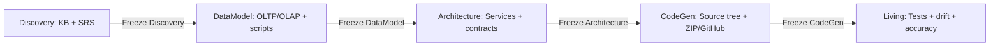
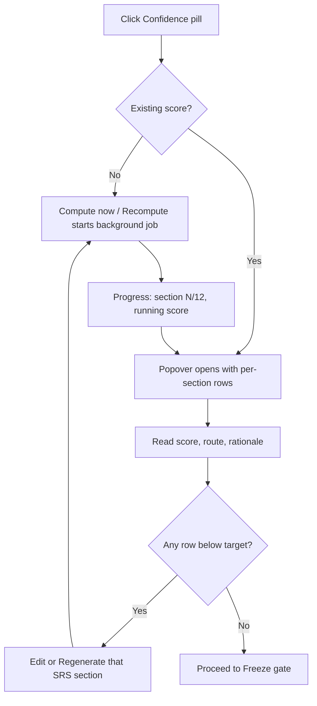
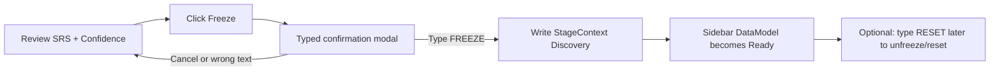

# LAMA User Manual

**Audience:** Migration Architect, Domain Subject Matter Expert, and the Ops engineer who keeps the studio running.
**Scope:** This manual explains what to click, what appears on screen, which artifacts are produced, and how each freeze gate unlocks the next stage. Deep architecture details live in `docs/ARCHITECTURE.md`.
**Version context:** Updated for the current LAMA repository state after the June manual became obsolete.

## 1. Welcome

LAMA — Legacy Application to Modernization AI studio — is a browser-based migration studio for turning legacy applications into cloud-native target applications. As a Migration Architect or Domain SME, you use LAMA to feed in legacy source code, database scripts, business documents, and optional live data sources. LAMA converts that evidence into a knowledge base, then walks you through requirements, data design, architecture, generated code, and ongoing living-system checks.

The studio is intentionally stage-gated. You do not jump from source code directly to generated code. You first freeze the Discovery artifacts, then DataModel artifacts, then Architecture artifacts, then CodeGen artifacts. Each freeze writes a Stage Context that becomes the source of truth for the next stage. This prevents a downstream stage from being generated from partial or unapproved evidence.

The UI is designed for review and control. You can edit sections, inspect confidence scores, see live logs, download artifacts, reset stages, and push outputs to GitHub. You do not need to understand the backend code to operate LAMA, but you should understand which button creates which artifact and when it is safe to freeze.

| Stage | User goal | Main artifacts | Unlock condition | Next stage |
| --- | --- | --- | --- | --- |
| 1. Discovery | Understand the legacy system and freeze the SRS. | KB, YAML/OWL context, TOON, business ontology, 12-section SRS. | Type `FREEZE` in the SRS freeze gate. | DataModel |
| 2. DataModel | Design target operational and analytical schemas. | PostgreSQL OLTP DDL, OLAP star schema, Bus Matrix, migration scripts. | Freeze the required data artifacts, especially OLTP and OLAP. | Architecture |
| 3. Architecture | Choose services and contracts. | Service Map, HLD, LLD, API Contracts, Mermaid sequence diagrams. | Freeze architecture artifacts. | CodeGen |
| 4. CodeGen | Generate target source trees. | Per-service backend/frontend files, Dockerfiles, ZIP, disk export, GitHub push. | Freeze CodeGen. | Living |
| 5. Living | Keep the migrated system aligned with the frozen SRS. | Selenium tests, JMeter plans, SRS drift report, SRS diff, Accuracy Report. | Optional post-generation controls. | — |



## 2. Prerequisites

| Requirement | What you need | How to check |
| --- | --- | --- |
| Docker Desktop or Docker Engine | Docker with Compose support. | Run `docker compose version` in a terminal. |
| RAM | At least 4 GB available for the LAMA container, MongoDB, HF encoders, and Python workers. | Docker Desktop → Settings → Resources. |
| Operating system | macOS or Linux are the supported operator environments in this repository. | Use a local terminal or server shell. |
| Network | Outbound access to LLM provider and Qdrant unless you use fully local providers. | Console → Providers → Test. |
| Port | Host port 8382 must be free. | Open `http://localhost:8382/health` after boot. |
| LLM API key | At minimum `OPENROUTER_API_KEY`, or configure Anthropic/OpenAI/Groq/Ollama/Gemini in Console. | Console → Providers. |
| Vector DB | `QDRANT_URL` and optional `QDRANT_API_KEY` for KB-RAG chat and SRS evidence. | Discovery → Build KB → KB health should show chunks/vectors. |
| Corporate proxy | Proxy env vars and CA bundle if TLS is intercepted. | See Ops chapter. |

If you are behind a corporate proxy, prepare these before first boot: proxy environment variables, a corporate root certificate PEM, and optionally pre-downloaded HuggingFace encoder models in `./hf_cache` plus LangGraph wheels in `./wheels`.

## 3. Installation & First Boot

1. Open a terminal in the repository root: `/Users/Arindam.Bose1/projects/lama/v1.0/repo_lama/lama`.
2. Create or update `.env` next to `docker-compose.yml` with provider, Qdrant, proxy, and CA settings.
3. Run `docker compose pull` if you want the newest `mishramesh/lama:latest`.
4. Run `docker compose up -d`.
5. Wait for the container health check to turn healthy.
6. Open `http://localhost:8382/health`; success is an HTTP 200 with a small JSON health response.
7. Open `http://localhost:8382/` in a browser.

Expected first-boot log lines from `docker/entrypoint-with-wheels.sh`:
```text
[lama-boot] seeding lama_hf_cache from /seed/hf_cache …
[lama-boot] HF cache seed complete (...).
[lama-boot] seeding lama_wheels from /seed/wheels …
[lama-boot] wheels seed complete (... files).
[lama-boot] installing langgraph + langchain-core from /wheels…
[lama-boot] langgraph already importable — skipping wheel install.
[lama-boot] lama_hf_cache already populated — skipping seed.
[lama-boot] lama_wheels already populated — skipping seed.
```

| Named volume | Purpose | First boot behavior | When to refresh |
| --- | --- | --- | --- |
| `lama_mongo_data` | Stores all projects, prompts, artifacts, usage, and audit logs. | Created empty, then `run_seed()` creates the PMIS pilot and seeded prompts/agents. | Only remove when you deliberately want to wipe all LAMA data. |
| `lama_hf_cache` | Stores HuggingFace encoder cache for confidence scoring. | Seeded from host `./hf_cache` if the volume is empty. | Refresh if confidence is stuck at 55% due to missing/offline encoders. |
| `lama_wheels` | Stores offline LangGraph/LangChain wheels. | Seeded from host `./wheels`; wrapper installs missing modules. | Refresh if confidence is stuck at 0% / `engine_unavailable`. |

Corporate SSL/CA fallback: prefer a real CA bundle over disabling verification. Mount the PEM with `LAMA_CORP_CA_HOST`, set `NODE_EXTRA_CA_CERTS` for Node/Factory CLI, and set `SSL_CERT_FILE` / `REQUESTS_CA_BUNDLE` / `CURL_CA_BUNDLE` for Python and HuggingFace clients. `LAMA_DISABLE_SSL_VERIFY` exists for development or enterprise troubleshooting only; do not use it for production trust decisions.

## 4. UI Tour

### Left sidebar

| Area | What you click | What happens | Success indicator |
| --- | --- | --- | --- |
| Stage list | Discovery, Data Model, Architecture, Code Generation, Living System. | Navigates to the selected stage if it is available/frozen/skipped. Locked stages show a toast and do not open. | Badge changes from locked to ready/available, frozen, or skipped. |
| Admin pages | Console, Prompt Library, Ontology Studio, Audit Log, GitHub Settings. | Opens configuration and review pages that apply to the active project or globally. | Page header changes and route updates. |
| Collapse button | Chevron / L rail button. | Shrinks the sidebar to icons. State is stored in `localStorage["lama:panel:sidebar"]`. | Rail icons remain visible. |
| Graph KB toggle | Settings menu / graph option in sidebar. | Toggles graph-KB prompt injection for the active project. | Toast says Graph KB enabled or disabled. |
| Skip stage menu | Stage overflow menu for DataModel, Architecture, Living. | Writes a skip Stage Context and unlocks downstream stage; Discovery and CodeGen cannot be skipped. | Skipped badge; downstream stage becomes available. |

Stage badge QA identifiers include `stage-Discovery-badge-frozen`, `stage-DataModel-badge-ready`, and `stage-CodeGen-badge-locked`. Confidence pills use identifiers such as `stage-confidence-pill-Discovery` and `stage-confidence-detail-Discovery`.

### Main workspace

- Most stage pages use resizable panels. Drag the thin divider between panels to give more room to chat, artifacts, diagrams, or code.
- Discovery uses a compact header, metrics row, step cards, and tabs for Knowledge Base and SRS. Chat is available as a floating overlay.
- DataModel uses an ER diagram area plus DDL/artifact panels.
- Architecture uses chat plus an artifact viewer with tabs.
- CodeGen uses file tree, Monaco editor, and code chat.
- Living uses Pipeline and Accuracy Report tabs.

### MiniConsole

- MiniConsole appears on long-running stage pages and streams backend logs through `/api/console/logs/tail`.
- Use Follow/Pause to control scrolling.
- Use Copy (`data-testid="mini-console-logs-copy"`) to copy buffered logs for support.
- Look for provider failures, stage job progress, token usage, and confidence-engine status.

## 5. Getting Started — The Reference Pilot

The reference pilot, **PMIS Migration Pilot**, is auto-seeded on first boot. It represents PHP 8 / CodeIgniter 4 / MariaDB migrating to FastAPI / Python 3.12 / PostgreSQL. Use this 5-minute path to learn the UI without creating a new project.

1. Start LAMA with `docker compose up -d` and open `http://localhost:8382/`.
2. In the left sidebar, confirm the active project name is PMIS Migration Pilot.
3. Click **Console** first. On the Providers tab, add or test your LLM provider. Confirm at least one active provider has low/medium/high routing.
4. Click **Discovery & SRS** in the sidebar.
5. In the top workflow cards, click **Upload Knowledge Base** if it is not already selected.
6. If seeded files are already present, review the Source Files metrics. Otherwise use Upload Files, Scan Local Folder, or Clone Git Repository.
7. Click **Build Knowledge Base**. A live progress dialog opens; wait for completion.
8. Open the SRS step card. Use the floating **Discovery Chat** if you want to ask, “What are the main PMIS workflows?”
9. In the SRS panel, click **Generate SRS** (`generate-srs-btn`). Watch the progress move through 12 sections.
10. Review sections 1–12. Use per-section **Regenerate** if one section is weak or empty.
11. Click the **Confidence** pill, then **Recompute**. Verify the 12 rows match the SRS sections and inspect scores/routes.
12. If acceptable, click **Freeze**, type `FREEZE`, and confirm. DataModel unlocks.
13. Open **Data Model**. Generate OLTP, OLAP, Bus Matrix, and migration scripts. Freeze required artifacts.
14. Open **Architecture**. Click Recommend / HLD / LLD / Sequence / API Contracts. Polling progress updates every 2 seconds. Freeze artifacts.
15. Open **Code Generation**. Click Generate All, review files in the Monaco editor, download ZIP or export to disk, optionally push to GitHub, then freeze.
16. Open **Living System**. Generate Selenium/JMeter/drift/SRS-diff artifacts and inspect Accuracy Report.

For the PMIS pilot, success means each left-sidebar stage progresses from ready to frozen, and each stage page shows artifacts with version numbers rather than empty-state cards.

## 6. Console (Model Fabric)

Visit Console before generating anything. LAMA routes every model call through the Model Fabric when providers are configured. If providers are missing or inactive, generation may fall back to env-var OpenRouter or fail with empty sections.

| Console tab | What to click | What happens | Check for success |
| --- | --- | --- | --- |
| Providers | Add/Edit provider card. Supported presets include OpenRouter, Anthropic, OpenAI, Groq, Ollama, Gemini, and custom-compatible providers. | Stores provider config, model catalogue, API key presence, and routing table. | Provider card shows active state and models. |
| Providers | Test. | Calls the provider through `/api/console/providers/{id}/test`. | Toast or card result says success; MiniConsole shows no auth error. |
| Providers | Fetch Models. | Refreshes the provider model list. | Model dropdowns populate. |
| Providers | Routing low/medium/high. | Maps agent complexity tiers to model IDs. | Chat/SRS dropdown shows grouped models and Auto uses Console default. |
| Agents | Expand an agent accordion row. | Shows agent key, stage, complexity, status, budget, override/wrap/replace controls. | Agent update toast; test can run successfully. |
| Agents | Reset budget. | Clears token budget usage for that agent. | Budget counters reset. |
| Prompts | Preview/Test prompt. | Renders prompt with project context and optionally sends a test call. | Preview content appears; cost estimate/log is recorded. |
| Usage | Change date window or inspect summary. | Reads usage summaries and token logs. | Spend grouped by provider, model, stage, and agent. |

### Providers tab

- Use `is_active` to control whether a provider participates in routing. An inactive provider stays saved but is ignored.
- Low tier should be cheap/fast for chat, sequence diagrams, small edits.
- Medium tier should be balanced for SRS generation and service code.
- High tier should be reserved for architecture recommendation, SRS regeneration, DB rule revalidation, and gap recovery.
- For Ollama, Docker must reach the host daemon through `host.docker.internal`; compose maps it for Linux as well as Docker Desktop.

### Agents tab

| Agent key | Label | Stage | Tier | Purpose |
| --- | --- | --- | --- | --- |
| orchestrator.discovery | Discovery Orchestrator | Discovery | medium | Manages KB build → OWL → TOON → SRS pipeline. |
| orchestrator.datamodel | Data Model Orchestrator | DataModel | medium | Manages OLTP → OLAP → Bus Matrix → Scripts. |
| orchestrator.architecture | Architecture Orchestrator | Architecture | medium | Manages Recommend → HLD → LLD → Sequence. |
| orchestrator.codegen | CodeGen Orchestrator | CodeGen | medium | Manages per-service file generation pipeline. |
| orchestrator.living | Living SRS Orchestrator | Living | medium | Manages diff SRS → test generation pipeline. |
| test.selenium | Selenium Test Generator | Living | medium | Generates JUnit5 + Selenium acceptance tests for each use case. |
| test.jmeter | JMeter Plan Generator | Living | medium | Generates Apache JMeter performance plans per persona. |
| drift.detector | Drift Detector | Living | high | Compares frozen SRS against live signals and reports gaps. |
| diff.srs | SRS Diff | Living | medium | Diffs two SRS snapshots and proposes artifacts to regenerate. |
| gov.core | Governance — Core Rules | Discovery | low | Loaded first in every LLM call; defines truth rules and source-of-truth. |
| gov.role_analysis | Governance — Role Analysis | Discovery | low | Extracts role → privilege maps with preconditions and postconditions. |
| gov.field_traceability | Governance — Field Traceability | Discovery | low | Maps UI fields to API attributes and DB columns. |
| gov.business_rule_extraction | Governance — Business Rule Extraction | Discovery | low | Creates a numbered business-rule catalogue. |
| gov.completeness_contract | Governance — 100% Legacy-Parity Completeness Contract | Discovery | low | Forces exhaustive workflow, access gate, BR, pre/post-condition extraction. |
| srs.spec.ieee29148 | SRS IEEE 830/29148 Specification | Discovery | low | Compliance directive prepended to SRS generators. |
| srs.revalidation | SRS Revalidation & DB Rule Incorporation | Discovery | high | Second-pass DB rule scan after SRS regeneration. |
| srs.gap_question | SRS Gap Questioner | Discovery | low | Asks clarifying questions grounded in KB. |
| srs.generate | SRS Generator | Discovery | medium | First-pass SRS section generation. |
| srs.regenerate | SRS Section Regenerator | Discovery | high | User-triggered section regeneration. |
| srs.edit | SRS Editor | Discovery | medium | Edits one SRS section from chat instructions. |
| srs.diff | SRS Diff Analyser | Discovery | medium | Diffs frozen SRS versus running system. |
| datamodel.oltp | OLTP DDL Generator | DataModel | high | Generates normalized PostgreSQL OLTP schema. |
| datamodel.olap | OLAP Schema Generator | DataModel | medium | Generates star schema for BI/NLP-to-SQL. |
| datamodel.bus_matrix | Bus Matrix Generator | DataModel | low | Generates fact × dimension bus matrix JSON. |
| datamodel.chat | Data Model Chat | DataModel | medium | RAG chat for editing OLTP/OLAP models. |
| arch.recommend | Architecture Recommender | Architecture | high | Recommends pattern and service decomposition. |
| arch.hld | HLD Generator | Architecture | medium | Generates HLD sections. |
| arch.lld | LLD Generator | Architecture | medium | Generates service LLD. |
| arch.sequence | Sequence Diagram Generator | Architecture | low | Generates Mermaid sequence diagrams. |
| arch.api_contracts | API Contracts Generator | Architecture | medium | Generates OpenAPI 3.1 specs. |
| arch.chat | Architecture Chat | Architecture | low | RAG chat for editing architecture docs. |
| codegen.service | Service Code Generator | CodeGen | medium | First-pass backend file generation. |
| codegen.regenerate | CodeGen File Regenerator | CodeGen | high | User-triggered file regeneration. |
| codegen.frontend | Frontend Code Generator | CodeGen | medium | Generates React components and pages. |
| codegen.docs | Documentation Generator | CodeGen | low | Generates README and API docs. |
| codegen.chat | CodeGen Chat | CodeGen | medium | RAG chat for editing generated code. |
| codegen.gap_recovery | Legacy Parity Gap Recovery | CodeGen | high | Detects and repairs legacy-parity gaps. |

The code comments and early Console text call these “~22 agents”; the current seed contains the expanded agent catalogue above. Treat the Console list as the runtime source of truth.

### Prompts tab

The user-facing seeded prompt set has grown. The original 12 core prompts remain important, and later iterations added Architecture, CodeGen, Living, and deep-analysis prompts. The core 12 are:
- `gov.core`
- `gov.role_analysis`
- `gov.field_traceability`
- `gov.business_rule_extraction`
- `gov.completeness_contract`
- `srs.spec.ieee29148`
- `srs.generate`
- `srs.gap_question`
- `srs.edit`
- `datamodel.oltp`
- `datamodel.olap`
- `datamodel.bus_matrix`

Editing a prompt increments the version. Many seeded prompts use `force_update=True`, so a future backend restart may bump or restore global prompt templates from `backend/seed.py`. If you need project-specific behavior, prefer a project override in Prompt Library or Console prompt tooling.

### Usage tab

- Use Usage before a long run to check spending patterns.
- A sudden increase usually means a provider fallback or repeated regeneration.
- Confidence recompute in strict-HF mode should not add LLM usage. If it does, check `LAMA_CONFIDENCE_STRICT_HF`.

## 7. Stage 1 — Discovery

Discovery turns legacy evidence into a knowledge base and a frozen SRS. This is where architects and SMEs spend the most review time.

### Importing legacy evidence

| UI location | Button / control | What happens | Success / failure check |
| --- | --- | --- | --- |
| Discovery → Upload Knowledge Base → Upload Files accordion | Drop files here or click to browse. `upload-file-kind` chooses file type. | Files are POSTed as KB files. ZIP archives are parsed in memory. Upload is additive by default. | Toast says uploaded; Source Files metric increases. |
| Discovery → Upload Knowledge Base → Scan Local Folder accordion | Enter absolute Folder Path, choose `scan-file-kind`, click Scan Folder. | Backend scans server-visible path using skip patterns. Existing KB is replaced by default for scan. | Toast says scanned N files; skipped backups/vendor folders are not listed. |
| Discovery → Upload Knowledge Base → Clone Git Repository accordion | Enter HTTPS URL, branch, optional username/token, choose file type, click Clone. | Git clone runs, then ingest continues in background; UI polls every 2 seconds. | Cloned Repository card shows URL, branch, commit, files, skipped count, status. |
| Discovery → Live Data Sources | Connect database / register app URL. | Adds schema and/or URL descriptors into the KB context. | Data source list updates; later SRS cites DB objects or endpoints. |
| Discovery → Target Stack | Review suggested target stacks and apply one. | Selected stack is saved to project target tech and used downstream. | Project target text and future prompts reflect the chosen stack. |

Skip patterns are deliberate: `node_modules`, `.git`, `vendor`, `__pycache__`, `*.bak`, `*.save`, `*_bkp`, `*_old`, `*_backup`, and `*.php_*`. If an expected file is missing, first check whether it matched a backup/vendor pattern.

### Build KB

1. After files appear, click **Build Knowledge Base** at the top of the Upload panel.
2. A progress dialog opens immediately. It polls phases such as extracting, aggregating, tech detection, TOON persistence, graph build, graphify, and Qdrant indexing.
3. The backend runs parsers, tech detection, OWL extraction, TOON serialization, business ontology support, graph building, and vector indexing.
4. When complete, a success toast appears and Discovery metrics update.
5. If it fails, leave the dialog open long enough to read the phase/error, then copy MiniConsole logs.

| Build step | What user sees | Artifact created |
| --- | --- | --- |
| Parsers | File counts and ingest progress. | KB files/chunks. |
| Tech detection | Stack fingerprint in logs and prompts. | Detected language/framework/DB metadata. |
| OWL extraction | Entities count rises. | Classes, routes, tables, columns, roles. |
| TOON serialization | KB text context becomes available. | Compact TOON for chat/SRS. |
| Business ontology / graph | Ontology data and graph stats. | Business domains/entities and relationships. |
| Vector store | RAG-ready chunks. | Qdrant collection entries. |

### Discovery sub-areas

| Area | Where | What to do |
| --- | --- | --- |
| Source Files | Upload Knowledge Base panel. | Review uploaded/cloned/scanned files; delete wrong files before Build KB. |
| KB health | Metrics row and KB health cards. | Refresh status and confirm files, chunks, and entities are non-zero. |
| Ontology Studio | Top-right link on Discovery or sidebar admin link. | Open business-domain graph once KB is built. |
| SRS | Generate SRS step / SRS Document tab. | Generate, edit, regenerate, confidence-check, freeze. |
| Floating Chat | Bottom/right chat overlay. | Ask questions or issue SRS-edit instructions. |

### KB health and YAML export

- Use the refresh control (`refresh-kb-health` where present) when metrics look stale after an ingest or Build KB.
- Click **Download OWL Context** / YAML export (`owl-export-btn`) from the KB health area. The endpoint name still says OWL for compatibility, but the current export is YAML-oriented KB context.
- A good export includes migration context, source entities, data-model hints, and service-boundary hints.
- If the export is empty, rebuild the KB and confirm files/entities are non-zero.

### Chat panel

| Control | Data-testid | Behavior |
| --- | --- | --- |
| Model dropdown | `model-selector` | Pick model for Discovery chat and SRS generation. Empty Auto delegates to Console routing. |
| SRS Edit toggle | `srs-edit-mode-btn` | Turns chat responses into section edits with Apply-to-SRS behavior. |
| New session | `session-new-btn` | Starts a rolling-memory session that survives refresh and context rollover. |
| End session | `session-end-btn` | Archives the rolling-memory session and returns to plain chat. |
| Send message | chat input / send button | Sends TOON-aware KB question. If intent says “generate SRS”, SRS may auto-trigger and the UI switches to SRS. |

The model selection persists in `localStorage["lama:chat:model"]`. Factory orchestrator mode can disable the dropdown and auto-route the model instead.

### Generate SRS

Click **Generate SRS** (`generate-srs-btn`) in the SRS panel after KB is ready. LAMA opens an SSE stream and writes sections progressively. You may see multiple sections “writing in parallel” depending on backend wave mode. Network interruptions are recoverable: the UI polls the backend job until completion and then refreshes the SRS document.

| Section key | Displayed section |
| --- | --- |
| introduction | 1. Introduction |
| overall_description | 2. Overall Description |
| actors_use_case_inventory | 3. Actors and Use Case Inventory |
| specific_requirements | 4. Specific Requirements |
| detailed_use_cases | 5. Detailed Use Cases |
| external_interfaces | 6. External Interfaces |
| non_functional_requirements | 7. Non-Functional Requirements (NFRs) |
| integration_requirements | 8. Integration Requirements |
| validation_verification | 9. Validation and Verification |
| traceability_matrix | 10. Traceability Matrix |
| appendices | 11. Appendices |
| entity_model | 12. Entity Relationship Model |

- Use Pause, Resume, and Cancel if a long run needs control. Pause takes effect after the current section checkpoint.
- Use per-section Regenerate (`srs-regenerate-btn-{section}` style buttons in the section menu) when only one section is weak.
- Use Edit (`srs-edit-btn-{section}`) to manually correct text. Save writes the section and increments the SRS version.
- PDF export is available from the SRS action menu; generated entity model renders as text summary in PDF and graph/table in the page.
- If a section contains `⚠ EVIDENCE GAP` or `NOT_EVIDENCED`, treat it as a review item before freezing.

### Confidence popover — the star feature

The Confidence pill appears near freeze controls and in stage toolbars. In compact mode it is a small pill labelled **Confidence** with a percentage or dash. Click it to open the popover. Right-clicking the compact pill starts a recompute.

| Popover column / item | What it means | How to use it |
| --- | --- | --- |
| Header score | Best persisted overall score for the stage; if latest recompute regressed, the popover can show both best and this run. | Use it as a quick freeze-readiness signal. |
| Rows | For Discovery, rows align to the 12 IEEE SRS sections. | Find exactly which SRS section needs review. |
| Score | Per-row confidence score. | Scores ≥95 are freeze-friendly; lower rows need inspection. |
| Route | How the engine scored: `hf_accept`, `hf_reject`, `hf_reject_hardstop`, or `engine_unavailable`. | Route tells you whether score came from HF acceptance, rejection, contradiction, or missing engine. |
| Rationale / gaps | Short explanation from confidence engine. | Use gaps to decide whether to edit evidence, regenerate section, or accept limitation. |
| Recompute | `stage-confidence-recompute-action-{stage}` | Starts a full background recompute over every section; current strict-HF mode is token-free. |
| Pause / Resume / Stop | `stage-confidence-pause-{stage}`, `stage-confidence-resume-{stage}`, `stage-confidence-stop-{stage}` | Control a running confidence job. |
| Regenerate confidence / Improve | Older documentation and code comments referred to an Improve/Regenerate-confidence button. In the current UI this button was intentionally removed; use **Recompute** plus per-section SRS Regenerate instead. | Do not look for a second confidence-action button in current builds. |



### Understanding confidence routes

| Route | Meaning | Operator action |
| --- | --- | --- |
| `hf_accept` | HF coverage is high enough and contradictions are absent; score normally 96. | Usually safe; still review business-critical content. |
| `hf_reject` | Coverage is low/middle band or signals are insufficient; score is floor/interpolated. | Open the section, add evidence-backed content or regenerate, then Recompute. |
| `hf_reject_hardstop` | Contradictions exceeded hard-stop threshold. | Do not freeze without resolving contradictions in SRS or KB. |
| `engine_unavailable` | LangGraph/HF engine unavailable under strict-HF mode; score often 0. | Ops should check `lama_wheels`, image, and `LAMA_CONFIDENCE_ENGINE`. |
| Uniform 55% | HF encoders unavailable/offline or all rows fell to reject floor. | Ops should check `lama_hf_cache`, `HF_HUB_OFFLINE`, certificates, and model cache. |
| Uniform 0% | Strict-HF blocked fallback because LangGraph missing. | Refresh wheels and restart container. |

Scores may vary because embedding coverage changes with section wording, KB coverage, contradictions, and entity-model completeness. To raise a low score, edit the SRS section content with source-backed details, regenerate the section, rebuild KB if source evidence was missing, then click Recompute.

### Discovery freeze gate



- Click Freeze only after every section is populated and low confidence rows have been reviewed.
- Type `FREEZE` exactly in the confirmation dialog.
- LAMA writes `StageContext(Discovery)` with SRS and KB handoff information.
- DataModel unlocks in the sidebar.
- To unfreeze/reset, use the Unlock/Reset flow and type `RESET` where requested.

## 8. Stage 2 — DataModel

DataModel converts the frozen SRS and KB into target database design and migration assets. If Discovery is not frozen or skipped into context, the page shows a locked banner and generation calls fail with HTTP 400.

| Area | Button | What happens | Check success |
| --- | --- | --- | --- |
| Top ER diagram | Generate Entity Graph / ER controls. | Builds or refreshes target entity graph from KB/SRS. | ER nodes and relationships render. |
| OLTP tab | Generate / Regenerate (`generate-oltp_ddl-btn`). | Starts OLTP DDL job. UI polls or streams progress and shows SQL. | SQL appears; version badge updates. |
| OLTP tab | Edit / Save (`edit-oltp_ddl-btn`, `save-oltp_ddl-btn`). | Switches SQL viewer to editor and persists changes. | Toast says Saved; version updates. |
| OLTP tab | Freeze (`freeze-oltp_ddl-btn`). | Freezes the OLTP artifact. | Frozen badge appears. |
| OLAP tab | Generate / Freeze (`generate-olap_ddl-btn`, `freeze-olap_ddl-btn`). | Creates star schema for BI/NLP-to-SQL and freezes it. | SQL appears; Frozen badge. |
| Bus Matrix | Generate Bus Matrix. | Creates fact × dimension JSON matrix. | Matrix table with checks appears. |
| Artifacts panel | Generate All Scripts. | Creates legacy→OLTP, OLTP→OLAP, and migration-test scripts. | Three script cards appear. |
| Chat | Ask DDL change. | DataModel RAG chat detects `[DDL_CHANGE]` and can apply to OLTP/OLAP. | Apply buttons update artifacts. |
| Toolbar | Confidence pill. | Scores DataModel stage artifacts. | Rows and score appear in popover. |
| Reset | Reset Stage 2 / Factory reset. | Typed `RESET` confirms destructive cleanup. | Artifacts cleared or whole project reset. |

- Required output: target OLTP DDL, OLAP DDL, Bus Matrix, and migration scripts.
- The stage unlocks Architecture when core frozen artifacts are present; OLTP and OLAP freeze are the critical cascade.
- Use download buttons (`download-{type}-btn`) to save SQL/JSON/Python files for external review.
- If generation hangs, inspect MiniConsole and job progress; long jobs are designed to be recoverable.

## 9. Stage 3 — Architecture

Architecture consumes DataModel Stage Context and produces service design artifacts. Unlike SRS/DataModel streaming, Architecture uses background jobs plus 2-second polling. This is deliberate: production ingress has a 60-second timeout, so polling is safer than a long SSE connection.

| Artifact tab | Button / action | What happens | Success check |
| --- | --- | --- | --- |
| Service Map | Recommend. | Starts service decomposition job from SRS/DataModel/KB. | Service cards or JSON service map appears. |
| Service Map | Approve / selected services / utility selection. | Persists approved service map and utility choices. | Approval toast; downstream HLD/LLD use selected services. |
| Service Map | Merge / Unmerge services. | Combines or splits service groups before CodeGen. | Service list changes. |
| HLD | Generate HLD. | Background job creates high-level design markdown; Mermaid blocks render. | HLD tab contains sections and diagrams. |
| LLD | Generate LLD. | Creates low-level design per service. | LLD markdown appears with components and data flows. |
| Sequence Diagrams | Generate Sequence. | Creates Mermaid sequence diagrams per use case. | Diagrams render; invalid syntax is sanitized where possible. |
| API Contracts | Generate API Contracts. | Creates OpenAPI 3.1 YAML per service. | YAML appears; downloadable artifact. |
| Any artifact | Edit / Save / Freeze / Download. | Manual edits persist; freeze marks artifact version. | Frozen badge and version. |
| Architecture Chat | Ask change request. | Detects `[HLD_CHANGE]`, `[ARCH_CHANGE]`, `[SERVICE_ADD]`, `[SERVICE_REMOVE]` and offers Apply. | Apply updates artifacts or service map. |
| Reset | Reset Stage 3. | Typed reset clears architecture artifacts. | Page returns to empty state. |

When you click a generation button, expect a progress bar and status line that refresh every 2 seconds. If the job fails, the error appears in the page and MiniConsole. Re-run only after fixing provider/configuration issues.

## 10. Stage 4 — CodeGen

CodeGen turns frozen architecture into generated target source trees. It is the final deliverable stage and cannot be skipped from the backend. Review carefully before pushing or freezing.

| UI area | Control | What happens | Success check |
| --- | --- | --- | --- |
| Top toolbar | Generate All. | Starts code generation for every selected service. | Job progress advances; file tree fills. |
| Top toolbar | Generate selected service / per-service regen. | Generates only one service or selected list. | Only relevant files update. |
| Top toolbar | Gap Recovery Backend / Frontend. | Repairs parity gaps in existing generated files. | Updated files and parity report. |
| Top toolbar | Auto-Validate & Improve. | Scores generated source files across six axes, repairs worst files, loops to threshold. | Live dashboard shows iterations and report. |
| File tree | Select file. | Loads file into Monaco editor. | Editor language changes by extension. |
| Editor | Edit / Save. | Manual file edits persist to CodeGen artifact store. | Toast says saved. |
| File tree context | Delete file/path. | Removes generated file(s). | File tree updates. |
| API mapping preview | Review legacy→new endpoint map. | Read-only deterministic preview from architecture service routes. | Missing endpoints warning if Architecture is incomplete. |
| Downloads | Download ZIP. | Downloads generated source tree as ZIP. | Browser receives ZIP blob. |
| Exports | Export to Disk. | Writes generated frontend/backend project under the host path mounted to `/lama-export`. | Toast shows export path; host folder appears next to repo by default. |
| GitHub | Push to GitHub. | Starts push job using saved GitHub Settings credentials. | Job success toast; repository gets commit. |
| Freeze | Freeze CodeGen. | Writes CodeGen Stage Context and unlocks Living. | Living becomes ready in sidebar. |
| Reset | Reset Stage 4. | Typed `RESET` clears generated files and stage state. | File tree empties. |

- Disk export default host location is the parent of the LAMA repo because compose mounts `${LAMA_EXPORT_HOST_DIR:-..}` to `/lama-export`.
- GitHub push requires PAT or credentials in GitHub Settings.
- ZIP can be empty if Architecture was not frozen or service map is missing; return to Stage 3 and freeze architecture artifacts.
- CodeGen file tree may be grouped for display, but generated storage is intentionally conservative due to frontend visual-edit constraints.

## 11. Stage 5 — Living

Living is the “keep the SRS honest” stage. It checks whether generated or evolving target code remains aligned with the frozen requirements. It is more operational than generative: tests, drift, diffs, and accuracy.

| Tab / accordion | Button | What happens | Success check |
| --- | --- | --- | --- |
| Pipeline → Selenium Tests | Generate. | Creates Selenium/JUnit acceptance tests from use cases. | Artifact with test files appears. |
| Pipeline → JMeter Plans | Generate. | Creates performance test plan files. | JMX/files appear. |
| Pipeline → Drift Detector | Paste live signals, Generate. | Compares runtime/observed signals against frozen SRS. | Markdown drift report appears. |
| Pipeline → SRS Diff | Paste SRS A and SRS B, Generate. | Shows added/removed/modified requirements and downstream regeneration recommendations. | Diff report appears. |
| Artifacts | Edit / Save / Freeze / Download. | Lets operator adjust generated tests/reports and freeze versions. | Artifact version/frozen badge. |
| Accuracy Report | Run / view report. | Scores KB/SRS/artifacts by sections and provides regenerate deep-links. | Rows show stage, score, and status. |
| Freeze Living | Freeze. | Marks Living complete. | Frozen status. |
| Reset | Reset Stage 5. | Typed `RESET` deletes Living artifacts. | Living page returns to empty artifact state. |

Living is implemented enough to generate and manage Selenium, JMeter, drift, SRS diff, and accuracy artifacts. Runtime observability is the conceptual direction; treat it as evolving capability rather than a full APM product.

## 12. The Confidence Engine — Deep Dive for Operators

### When to click Recompute

- After first SRS generation completes.
- After manually editing an SRS section.
- After regenerating one or more sections.
- After rebuilding KB or changing source evidence.
- Before freezing any stage.
- When the sidebar confidence pill shows dash, stale, or an unexpectedly low score.

### When to regenerate content

- Regenerate a specific SRS section when its confidence row is low and the section is clearly sparse, contradictory, or missing evidence.
- Regenerate DataModel/Architecture/CodeGen artifacts when confidence or human review points to artifact-level gaps.
- In current builds, the Confidence popover itself does not regenerate sections; the older Improve/Regenerate-confidence button was removed to keep confidence scoring HF-only and token-free.

### How to read rows

| Band | Typical meaning | Action |
| --- | --- | --- |
| 95–100 | Excellent. HF accepted coverage; 96 is the normal strict-HF accept score. | Review and freeze if business stakeholders agree. |
| 85–94 | Good but below freeze target. Often middle-band interpolation. | Check rationale; add missing evidence if critical. |
| 70–84 | Moderate. Coverage likely incomplete. | Edit or regenerate before freeze. |
| 55–69 | Reject floor or low coverage. | Investigate KB/SRS evidence and HF encoder health. |
| 0 | Engine unavailable under strict-HF. | Ops issue: LangGraph/wheels/image. |

Strict-HF mode does not call an LLM by default. The reason is factuality and cost control: the confidence engine uses local HuggingFace encoders for coverage and contradiction checks. This prevents a model from “grading” another model’s hallucination and avoids surprise token spend.

### Troubleshooting confidence

| Symptom | Likely cause | Fix |
| --- | --- | --- |
| Uniform 55% | HF encoders cannot load or signals unavailable. | Check `HF_HUB_OFFLINE`, `TRANSFORMERS_OFFLINE`, `SSL_CERT_FILE`, and `lama_hf_cache`. |
| Uniform 0% | LangGraph missing or strict-HF engine unavailable. | Check `lama_wheels`, wrapper entrypoint, and backend logs. |
| Scores vary by recompute | Embedding coverage or contradiction detection varies with current artifact text and KB. | Use best score as indicator, inspect latest-run rows for drift. |
| Confidence adds LLM cost | Strict-HF disabled or fallback enabled. | Unset `LAMA_HF_ALLOW_LLM_FALLBACK` and keep `LAMA_CONFIDENCE_STRICT_HF` auto/on. |
| Rows do not match 12 SRS sections | Stale cached confidence document. | Click Recompute; backend invalidates old catalogue rows. |

## 13. Prompt Library

Prompt Library is for browsing and editing versioned prompts. Console also exposes prompt preview/test tooling, but Prompt Library is the simple global/project editor.

| Area | Click | What happens | Data-testid |
| --- | --- | --- | --- |
| Header tabs | Global | Shows global prompt templates seeded by backend. | `tab-global` |
| Header tabs | Project | Shows project-specific overrides merged over globals. | `tab-project` |
| Prompt card | Textarea | Edit the template in monospaced editor. | `prompt-textarea-{key}` |
| Prompt card | Save | Persists prompt and bumps version. | `prompt-save-{key}` |
| Project prompt card | Remove override | Deletes project override and falls back to global. | `prompt-reset-{key}` |

Rev-bump behavior: saving a prompt increments its version. However, global prompts marked `force_update=True` in the backend seed may be updated again on next backend boot. For stable per-project tuning, use Project overrides.

## 14. Ontology Studio

Ontology Studio visualizes the business ontology built from the KB. It is not just a raw code graph; the current page focuses on business-domain entities, relationships, lifecycle states, backed-by tables, implemented-in classes, and deterministic FK relationships.

| Control | What it does | Success check |
| --- | --- | --- |
| Back to Discovery | Returns to Discovery page. | Route changes. |
| Graph / Tree toggle | Switches between force-directed graph and domain tree. | Selected mode highlighted. |
| Build now / Regenerate (`regenerate-btn`) | Starts business ontology job; polls every 2 seconds. | Toast says built/regenerated; graph appears. |
| Export JSON (`export-ontology`) | Downloads current ontology payload. | Browser downloads JSON. |
| Search (`ontology-search`) | Filters/highlights entities by name. | Graph/tree narrows focus. |
| Domain chips | Toggle domain visibility. | Chips dim/brighten and graph updates. |
| Entity node | Click node. | Detail panel shows description, owner, lifecycle, tables/classes, relationships. | Selected entity details visible. |

- Dashed grey relationships typically indicate FK fallback edges.
- Colored entity boxes represent business domains.
- If the stale banner appears, KB changed after ontology generation; click Regenerate.
- If LLM enrichment was skipped, the UI shows deterministic clusters only. This is still useful but less descriptive.

## 15. GitHub Settings

GitHub Settings stores per-project repository and credential settings used by SRS push and CodeGen push.

| Field / button | What to enter/click | What happens | Data-testid |
| --- | --- | --- | --- |
| GitHub Repository | Target repository URL, e.g. `https://github.com/org/pmis-modernized`. | Saved as project GitHub config. | `gh-repo` |
| Auth tab token/basic | Choose Personal Access Token or username/password. | Controls which credential fields are required. | `gh-auth-tab-token`, `gh-auth-tab-basic` |
| Branch | Target branch, usually `main`. | Pushes use this branch. | branch input on page |
| Save | Persist config and credentials. | Credentials stored server-side; token/password field clears. | Save button |
| Test Connection | Calls GitHub API or token-format check. | Result panel/toast says connected or failed. | Test button |
| Push SRS | Commits `docs/SRS.md` for the active project where supported. | Toast says SRS pushed or failed. | Push button |
| CodeGen Push | Start from CodeGen page after config is saved. | Pushes generated source tree. | CodeGen GitHub push job controls |

Use a PAT with the minimum repo permissions needed for the target repository. Do not paste credentials into chat or prompts.

## 16. Audit Log

Audit Log records state-changing actions and rich LLM traces when available. Use it to answer “who changed what, when, and with which model.”

| Action | What happens |
| --- | --- |
| Open Audit Log from sidebar | Shows active project events in reverse chronological list. |
| Click a row with trace | Opens Detail Log Trace dialog. |
| Copy JSON | Copies raw trace envelope for support or review. |
| Inspect fields | Stage, agent, status, elapsed, model, request/response times, error reason, usage. |

Current UI primarily filters by active project. If you need action/date filtering beyond the page controls, export/copy rows or query Mongo directly as an ops/admin task.

## 17. Ops Chapter

### docker-compose.yml walkthrough

| Compose area | Purpose |
| --- | --- |
| Image and port | Runs `${LAMA_IMAGE:-mishramesh/lama:latest}` and publishes `8382:8382`. |
| `lama_mongo_data:/data/db` | Persists bundled MongoDB state. |
| `./frontend/build:/usr/share/nginx/html:ro` | Local UI override; rebuild frontend to update served SPA without rebuilding image. |
| `./backend:/app/backend` | Local backend override; restart container after Python edits. |
| `./docker/nginx.conf` | Overrides nginx config. |
| `lama_hf_cache` + `./hf_cache` | Named HF cache seeded from host folder. |
| `lama_wheels` + `./wheels` | Offline wheels volume seeded from host folder. |
| `entrypoint-with-wheels.sh` | Seeds volumes, installs LangGraph if missing, then starts baked entrypoint. |
| Factory CLI mounts | Expose Linux `droid` binary and Factory config to container. |
| Corporate CA mount | Mounts `corp-ca.pem` as trusted Node/Python CA source. |
| `/lama-export` | Host export target for CodeGen disk export. |
| Git cache mount | Optional host-visible clone cache. |

### Common ops commands

```bash
docker compose up -d
docker compose logs -f lama
curl -fsS http://127.0.0.1:8382/health
docker compose restart lama
docker compose pull && docker compose up -d --force-recreate
docker volume rm lama_hf_cache && docker compose up -d
docker volume rm lama_wheels && docker compose up -d
```

### Refreshing HF cache

1. Stop only if needed; the volume can be removed while container is down.
2. Run `docker volume rm lama_hf_cache`.
3. Ensure host `./hf_cache` contains the pre-downloaded HF models.
4. Run `docker compose up -d`.
5. Check logs for `seeding lama_hf_cache` and then run a Confidence Recompute.

### Refreshing wheels

1. Run `docker volume rm lama_wheels`.
2. Ensure host `./wheels` contains `langgraph`, `langchain-core`, and transitive wheels.
3. Run `docker compose up -d`.
4. Check logs for `seeding lama_wheels` and `installing langgraph + langchain-core`.
5. If logs say `/wheels not populated`, verify the bind mount path.

### Behind corporate proxy

- Set `HTTP_PROXY`, `HTTPS_PROXY`, and `NO_PROXY` before `docker compose up -d` so clone/HTTP operations inherit them.
- Place corporate root certificate at `./certs/corp-ca.pem` or set `LAMA_CORP_CA_HOST` to an absolute path.
- Use `NODE_EXTRA_CA_CERTS=/usr/local/share/ca-certificates/corp-ca.crt` for Factory/Droid Node TLS.
- Use `SSL_CERT_FILE`, `REQUESTS_CA_BUNDLE`, and `CURL_CA_BUNDLE` for Python/HF/curl trust.
- For offline confidence, pre-download HF models to `./hf_cache` and keep `HF_HUB_OFFLINE=1`.
- Use `LAMA_DISABLE_SSL_VERIFY` only as a temporary diagnostic bypass, not as the normal enterprise fix.

### Upgrading the image

1. Back up or leave `lama_mongo_data` untouched.
2. Run `docker compose pull`.
3. Run `docker compose up -d --force-recreate`.
4. Watch logs for seed updates. Prompt and agent seeds are idempotent; force-updated prompts may rev-bump.
5. Open `/health`, then Console → Providers → Test.
6. If UI bind mount is used, run `cd frontend && yarn build` before restart so nginx serves a fresh bundle.

## 18. Troubleshooting

| Symptom | Likely cause | Fix |
| --- | --- | --- |
| Confidence stuck at 55% | HF encoders cannot load or offline cache missing. | Check `lama_hf_cache`, `HF_HUB_OFFLINE`, `TRANSFORMERS_OFFLINE`, `SSL_CERT_FILE`, and boot logs. |
| Confidence stuck at 0% | LangGraph missing and strict-HF blocks fallback. | Refresh `lama_wheels`, verify entrypoint wrapper, restart, check `is_available` in logs. |
| SRS generation returns empty sections | Fabric provider misconfigured, inactive/invalid key, or provider 401/402. | Console → Providers → Test; set active provider routing; check MiniConsole. |
| Stage locked HTTP 400 | Upstream stage is not frozen/skipped, so `require_stage_context` fails. | Return to upstream stage, freeze it, or use allowed Skip where appropriate. |
| CodeGen ZIP empty | Architecture service map/artifacts not frozen or no codegen files generated. | Freeze Architecture, regenerate CodeGen, then download ZIP. |
| Chat 502 | LLM env-var call timed out or provider transient failure. | Retry; acceptable in some tests. Check provider status and token credits. |
| Frontend blank page | Nginx serves an empty/stale bind-mounted `frontend/build`. | Run `cd frontend && yarn build`, then `docker compose restart lama`. |
| Build KB finds too few files | Skip patterns or wrong container-visible path. | Use Clone Git or Upload ZIP; verify path is visible inside container. |
| Git clone says ingesting for long time | Large repo or slow host bind mount. | Wait; status polls every 2s. Increase `LAMA_GIT_CLONE_TIMEOUT` for slow repos. |
| Provider dropdown shows stale model | Model persisted in localStorage but provider list changed. | Chat panel clears invalid value; manually choose Auto or clear `lama:chat:model`. |
| Ontology stale banner | KB changed after ontology was built. | Click Regenerate in Ontology Studio. |
| GitHub push fails | Missing PAT, wrong repo URL, insufficient permissions, or branch issue. | GitHub Settings → Save and Test Connection; verify PAT scope. |
| Export to disk not found | Host mount points elsewhere. | Check `LAMA_EXPORT_HOST_DIR` and toast path; default is parent of repo. |
| MiniConsole logs absent | Backend log tail endpoint not reachable or panel paused. | Resume Follow/Pause, refresh page, check `/health`. |

## 19. Keyboard Shortcuts & Tips

- Drag panel dividers to resize work areas; sizes are remembered by the browser where components support it.
- Browser back/forward preserves route-level stage state; some panel state is in localStorage/sessionStorage.
- The chat model persists as `localStorage["lama:chat:model"]`; clear it when provider routing changes unexpectedly.
- Use Auto in the model dropdown when you want Console routing by agent tier.
- Use MiniConsole Copy before reporting a generation failure.
- Prefer per-section SRS Regenerate over full SRS regeneration when only one row is weak.
- Freeze only after artifacts are reviewed and downloaded if your governance process requires external sign-off.
- Use Reset flows carefully; they require typed `RESET` because they delete artifacts.
- Use Skip only when governance allows omitting an intermediate artifact stage. CodeGen is not skippable.
- Hard refresh the browser after frontend rebuilds if UI looks stale.

## 20. Glossary

| Term | Meaning |
| --- | --- |
| SRS | Software Requirements Specification. In LAMA, a 12-section IEEE-style document generated from KB evidence. |
| KB | Knowledge Base: parsed files, chunks, entities, tech detection, graph, and vector data. |
| TOON | Token-oriented compact serialization of KB entities for LLM prompts. |
| OWL | Ontology-style extracted model of classes, tables, routes, roles, and relationships. Export endpoint now returns YAML KB context for compatibility. |
| RAG | Retrieval-Augmented Generation: finding relevant KB chunks before prompting the model. |
| LLM | Large Language Model used for chat/generation. |
| HF | HuggingFace. LAMA uses local HF encoders for confidence scoring. |
| Confidence Engine | Stage scoring system that compares artifacts against KB/ground truth and reports score, route, and rationale. |
| LangGraph | Workflow engine used by the confidence scoring graph. |
| Fabric | Model Fabric: provider routing and usage layer in Console. |
| Stage Context | Frozen handoff document written when a stage is approved; downstream stages require it. |
| Freeze Gate | Typed confirmation action that makes a stage authoritative and unlocks the next stage. |
| Strict-HF | Confidence mode that prevents LLM fallback, using only local HF signals. |
| Business Ontology | Business-domain graph of entities and relationships derived from KB. |
| Bus Matrix | Fact × dimension planning matrix for OLAP schema design. |
| HLD | High-Level Design. |
| LLD | Low-Level Design. |
| PAT | GitHub Personal Access Token. |
| MiniConsole | Floating/log panel that tails backend logs and usage signals. |

## 21. Appendix A — Full env-var reference

| Environment variable | Plain-English description |
| --- | --- |
| LAMA_IMAGE | Docker image to run; default `mishramesh/lama:latest`. |
| LAMA_PULL_POLICY | Image pull behavior; default `always`. |
| OPENROUTER_API_KEY | OpenRouter key used when Console routing or fallback requires OpenRouter. |
| OPENROUTER_BASE_URL | OpenRouter API base; usually `https://openrouter.ai/api/v1`. |
| LAMA_DEFAULT_MODEL | Legacy fallback model; Console routing normally decides per tier. |
| QDRANT_URL | Vector database URL for KB-RAG chat and SRS evidence retrieval. |
| QDRANT_API_KEY | Qdrant API key, if Qdrant is secured. |
| MONGO_URL | MongoDB URL; default points at bundled Mongo inside the container. |
| DB_NAME | Mongo database name; default `lama`. |
| LAMA_EXPORT_ROOT | Container export path for CodeGen disk export; default `/lama-export`. |
| LAMA_EXPORT_HOST_DIR | Host folder mounted to `/lama-export`; default parent folder `..`. |
| LAMA_GIT_CLONE_ROOT | Optional clone-cache path inside container; empty uses backend default. |
| LAMA_GIT_CLONE_TIMEOUT | Git clone timeout in seconds; default 300. |
| HTTP_PROXY / HTTPS_PROXY / NO_PROXY | Forward corporate proxy settings into clone and KB fetch operations. |
| LAMA_FACTORY_CLI_BIN | Path to Factory Droid CLI inside the container. |
| LAMA_DROID_BIN_HOST | Host path mounted as `/usr/local/bin/droid`. |
| LAMA_FACTORY_CONFIG_HOST | Host Factory config directory mounted into the container. |
| LAMA_FACTORY_MODE | Marks deploy as CLI-first; default `cli` in compose. |
| LAMA_FACTORY_CLI_SLIM | Strips large KB blocks from Factory prompts; default on. |
| LAMA_DISABLE_SSL_VERIFY | Development-only TLS bypass for Python HTTP clients behind SSL interception. |
| LAMA_CA_BUNDLE | Python/httpx corporate CA bundle path. |
| NODE_EXTRA_CA_CERTS | Node/Factory CLI corporate CA bundle path. |
| SSL_CERT_FILE | Certificate bundle for httpx / HuggingFace clients. |
| REQUESTS_CA_BUNDLE | Certificate bundle for requests/HuggingFace helpers. |
| CURL_CA_BUNDLE | Certificate bundle for curl-based probes. |
| LAMA_USE_GRAPH_KB | Enable graph-KB injection into prompts by default. |
| LAMA_CONFIDENCE_ENGINE | Set `langgraph` to enable LangGraph + HF confidence engine. |
| LAMA_CONFIDENCE_STRICT_HF | Auto-on with langgraph; blocks LLM fallback in confidence scoring. |
| LAMA_HF_ALLOW_LLM_FALLBACK | Opt-in legacy middle-band LLM confidence fallback. |
| LAMA_HF_COVERAGE_ACCEPT | HF coverage threshold for accepted sections; default 0.90. |
| LAMA_HF_COVERAGE_FLOOR | HF low-coverage floor threshold; default 0.40. |
| LAMA_HF_CONTRADICTION_HARD_STOP | NLI contradiction count that hard-stops acceptance; default 2. |
| LAMA_HF_ACCEPT_SCORE | Accepted score; default 96. |
| LAMA_HF_REJECT_SCORE | Rejected floor; default 55. |
| LAMA_HF_EMBEDDING_MODEL | Override embedding model; default bge-small-en-v1.5. |
| LAMA_HF_NLI_MODEL | Override NLI model; default nli-deberta-v3-base. |
| HF_HUB_OFFLINE | Forces HF model loading from mounted cache; compose sets `1`. |
| TRANSFORMERS_OFFLINE | Forces Transformers offline mode; compose sets `1`. |
| LAMA_CONFIDENCE_STAGE_CONCURRENCY | Parallel section scoring limit; default from backend. |
| LAMA_CORP_CA_HOST | Host corporate CA PEM mounted for Node/Factory. |
| LAMA_DROID_BIN_HOST_DIR | Writable host directory where Linux droid binary can be installed. |
| LAMA_GIT_CACHE_HOST | Optional host-visible clone cache. |
| REACT_APP_BACKEND_URL | Frontend local-dev API override; single-image uses relative `/api`. |

Production notes: set a strong JWT/auth secret if your deployment requires login hardening; do not rely on defaults for public exposure. Keep API keys out of the repository and inject them through `.env`, Docker secrets, or platform environment settings.

## 22. Appendix B — File-format cheat sheet

### YAML / OWL context export

The Discovery export button is named OWL for backward compatibility (`owl-export-btn`), but the current payload is YAML-style KB context. It is for review, evidence exchange, and prompt debugging.
```yaml
migration_context:
  project: PMIS Migration Pilot
  source_stack: PHP 8 / CodeIgniter 4 / MariaDB
  target_stack: FastAPI / Python 3.12 / PostgreSQL
data_model_hints:
  high_risk_tables: []
microservice_hints:
  suggested_boundaries:
    - claims
    - users
entities:
  tables:
    - name: pmis_claims
      columns: [id, status, amount]
```

### TOON context

TOON is compact and optimized for model prompts. It is not intended to be hand-authored by business users, but architects may inspect it when a model appears to miss a source entity.
```text
TABLES:
  pmis_claims(id,status,amount,created_at)
CLASSES:
  ClaimsController.exportClaims -> route:/claims/export
ROLES:
  Admin, Approver, Viewer
```

### When to hand-edit vs regenerate

| Situation | Best action |
| --- | --- |
| A section is mostly correct but missing a known business rule. | Hand-edit the SRS section, save, then Recompute confidence. |
| A section is empty, generic, or cites wrong stack/framework. | Regenerate the section after fixing provider/KB issues. |
| An entire artifact family is based on stale KB. | Rebuild KB, then regenerate downstream artifacts. |
| DDL has naming/style corrections only. | Hand-edit DDL and freeze after review. |
| Code file has a small syntax or naming issue. | Edit in Monaco and save. |
| Code misses a whole workflow. | Use CodeGen gap recovery or regenerate the service after checking Architecture coverage. |
| Ontology domain name is misleading but relationships are useful. | Regenerate after KB improvement; avoid hand-editing ontology JSON unless exporting externally. |
| Prompt behavior needs lasting project tuning. | Use project prompt override instead of editing generated artifact repeatedly. |

### Operator action checklists by stage

### Discovery

| Action | Click / type | Success signal |
| --- | --- | --- |
| Upload files | Choose file type, drop files, confirm count. | Toast, version/frozen badge, artifact content, or sidebar badge updates. |
| Scan folder | Enter absolute path, click Scan Folder, check skipped count. | Toast, version/frozen badge, artifact content, or sidebar badge updates. |
| Clone Git | Enter URL/branch/token, watch cloned repository card. | Toast, version/frozen badge, artifact content, or sidebar badge updates. |
| Build KB | Click Build Knowledge Base, wait for done, refresh metrics. | Toast, version/frozen badge, artifact content, or sidebar badge updates. |
| Ask chat | Open floating chat, choose model/Auto, send question. | Toast, version/frozen badge, artifact content, or sidebar badge updates. |
| Generate SRS | Open SRS step, click Generate SRS, watch 12 sections. | Toast, version/frozen badge, artifact content, or sidebar badge updates. |
| Review confidence | Click Confidence, Recompute, inspect rows. | Toast, version/frozen badge, artifact content, or sidebar badge updates. |
| Freeze | Click Freeze, type FREEZE, check DataModel ready. | Toast, version/frozen badge, artifact content, or sidebar badge updates. |

### DataModel

| Action | Click / type | Success signal |
| --- | --- | --- |
| Generate OLTP | Click Generate in OLTP tab, review SQL. | Toast, version/frozen badge, artifact content, or sidebar badge updates. |
| Generate OLAP | Click Generate in OLAP tab, review star schema. | Toast, version/frozen badge, artifact content, or sidebar badge updates. |
| Generate Bus Matrix | Click Bus Matrix generate, inspect fact/dimension grid. | Toast, version/frozen badge, artifact content, or sidebar badge updates. |
| Generate scripts | Click Generate All Scripts, download Python scripts. | Toast, version/frozen badge, artifact content, or sidebar badge updates. |
| Edit artifacts | Click Edit, change content, Save. | Toast, version/frozen badge, artifact content, or sidebar badge updates. |
| Freeze artifacts | Click Freeze on required artifacts, check Architecture ready. | Toast, version/frozen badge, artifact content, or sidebar badge updates. |

### Architecture

| Action | Click / type | Success signal |
| --- | --- | --- |
| Recommend service map | Click Recommend, wait polling job. | Toast, version/frozen badge, artifact content, or sidebar badge updates. |
| Approve map | Review cards, select/merge services, Approve. | Toast, version/frozen badge, artifact content, or sidebar badge updates. |
| Generate HLD | Click HLD generate, inspect markdown. | Toast, version/frozen badge, artifact content, or sidebar badge updates. |
| Generate LLD | Click LLD generate, inspect service details. | Toast, version/frozen badge, artifact content, or sidebar badge updates. |
| Generate sequence | Click Sequence generate, inspect Mermaid diagrams. | Toast, version/frozen badge, artifact content, or sidebar badge updates. |
| Generate API | Click API Contracts, inspect OpenAPI YAML. | Toast, version/frozen badge, artifact content, or sidebar badge updates. |
| Freeze | Freeze artifacts, check CodeGen ready. | Toast, version/frozen badge, artifact content, or sidebar badge updates. |

### CodeGen

| Action | Click / type | Success signal |
| --- | --- | --- |
| Generate code | Click Generate All, watch job. | Toast, version/frozen badge, artifact content, or sidebar badge updates. |
| Review API mapping | Check legacy/new endpoint mapping warnings. | Toast, version/frozen badge, artifact content, or sidebar badge updates. |
| Edit file | Select file, edit Monaco, Save. | Toast, version/frozen badge, artifact content, or sidebar badge updates. |
| Run gap recovery | Choose backend/frontend recovery when parity gaps remain. | Toast, version/frozen badge, artifact content, or sidebar badge updates. |
| Download ZIP | Click ZIP, confirm non-empty archive. | Toast, version/frozen badge, artifact content, or sidebar badge updates. |
| Export disk | Click Export to Disk, open host folder. | Toast, version/frozen badge, artifact content, or sidebar badge updates. |
| Push GitHub | Click Push after settings test passes. | Toast, version/frozen badge, artifact content, or sidebar badge updates. |
| Freeze | Freeze CodeGen, check Living ready. | Toast, version/frozen badge, artifact content, or sidebar badge updates. |

### Living

| Action | Click / type | Success signal |
| --- | --- | --- |
| Generate Selenium | Open Pipeline → Selenium, Generate. | Toast, version/frozen badge, artifact content, or sidebar badge updates. |
| Generate JMeter | Open JMeter, Generate. | Toast, version/frozen badge, artifact content, or sidebar badge updates. |
| Run Drift | Paste live signals, Generate. | Toast, version/frozen badge, artifact content, or sidebar badge updates. |
| Run SRS diff | Paste two SRS versions, Generate. | Toast, version/frozen badge, artifact content, or sidebar badge updates. |
| Run Accuracy | Open Accuracy Report and run/review rows. | Toast, version/frozen badge, artifact content, or sidebar badge updates. |
| Freeze or reset | Freeze artifacts or type RESET to clear stage. | Toast, version/frozen badge, artifact content, or sidebar badge updates. |

### Detailed operator runbooks

The following runbooks expand the click-by-click details for operators who prefer a strict checklist while conducting a migration workshop. They intentionally repeat key controls from earlier sections so the manual can be used at the screen without jumping between chapters.

#### Discovery workshop runbook

| Step | Click / observe | Operator note |
| --- | --- | --- |
| Confirm active project | Look at the left sidebar header and project label. | Do not start uploads into the wrong project. |
| Open Stage 1 | Click **1. Discovery & SRS** in the left sidebar. | If the stage is frozen, decide whether this is a review session or a reset/rework session. |
| Open Upload step | Click the **Upload Knowledge Base** step card. | The upload panel opens with accordions for files, folder, and Git. |
| Choose file kind | Use the File type dropdown before ingest. | Use `legacy_code` for source, `legacy_db` for DDL, `existing_srs` for prior docs, `api_spec` for OpenAPI/Postman/WSDL. |
| Upload ZIP or files | Drop files into the dashed box or click to browse. | Wait for the upload toast before clicking Build KB. |
| Scan server folder | Open Scan Local Folder, paste an absolute server-visible path, click Scan Folder. | If path is on your Mac but not mounted into Docker, scan will fail; use ZIP/Git instead. |
| Clone repository | Open Clone Git Repository, enter HTTPS URL, branch, token if needed, then Clone. | Keep the accordion open and watch file_count, skipped_count, current_file, and commit. |
| Review imported files | Scroll the file list. Delete obviously wrong files before Build KB. | Backups and vendor files should normally be absent. |
| Build KB | Click the yellow **Build Knowledge Base** button at the top of the panel. | The progress dialog should show phase changes rather than a frozen spinner. |
| Confirm KB health | Read Source Files, Code Entities, KB Chunks metrics. | At least files and chunks should be non-zero before SRS generation. |
| Export context | Click OWL/YAML export when available. | Open/download confirms context is not empty. |
| Open Ontology Studio | Click top-right Ontology Studio. | Use graph/tree to confirm major business domains make sense. |
| Return to SRS | Click Back to Discovery, then Generate SRS step card. | SRS panel fills the main workspace. |
| Select model | Open chat/model dropdown or leave Auto. | Auto delegates to Console routing. |
| Generate SRS | Click Generate SRS and keep browser tab open. | Sections appear progressively; network recovery may continue server-side. |
| Review each section | Open sections 1 through 12. | Look especially for source stack names, role workflows, business rules, and evidence gaps. |
| Fix one section | Click that section’s Regenerate or Edit. | Regenerate uses selected model; Edit is deterministic/manual. |
| Check confidence | Click Confidence pill, click Recompute if needed. | Rows should list the 12 IEEE sections. |
| Freeze Discovery | Click Freeze, type FREEZE. | Sidebar shows Discovery frozen and DataModel ready. |

#### DataModel review runbook

| Step | Click / observe | Operator note |
| --- | --- | --- |
| Open Stage 2 | Click **2. Data Model**. | If locked, return to Discovery and freeze or skip appropriately. |
| Inspect ER diagram | Review generated/current ER graph at the top. | Missing major tables means Discovery KB needs correction. |
| Generate OLTP | Click Generate in OLTP Schema. | Review PostgreSQL DDL for normalized tables, PKs, FKs, audit columns, indexes. |
| Edit OLTP | Click Edit if names or constraints need governance alignment. | Save before freezing. |
| Freeze OLTP | Click Freeze on OLTP. | Frozen badge appears with version. |
| Generate OLAP | Click Generate in OLAP Star Schema. | Review facts, dimensions, grain, surrogate keys, and date dimensions. |
| Freeze OLAP | Click Freeze on OLAP. | Architecture unlock requires frozen data context. |
| Generate Bus Matrix | Click Generate Bus Matrix. | Validate fact/dimension intersections with SMEs. |
| Generate scripts | Click Generate All Scripts. | Review legacy→OLTP, OLTP→OLAP, and test migration scripts. |
| Use chat for edits | Ask Data Model chat for a DDL change. | Apply button should patch OLTP/OLAP only after you review the proposed change. |
| Download artifacts | Use .sql/.json/.py download buttons. | Store them with review evidence if your governance process requires it. |
| Confidence | Click compact Confidence pill. | Low rows imply DDL/script mismatch with SRS/KB. |
| Freeze outcome | Confirm Architecture badge becomes ready. | If it does not, verify OLTP and OLAP are both frozen. |

#### Architecture review runbook

| Step | Click / observe | Operator note |
| --- | --- | --- |
| Open Stage 3 | Click **3. Architecture**. | Locked means DataModel is not frozen/skipped. |
| Recommend services | Click Recommend. | Wait for polling job and review service map JSON/cards. |
| Prune services | Select the services you actually want generated. | Avoid generating throwaway services; CodeGen uses this map. |
| Merge services | Use Merge where multiple small services should become one deployable. | Merged name should be lower-kebab-case. |
| Select utilities | Review cross-cutting utilities if shown. | Audit logging, integrations, and shared utility choices influence CodeGen. |
| Approve service map | Click Approve. | HLD/LLD/API generation now uses approved map. |
| Generate HLD | Click HLD generation. | Review deployment view, service responsibilities, data ownership, and diagrams. |
| Generate LLD | Click LLD generation. | Review class/module/component detail per service. |
| Generate sequence | Click Sequence Diagrams. | Mermaid diagrams should render; text fallback indicates sanitization. |
| Generate APIs | Click API Contracts. | OpenAPI YAML should align with legacy routes and SRS requirements. |
| Chat edits | Ask Architecture Chat for changes. | Only click Apply after reading detected change blocks. |
| Freeze artifacts | Freeze each accepted artifact. | CodeGen should become ready after architecture handoff is complete. |
| Reset if wrong | Use Reset Stage 3 and type RESET if decomposition is fundamentally wrong. | Then regenerate from a corrected DataModel/Discovery context. |

#### CodeGen delivery runbook

| Step | Click / observe | Operator note |
| --- | --- | --- |
| Open Stage 4 | Click **4. Code Generation**. | Locked means Architecture was not frozen. |
| Review API mapping first | Open the mapping/preview area. | Warnings about no endpoints mean Architecture must be regenerated. |
| Generate all | Click Generate All. | Watch job progress; do not navigate away if you want live feedback. |
| Generate selected services | Use service filter/selection when rerunning only part of the app. | Reduces token use and review scope. |
| Open file | Click a file in the left tree. | Monaco opens with language detection based on extension. |
| Manual edit | Click into editor, change content, Save. | Saved content is included in ZIP/export/push. |
| Chat file edit | Ask code chat for a file change. | Detected `[FILE_CHANGE:path]` proposal can be applied after review. |
| Gap recovery | Run backend/frontend gap recovery if parity report is low. | Generated files should become more complete, not shorter. |
| Auto-Validate | Click Auto-Validate & Improve, choose service/threshold/iterations. | Dashboard shows score iterations and repaired files. |
| Download ZIP | Click ZIP download. | Open the archive; verify source tree and Dockerfiles exist. |
| Export disk | Click Export to Disk. | Open host path from toast; default is sibling of repo. |
| Push GitHub | Click GitHub push after Settings test passes. | Repository receives generated files. |
| Freeze CodeGen | Click Freeze. | Living becomes ready; this is the final deliverable checkpoint. |

#### Living operations runbook

| Step | Click / observe | Operator note |
| --- | --- | --- |
| Open Stage 5 | Click **5. Living System**. | Locked means CodeGen is not frozen. |
| Selenium | Open Pipeline → Selenium Tests and Generate. | Acceptance tests appear as files. |
| JMeter | Open Pipeline → JMeter Plans and Generate. | Performance test plan appears. |
| Drift | Paste live runtime signals and Generate. | Report identifies SRS drift. |
| SRS diff | Paste old/new SRS versions and Generate. | Report lists changed requirements and downstream artifacts to regenerate. |
| Accuracy report | Open Accuracy Report. | Rows show score and stage links. |
| Edit artifacts | Use Edit/Save on generated test/report files. | Manual corrections persist. |
| Freeze artifacts | Freeze stable Living artifacts. | Frozen badges protect versions. |
| Reset Living | Type RESET only when intentionally deleting Living artifacts. | Pipeline returns to generate state. |

### QA traceability quick list

Use these identifiers when coordinating with QA or a testing agent. Not every control is visible in every project state; locked/frozen pages hide or disable some buttons by design.

| UI element | Data-testid |
| --- | --- |
| Sidebar collapsed | sidebar-collapsed |
| Expand sidebar | expand-sidebar |
| Stage frozen badge | stage-{key}-badge-frozen |
| Stage ready badge | stage-{key}-badge-ready |
| Stage locked badge | stage-{key}-badge-locked |
| Onboarding banner | onboarding-banner |
| Upload file kind | upload-file-kind |
| Scan file kind | scan-file-kind |
| Git accordion | accordion-git |
| SRS model dropdown | model-selector |
| SRS edit mode | srs-edit-mode-btn |
| New rolling session | session-new-btn |
| End rolling session | session-end-btn |
| Generate SRS | generate-srs-btn |
| Confidence pill | stage-confidence-pill-{Stage} |
| Confidence detail | stage-confidence-detail-{Stage} |
| Confidence recompute | stage-confidence-recompute-action-{Stage} |
| DataModel OLTP generate | generate-oltp_ddl-btn |
| DataModel OLTP freeze | freeze-oltp_ddl-btn |
| DataModel reset modal | reset-modal |
| Architecture reset modal | architecture reset modal controls |
| CodeGen reset modal | codegen-reset-modal |
| CodeGen reset confirm | codegen-reset-confirm |
| Auto-Validate modal | auto-validate-modal |
| Auto-Validate start | av-start |
| Living reset modal | living-reset-modal |
| Living reset confirm | living-reset-confirm |
| Ontology page | ontology-studio-page |
| Ontology graph mode | mode-graph |
| Ontology tree mode | mode-tree |
| Ontology regenerate | regenerate-btn |
| Ontology export | export-ontology |
| GitHub repo | gh-repo |
| GitHub token tab | gh-auth-tab-token |
| GitHub basic tab | gh-auth-tab-basic |
| Prompt global tab | tab-global |
| Prompt project tab | tab-project |
| Prompt card | prompt-card-{key} |
| Audit trace dialog | audit-trace-dialog |
| Audit trace copy | audit-trace-copy |
| MiniConsole copy logs | mini-console-logs-copy |

### Workshop facilitation tips

- Keep one browser tab on the active stage and another on Console → Usage during long LLM runs.
- Before freezing a stage, ask the domain SME to read only the changed/low-confidence rows first, then scan the full artifact.
- When a generation fails, do not immediately retry multiple times; first inspect MiniConsole for provider credit, TLS, or timeout errors.
- Use downloads after every frozen stage so your migration governance folder has an immutable copy outside Mongo.
- Use project prompt overrides for one migration and global prompt edits only when you want to change behavior for all future migrations.
- Prefer Git clone for large repos because it preserves path context; prefer ZIP upload when Docker cannot see the local folder path.
- If the UI shows stale stage state after freeze, wait for the sidebar poll or refresh the browser.
- If a confidence row is low but the section is intentionally out of scope, document that exception in the SRS before freezing.
- If CodeGen output is too broad, return to Architecture and prune/merge services before regenerating code.
- For regulated migrations, capture Audit Log traces for each final-generation call and store the YAML export with the frozen SRS.

### Final pre-freeze checklist

Use this checklist immediately before each typed freeze gate.

- Confirm the upstream stage badge is not locked.
- Confirm the artifact you are freezing has a visible version number.
- Confirm generated content is not an error message pasted into the artifact body.
- Confirm MiniConsole has no unresolved provider/auth/TLS error for the final run.
- Confirm confidence has been recomputed after the last manual edit.
- Confirm low-confidence rows have explicit SME acceptance or have been regenerated.
- Confirm downloads have been saved if your governance process requires external evidence.
- Confirm GitHub Settings are tested before any push action.
- Confirm `FREEZE` is typed only after the review owner approves.
- Confirm `RESET` is typed only when artifact deletion is intentional.
- Confirm skipped stages are documented, because skipped Stage Contexts unlock downstream generation without artifacts.
- Confirm CodeGen is not frozen until ZIP/export/GitHub output has been inspected.
- Confirm Living drift reports are reviewed before accepting target-code changes after migration.
- Confirm Audit Log rows exist for major generation, freeze, reset, and push actions.
- Confirm the browser shows the correct active project before every destructive action.

